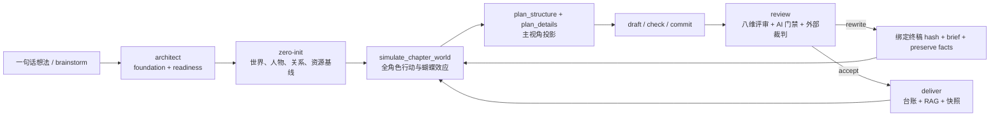

# novel-studio 2026-07-10 工程变更总览

这份 README 汇总本次准备合入 `main` 的全部工程变更。主体改动跨越 140+ 个文件，目标不是增加一组彼此孤立的功能，而是把小说生产链统一成一条可恢复、可校验、可追溯的动态世界推演流水线。

## 本次交付结论

- 正文写作统一通过 `novel-studio --pipeline` 执行；新书默认阶段为 `architect -> zero-init -> write -> review -> rewrite -> deliver`。
- 每章规划前新增全角色世界推演。角色依据自己的目标、压力、资源、知识边界和误判做决定，再由主视角投影收束为正文可见内容。
- 返工不再重新发明章节。系统绑定当前终稿 hash、审核 brief 和必须保留事实，推演、计划、正文与复审必须引用同一份返工来源。
- pipeline 完成状态不再只看布尔值。阶段产物写入 SHA-256 指纹，恢复、重跑和最终交付都会重新核验证据。
- RAG 增加独立就绪入口、真实 embedding/Qdrant 状态检查、重试与可恢复索引写入；项目事实、写法资产与审核校准继续分通道召回。
- 审核链增加正文版本新鲜度检查、本地 AIGC 分片判定、外部 DeepSeek 裁判和 warning/blocking 分级。
- 进度看板升级为全信息编辑工作台，区分主线下一章与实际返工章，并交叉校验正文、进度、评审、RAG、运行事件和资产沉淀。

## 新的执行链路



### 1. Architect 成为正式 pipeline 阶段

默认 pipeline 现在包含 `architect` 和 `zero-init`。第一章不能绕过 foundation、世界基线和零章 readiness 直接写正文。

新增独立检查入口：

```bash
novel-studio --architect-check --dir data/runs/<书名>/output/novel
novel-studio --zero-init --check --dir data/runs/<书名>/output/novel
```

Architect 阶段会核验：

- `premise.md`
- `characters.json`
- `world_rules.json`
- `book_world.json`
- `world_codex.json`
- `layered_outline.json` 或 `outline.json`
- `meta/compass.json`
- `meta/architect_readiness.json`

foundation 发生变化后，旧 readiness 会失效，不能继续被 `ready:true` 误放行。

### 2. 每章先做全角色世界推演

新增 `simulate_chapter_world` 工具与 `meta/chapter_simulations/NNN.json` 持久化层。

每个实名角色都必须提交：

- 当前时间与位置
- 自己的目标和压力
- 可用资源与知识边界
- 至少两个真实可选行动
- 最终决定、决定理由和实际行动
- 行动所需的现实时间与完成度
- 即时结果、后续状态和蝴蝶效应
- 对主角立即可见、延迟可见或隐藏的影响

角色决策可以分批提交，只有全部在册角色覆盖、主角选择与角色决策一致、因果链完整后，才会生成正式 `simulation_id`。章节 plan 必须引用这个 ID，正文只能渲染主角依法可感知的信息。

### 3. 返工章使用同一事实源

返工队列存在时，写作工具只能处理队首章节，不能偷偷规划下一章。

新增 `rewrite_source` 契约：

- 当前终稿路径与 SHA-256
- 当前 rune 字数
- 审核 brief 路径
- `preserve_facts` 必须保留事实
- 世界推演中的逐条事实覆盖证明

若正文、brief、世界推演或计划来源发生漂移，系统会拒绝沿用旧结构。重写允许围绕审核结论调整表达和局部组织，但不得改变既有事件顺序、金额、地点、角色出场、结果、伏笔和章末承诺。

### 4. Pipeline 完成证据可复核

`meta/pipeline.json` 的阶段证据新增产物指纹。恢复时先验证旧指纹，再验证当前阶段条件；最终交付前还会对全部已完成阶段做一次总对账。

这解决了以下问题：

- rewrite 修改正文后，write/review 阶段仍被旧证据误判完成；
- review 文件存在，但对应的正文版本已经变化；
- deliver 已标记完成，但 RAG、进度台账或交付快照并未真正落盘；
- pipeline 中断后仅凭 `completed` 数组跳过关键步骤。

## RAG 与检索升级

### 独立就绪入口

```bash
novel-studio --rag-ready --dir data/runs/<书名>/output/novel
novel-studio --build-rag --dir data/runs/<书名>/output/novel --with-embeddings
```

`--rag-ready` 只修复和验证 RAG，不启动正文写作。它会检查索引配置、embedding 能力、向量维度、Qdrant collection 和项目检索状态。

### 可靠性变化

- 本地 GGUF embedding、OpenAI-compatible embedding 与 Qdrant 写入路径统一错误语义。
- embedding 与 Qdrant 写入支持受控重试、并发限制和失败回填。
- 索引器、vector store、RAG sink 和项目事实入库补齐去重与恢复测试。
- `craft_recall`、project memory 和章节上下文继续区分 project / world / character / plot / craft / benchmark 等 facet。
- `meta/rag/index_state.json`、检索 trace 和召回日志作为真实运行证据，不用“本地文件存在”冒充已经走向量引擎。

进度看板读取 `index_state.md` 的轻量摘要，不再每 4 秒反序列化近百 MB 的 chunk 正文。

## 审核、AIGC 与版本新鲜度

### 正文版本绑定

审核、AI 门禁与外部裁判产物可以携带 `body_sha256`。pipeline 在放行时检查评审是否仍对应当前正文，过期评审不能继续作为完成证据。

### AI 门禁

- 本地 AIGC 分片代理补齐整章单段风险和人工锚点校准边界。
- 对话占比改为同时考虑行级与引号内汉字占比，降低单段正文的错误估计。
- `external_aigc_ratio` 纳入机械阻断规则。
- warning 与 blocking 分开处理；接近阈值但缺乏复合证据的提示不再自动制造返工死循环。
- DeepSeek 外部裁判保留 verdict、概率、风险、模型和正文 hash，作为异模型复核证据。

### 返工闭环

review、rewrite、deliver 会共享最新正文版本、审核 brief 和 pipeline evidence。已通过的低风险外部判定不应被旧 warning 反复推回返工队列。

## 模型与运行时

- 模型 fallback 现在保留各目标自己的 `reasoning_effort`，切换 provider/model 时不会沿用错误思考档位。
- failover 模型透传能力声明并为每个目标构造独立 call options。
- 模型注册表、配置示例和测试已同步当前模型条目。
- Host/Coordinator flow 加强返工队列优先级、停止条件、阶段恢复和运行日志证据。
- 诊断快照增加 pipeline、运行队列和恢复状态所需字段。

## 进度看板 3.0

启动：

```bash
novel-studio service start
novel-studio service status
novel-studio service open
```

地址：<http://127.0.0.1:8765/>

首页新增：

- 项目搜索、运行状态筛选和排序
- 正文实算进度、细纲覆盖和质量通过率
- 主线下一章与实际工作章分离
- 推演、计划、落稿、校验、提交、评审、返工、交付步骤链
- 评审、AI 门禁、模型用量、成本、RAG 和核心资产覆盖
- 正文、进度、评审 hash、返工队列和运行事件的一致性结论

详情页包括：

- 总览：运行状态、数据一致性、资产、RAG、章节和模型用量
- 设定：世界地图、地点、现实交通、势力、规则与时间线
- 人物：目标、压力、知识账本、决策框架、合理犯错、最新位置和性格变化
- 成长轨迹：出场生命线、长期弧线与状态变化流
- 计划：卷弧、下一章、细纲、伏笔和时间线
- 离屏世界：配角独立经历、会面约束、世界增量和信息传播
- 质量：评审、AIGC、外部判定、正文版本新鲜度和写作指标
- 运行：实时事件、近期错误和原始日志

看板 API 的 RAG 汇总已从全量索引解析改为轻量状态读取，本地四项目扫描约 0.03 秒。

## 主要持久化产物

| 目录或文件 | 用途 |
|---|---|
| `meta/architect_readiness.*` | foundation 完整性与新鲜度 |
| `meta/first_chapter_generation_readiness.*` | 第一章前零章硬门禁 |
| `meta/chapter_simulations/NNN.*` | 全角色章节世界推演 |
| `drafts/NN.plan*.json` | 分阶段章节计划 |
| `reviews/NN.json` | 八维审核与 rewrite/accept 结论 |
| `reviews/NN_ai_gate.json` | 本地 AIGC 与机械门禁 |
| `reviews/NN_deepseek_ai_judge.json` | 外部异模型判定 |
| `meta/character_stage/NNN.*` | 角色位置、行动和性格变化 |
| `meta/side_character_journeys/NNN.*` | 非主角独立经历与传播路径 |
| `meta/chapter_world_deltas/NNN.*` | 章节造成的世界增量 |
| `meta/rag/index_state.*` | RAG 配置、chunk 和向量状态 |
| `meta/pipeline.json` | 阶段状态、产物和 SHA-256 证据 |
| `meta/delivery_snapshots/` | 可复核交付快照 |

## 推荐使用方式

### 新书

```bash
novel-studio --pipeline \
  --new-novel \
  --prompt-file prompt.md \
  --stages architect,zero-init,write,review,rewrite,deliver
```

### 已有项目恢复

```bash
novel-studio --architect-check --dir output/novel
novel-studio --rag-ready --dir output/novel
novel-studio --zero-init --check --dir output/novel
novel-studio --pipeline --prompt-file prompt.md
```

不要手工把 `pipeline.json` 的阶段改成完成。若证据过期，应让 pipeline 重新验证或重跑对应阶段。

## 验证命令

合入前使用以下命令验证完整工程：

```bash
gofmt -w <本次修改的 Go 文件>
go test ./...
go build -o novel-studio ./cmd/novel-studio
python3 scripts/validate_skill_context.py
python3 -m unittest services.dashboard.test_server -v
python3 -m py_compile services/dashboard/server.py services/dashboard/test_server.py
```

前端内嵌 JavaScript 还需执行语法检查，服务启动后确认：

```bash
novel-studio service status
curl -sS http://127.0.0.1:8765/api/novels
```

## 兼容与迁移提示

- 旧项目若已经完成第一章，不会仅因新增 zero-init schema 被强制倒退；但新写第一章必须通过当前 readiness。
- 旧 pipeline evidence 没有 artifact digest 时，首次恢复会按当前产物重新验证并补写指纹。
- 旧评审缺少 `body_sha256` 时属于“版本未知”，不会被伪装成已确认新鲜；重新 review 后会产生完整证据。
- 若历史正文被直接修改但没有刷新 `progress.json`，看板会显示正文实算字数与台账差异。
- RAG 的监听端口存在不等于向量引擎可用，应以 `--rag-ready`、index state 和实际召回 trace 为准。

## 相关文档

- [根 README](README.md)
- [Pipeline 恢复审计](docs/pipeline-recovery-audit-20260710.md)
- [写作与审核工作流](docs/writing-review-workflow.md)
- [架构说明](docs/architecture.md)
- [上下文管理](docs/context-management.md)
- [数据生命周期](docs/data-lifecycle-and-progression.md)
- [进度看板说明](services/dashboard/README.md)
