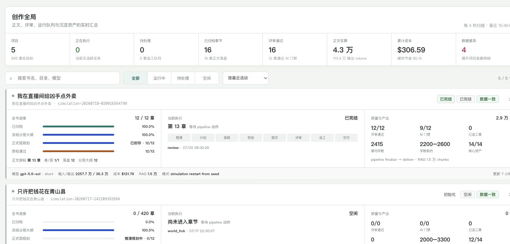
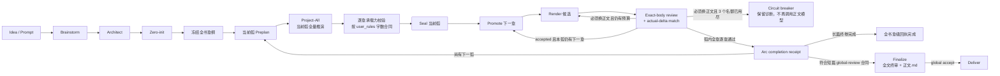
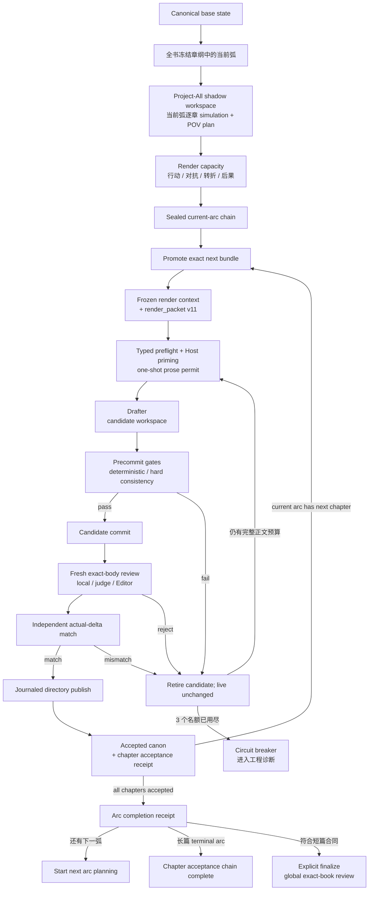

> [!NOTE]
> 这是 `main` 在 2026-07-20 的完整生产协议与运维参考，保留 execution lock、receipt、恢复窗口、命令边界和近期升级细节。第一次了解项目请先阅读更精简的 [产品 README](README.md)。

<div align="center">

# novel-studio

**单世界全角色推演驱动的 AI 小说生产工程**

先让世界与角色作出有理由的决定，再把主角看得见的因果渲染成正文。

[](https://github.com/Xiaoyangy/novel-studio/releases/latest)
[](LICENSE)
[](go.mod)
[](#安装)

[快速开始](#快速开始) · [生产可靠性](#生产可靠性) · [工作流](#工作流) · [质量闭环](#质量闭环) · [进度看板](#进度看板) · [命令速查](#命令速查) · [文档](#文档)

</div>

---

novel-studio 是一个开源、自托管、local-first 的 AI 小说生产系统，支持 2—3 万字短篇生产，并以百万字级连载、长篇网文和整书工程化创作为架构目标。

它不是“把上一段继续写长”的文本生成器。系统会先维护同一个世界中的角色状态、知识边界、资源、关系与独立决策，再将蝴蝶效应投影为主视角章节计划。正文、审核、返工、提交和 RAG 都绑定落盘事实与精确正文 SHA。

> [!IMPORTANT]
> 新书必须先完成 **Architect**，再完成 **zero-init**，之后才允许写正文。默认 pipeline 已固化这条阶段边界，不会让 Writer 临时代办前置设计。

> [!NOTE]
> 本页是当前 `main` 的合并参考。[README-20260714.md](README-20260714.md) 只保存 2026-07-14 当时的历史基线，其中的 `render_packet v9` 等旧描述不能代替当前行为。

## 核心能力

| 能力 | novel-studio 如何处理 |
|---|---|
| 单世界全角色推演 | 每个角色依据自己的目标、压力、知识、关系和资源作决定；离屏角色不会围着主角静止等待 |
| 主视角投影 | 完整世界决定留在模拟层，正文只接收主角可见事实、必要结果与人物声口 |
| 规划与渲染分离 | 全书章纲先冻结；此后每次只对当前一弧完成 `preplan → project-all → seal`，再按章 `promote → render → exact-body review`，弧内全章验收后才进入下一弧 |
| 长篇记忆 | 项目事实、写法资料、对标素材和审核校准分通道路由，支持 BM25、embedding、本地向量与 Qdrant |
| 质量闭环 | 机械规则、本地整章 AIGC、独立 DeepSeek 裸正文审核、Editor 和 hard consistency 共同决定候选正文能否最终验收与交付 |
| 断点恢复 | pipeline、章节、review、rewrite、commit 和 RAG 都有持久化状态与 checkpoint |
| 项目隔离 | 每本书拥有独立 prompt、世界、人物、计划、正文、审核、RAG 和交付快照 |
| 有界执行 | 每个 sealed candidate 最多预留 3 个持久正文 realization 名额（初稿 + 2 次整章重渲染）；第 4 个名额在 provider 前熔断 |
| 可观测性 | 浏览器看板统一展示世界推演、人物状态、章节计划、质量门禁、模型调用和运行错误；持久 timing ledger 与独立 watchdog 用于定位慢章 |

## 生产可靠性

正文入口按固定顺序执行：

```text
typed seal/promote/render preflight
        ↓
Host 加载 exact frozen render context
        ↓
在 provider-facing 私有副本中校验/补齐 prospective anti_ai_render_contract
        ↓
追加 server-owned priming envelope → 消费一次性 prose permit
        ↓
至多一次正文 provider 调用 → exact-body transaction → review → publish
```

| 保证 | 当前行为 |
|---|---|
| 首 token 合同 | provider-facing 私有副本中的 `render_packet v11` 必须唯一、章号匹配，并带完整 typed `anti_ai_render_contract`；历史 v11 若只缺该合同，可由 prospective 兼容层补入私有副本，sealed 原字节不改。畸形合同、旧版或未来版 fail closed，本次 realization 的 provider 调用数为 0 |
| 单次正文调用 | 一次持久 dispatch reservation 只能换取一个绑定当前执行租约的一次性 permit；一次 permit 至多越过一次正文 provider 边界，也可能在 provider 前失败而不产生正文调用 |
| 有界重渲染 | 同一 sealed candidate 最多预留 3 个持久 realization 名额（初稿 + 最多两次整章重渲染）；崩溃不会返还已预留名额，第 4 个名额在 provider 前熔断。合法 successor candidate 使用新的身份与账本，不等于删除旧账本重置 |
| 精确恢复 | sealed plan identity 与 exact body SHA 两级寻址；恢复按不可变 phase receipt 跳过已经完成的 Writer、review 或目录发布步骤 |
| 审核去重 | Editor 与 DeepSeek 按 exact request identity 合并并发 cache miss；等待者在锁内复读缓存。若胜者在 provider 返回后、缓存落盘前崩溃，恢复仍可能重试，不承诺跨崩溃 exactly-once |
| 慢章诊断 | 15 秒 heartbeat、5 分钟无持久进展标记 stalled、25 分钟生成一次脱敏诊断；watchdog 只诊断，不会擅自取消仍在运行的 provider |

> [!NOTE]
> 正常短篇章节 `promote → exact-body accept` 的 **12—18 分钟**是下一次完整短篇生产的实测目标，不是已经由本次回归测试证明的承诺。遇到慢章应先读取 timing/dispatch 账本，再决定是否允许重渲染。事故数据、根因和验收口径见 [2026-07-20 番茄短篇生产事故复盘](docs/design-audits/2026-07-20-short-story-production-postmortem.md)。

## 当前规划—渲染边界

默认 pipeline 先冻结全书章纲，再以“一弧一弧”为唯一生产单元。`project-all` 是为兼容保留的 CLI 阶段名，在当前模式中它的边界是“当前整弧”，不是“从现在到全书末章”：

```text
全书章纲冻结
        ↓
当前弧 preplan → project-all → 承载力校验 → seal
                                                  ↓
                              第 1 章 promote → render → 单章审核
                              第 2 章 promote → render → 单章审核
                                                  …
                              弧内全章回执齐全 → 下一弧
```

当前弧的规划与承载力校验必须完整结束，该弧正文才有入口：

| 阶段 | 当前能力 | 硬边界 |
|---|---|---|
| `outline-all` / Architect | 固定全书卷、弧、章位与基础因果骨架 | 这是全书导航图，不是各章正式 plan，不能直接渲染 |
| `preplan` | 以已冻结的全书章纲和当前已验收正史为基准，定位当前弧边界、目标与承接义务 | 只能从弧起点或已验证的恢复点进入；不能跨过未完成的上一弧 |
| `project-all` | 分别冻结正史基线、foundation 和本地 RAG snapshot，在隔离工作区一次推演当前弧的全部章节；逐章建立 world simulation、角色选择、POV 信息边界、跨章义务、projected delta、正式 plan 与 render capacity；上一章发布明确后果 ID/文本，下一章必须逐字承接并由具体 causal beat 消费 | 不写正文、不推进 live progress、不连接 live RAG、不调用 Drafter；弧内任一章缺失或相邻章只是表面相关都不能 seal |
| 承载力校验 | 每章 plan 必须靠事件、行动、对抗、转折与后果自然支撑 `user_rules.structured.chapter_words` 指定的区间 | 禁止靠重复解释、同义复述、空对话或景物填充凑字数；承载力不足必须返回规划层 |
| `seal` | 校验当前弧的章节连续性、前后状态根、obligation registry、capacity、RAG fact receipt、simulation 身份、render context 和 digest chain，并发布不可变弧规划 | building generation 不可提升；sealed arc 不允许原地修改 |
| `promote` | 只将 realization cursor 指向的下一章机械安装为 live frozen plan，并写 exact promotion receipt | 不调用模型、不重新规划、不跳章；实际前态必须等于 projected 前态 |
| `render` | 只消费已封存的当前章 plan 与 draft context；候选正文完成 commit、fresh exact-body review 和 actual-delta 匹配后才原子替换 live，并产生章级不可变验收回执 | 审核始终按章、绑定该章最终 exact body SHA；禁止 live RAG、临时召回、重规划和重推演 |
| 弧完成 | 聚合弧内每章的 acceptance/outcome 回执，校验无缺章、无跳章、无 SHA 漂移后写入 arc completion receipt | 这是完整性检查，不是“弧级正文审核”；回执不齐不得进入下一弧 |

`project-all` 不是循环调用旧 `plan`，也不是一次性计算全书剩余章节。它使用独立 projected store、projection cursor 和 realization cursor，把当前弧作为一个联合因果窗口；弧内每章 bundle 都绑定前一章 digest、结构化前后状态与显式 `arc_transition_contract`。非弧首章必须逐字复制上一章的 outgoing consequence ID/文本，且 `consumed_by_cause` 必须精确等于本章某个 `causal_beats[].cause`；系统不再用 `goal`、`hook` 或相似措辞替规划者伪造因果连接。`seal` 之前没有正文，`seal` 之后当前弧规划不可变。

`source_snapshot.json` 分开保存 `base_canon_root`、`foundation_snapshot_root` 与 `rag_snapshot_root`。正史根回答“哪些结果已经真实发生”，foundation 根覆盖项目设定、人物与规划可读台账，本地 RAG 根只覆盖初始化时复制的检索工件；三者共同参与 generation 身份，但不会互相冒充。shadow 内后来增长的 projected ledger 或召回结果也不会反向改写这些基线根。

新鲜的 project-all 角色决定必须经过服务端生成的
`project-all-grounded-authority.v1` 回执。模型不能提交或伪造这份回执；它精确绑定
generation、上一章 projected context/state、foundation 输入、初始或连续态、当前章大纲、
被授权角色的真实决定、已消费的 context-access receipt 和当前 phase lock。工具先从已验证
的 `project_all_state` 固定 `generation_id`，再封存 authority receipt，最后才计算
`simulation_id`；bundle 不会在 ID 生成后偷偷改写 simulation 的 generation。

当正史基线为第 0 章时，第一投影章可以使用 zero-init 的角色种子；第二投影章起，以已提交
到 building chain 的 projected continuity、前章 world delta 和累计 state changes 为准。
zero-init 只允许作为“该角色此前从未产生连续态”的首次入场回退；只要该角色已有真实连续态
记录，即使记录不完整，也不能退回零章种子覆盖它。缺少权限的离屏角色可生成
`hold_baseline` 控制记录，但这类记录是“没有获准改变”的证明，不是剧情事件，永远不会写成
projected state delta。

`project_all_grounded` 只允许 `rewrite_source_absent=true` 的新推演，不能把返工章包装成
“新决定”来放松约束。真正的返工继续使用 exact rewrite source、`preserve_facts`、知识锁
和正文 SHA 的严格合同；sealed 模式下已有返工则按显式 restart/rebase 边界处理。

只要一次 pipeline 请求包含 `project-all`，系统就会在执行该阶段之前持久化 `sealed_two_pass_v2`。即使随后推演失败或进程退出，旧 `plan/write/rewrite` 和未封存 frozen plan 也不能绕回正文路径；兼容单章路径只适用于尚未启用该模式的旧项目。

渲染与审核仍严格逐章进行。当前章通过后只机械提升当前弧的下一份 sealed bundle；不会为这一章或整弧重做正文质量判定。若正文实现不了封存的事实变化，候选会被隔离并保留诊断；弧内任一章未通过，下一弧都不会开始。

每个 bundle 的伏笔 hard-change，以及资源、关系、知识中 POV 可见的 hard-change，必须与该章 `projected_delta` 精确同集；缺项和凭空增加项都会在 seal 前失败。`MustPreserve`、`RevealBudget`、POV unknown 与正文可见证据还会在 promote/render 边界继续复核。

崩溃恢复覆盖 project-all 的 registry/bundle/generation/cursor 多文件推进、seal/activation、promotion、候选目录发布和 outcome/cursor 写入。目录发布使用 `live → archive`、`candidate → live` 的 journaled transaction；进程在任一 rename 窗口退出，下一次 render 会在加载项目文件前完成恢复。PID 绑定的 phase execution lock 同时阻止另一进程借用当前 planning/render 能力。

完整数据合同见 [Project-All 架构规范](docs/project-all-architecture.md)。

### 2026-07-16 主干升级摘要

- 新增 `ProjectedStoreV2`、正式 chapter bundle、obligation registry、projection/realization 双 cursor、immutable seal、promotion/outcome/lifecycle receipts。
- 将兼容阶段名 `project-all` 收紧为“当前弧全量推演”：全书章纲先冻结，然后每弧逐章物化完整世界推演、POV plan 和承载力合同，弧内全部完成后才能 seal。
- project-all source snapshot 分开绑定 canon、foundation 与本地 RAG；shadow 可读初始化时的检索副本，但不连接 live Qdrant，也不会把 projected 写入折回正史基线。
- 新增服务端 `project_all_grounded` authority receipt：绑定 generation/context/input/角色决定和 phase access；generation 先固定，再生成 simulation ID，任何身份漂移都 fail closed。
- 第二投影章起以逐角色 projected continuity 为权威；zero-init 只为从未出现过连续态的角色提供首次入场回退，`hold_baseline` 控制 no-op 不进入 state delta。
- 正文上下文升级到冻结 `render_packet v11`：保留 hard contract、事实锚点、人物声口与有来源的 craft methods；raw RAG、隐藏世界状态和检测指标不进入正文会话。
- render 改为候选目录生产：Drafter、commit、DeepSeek/Editor exact-body review、actual-delta 匹配都在副本内完成，通过后才原子发布。
- 新增多文件 project-all intent journal 与目录发布 transaction；覆盖 bundle/cursor 六个写入窗口、live archive/candidate promote 四个窗口、跨进程锁、幂等恢复和内容篡改检测。
- outline-all 的最后一条模型消息由宿主从唯一 `OUTLINE_ALL_INTENT` 重新生成，只包含本次 operation/type/volume/arc/span；即使前文含有大量旧弧，模型也不能把历史目标当成当前授权，原有候选与 operation receipt 可原样断点续跑。
- `ArcPlanningManifest` 额外封存章级字数区间与来源 `user_rules` 摘要；每份 chapter acceptance 记录并复算最终正文 Unicode rune 数，弧完成重放也会再次校验。已经被 acceptance 绑定的章级审核文件禁止被 standalone review 覆盖。
- 新增 `--rebase-all-chapters`：旧正史先做 exact-root 归档，再通过可恢复目录交换回到第 0 章；rebase 候选立即锁定 `sealed_two_pass_v2`，避免中断后退回旧写作路径。
- execution lock 增加当前进程身份和 foundation 工具白名单；planning、render、context receipt、hidden-state commit control 都不能借用另一进程的锁。
- promote 会先隔离目标章遗留 draft/parts；render 拒绝未封存 steer、实时 RAG、完整幕后状态和 compatibility frozen plan。伏笔 hard-change 与 POV 可见的资源/关系/知识变化必须和 projected delta 精确绑定，`MustPreserve`、`RevealBudget` 与 POV unknown 也由服务端复核。
- 规划与渲染使用不同输入摘要：Editor/Reviewer/Drafter 改动不会无谓作废已封存弧规划，Writer/Planner 或 Drafter 自身漂移仍会准确阻断对应阶段。
- 人工外部检测明确降为 SHA 绑定的可选抽查：用户报告只否决那一版正文，不形成逐章复测义务，也不授权系统操作检测网页。

### 2026-07-17 续跑稳定性修复

- 本地 GGUF embedding 服务将 `n_batch` 与 `n_ubatch` 同步为不超过 2048 的相等值，避免新版 llama-server 把不等参数一起压低到 128 后在正常 900-rune 事实块上退出；默认、较小及较大 context 都有参数边界回归测试。
- 进度看板新增独立 RAG 运行态与正式弧规划口径：冻结的全书分层大纲不再冒充当前弧已经正式推演，building bundle、seal receipt 与正文章号各自显示；章零规划和 RAG 重建均不再误报“正在执行第 1 章”。
- `outline-all` 的单次 operation 最多执行四轮；每次 `save_foundation` 被拒后，下一轮最后一条 user 消息都会重新附上同一份精确授权与宿主原始错误，防止长上下文重试时漂移到其他卷弧。上限与回锚只属于运行时传输，不改变既有候选的 protocol digest，可从原 operation receipt 继续。
- 章纲占位符检查改为语义化处理：`占位`、`占位内容`、`此处占位` 等元写作壳仍会 fail closed；长而具体的经营事件中出现“拆单占位”“仓位占位”等正常叙事词不再被误杀。其他 `TODO`、`待细化`、`继续推进` 等空泛片段继续严格拦截。
- 指南针回收的逐弧保存、自动 `revise_arc` 定位与全书终局校验现在共用同一个确定性证据谓词：章级 ref 必须逐字段一致、落在冻结的全局章位且只出现一次，对应 `planned_resolution` 的行动者、行动与终态必须在该章 `core_event/scenes` 中形成跨首中尾的具体语义证据。自然改写可以通过；裸 ref、空泛“事情解决”以及带常见显式否定、方案引用、未采纳或未来态框架的字面复制不能冒充兑现。缺口会在目标弧内即时返工，不再等全书展开完才报错；它也不替代后续逐章推演、逐章渲染和 exact-body 审核。
- Project-Arc 的 world simulation 不再把一次长会话当成唯一成败边界：首次会话上限为 12 turns，恢复会话上限为 8 turns，每次成功工具调用继续落到同一 non-canon partial；宿主按角色决定、rewrite coverage、主角投影与时间窗的去时间戳/去 token 语义摘要和机械 gaps 判断真实落盘进展，同形状但内容有效纠正也会被识别。连续 3 次没有 durable progress 会提前 fail-closed；即使每轮持续推进，总会话仍硬限 8 次，因此大角色表能继续收敛，原参数反复重交或语义振荡也不会无限运行。上一会话最近的 `simulate_chapter_world` 校验错误会经过解码、去重和限长后随 gaps 一起进入下一恢复提示；grounded、blocking 与其他 non-blocking 角色的错误分开说明，通过基础前置校验后，同一 grounded 提交中可独立判定的字段错误会一次返回，避免模型逐字段碰墙或误把 `project_all_grounded` 角色交给 contract 物化。layered authority 传输会把 `project_all_grounded` 的长公共 policy 提升到 mode 层，并为每名角色保留逐字目标、动作、压力策略、显式空资源、知识锁与决策模型，避免最后一个缺口恰好落入 Codex 单消息中段裁剪区。若最后一轮刚好补齐字段却没来得及 finalize，宿主会用当前 execution lease 刷新 `novel_context` access receipt 并原子收口，不要求人工重跑，也不复用旧 PID 的 token。
- authority roster 会稳定地把尚未完成的角色放在已落盘角色之前，已落盘部分仍保持原顺序；活动中的 `project_all_grounded` 条目还会自带完整 decision policy。即使真实 `novel_context` 工具结果超过 53k、Codex 按单消息 45k 上限保留首尾，当前缺口的逐字 authority 合同也仍完整位于模型可见区，而不是要求模型从被裁掉的中段猜字段。
- `project_all_grounded` 主角只对 `protagonist_projection.chosen_decision` 做服务端精确绑定；options 和 reason 仍由模型按最终决定时点的可用选项与可见证据编写，再经知识边界、新奇事实和因果锚点校验，防止已失败或后见动作被固化成当前选项。任何显式提交的残缺 projection 都在落盘前原子拒绝，不再覆盖可恢复 partial；若所有有界会话仍不能收口，错误会同时报告剩余 gaps、agent error 与 host-finalize error。
- `blocking=true` 的 hold-baseline/rewrite-only 角色合同改由宿主在模型会话前按 8 名一批确定性物化，不消耗模型轮次，也不生成 grounded 决定或自动 finalize。Project-All generation identity 同时纳入 Simulator/Planner 实际可见的工具 description、schema 与逐角色 authority policy 摘要；选项语义、必填字段、权限规则或工具合同变化会正式生成新 generation，不会静默续用旧 partial。grounded 角色的 `location` 必须是 32 字以内、无句子标点的空间锚点，`decision/action` 不得复制 `current_goal`，`decision_reason` 与其余投影必须由至少两个当前因果锚点支持并禁止后见信息；模型可见政策与服务端校验现在保持同一合同。

### 2026-07-17 零号资产与生产合同硬化

- 生产顺序固定为“冻结全书章纲 → 当前弧全章推演与承载力校验 → seal 当前弧 → 按章 render → 按章 exact-body review”；不得先推演全书再回头渲染，也不得边规划边写正文。当前弧全部 chapter plan 必须足以自然承载正文，封板后才开放该弧第一章渲染，弧内逐章验收完毕后才进入下一弧。
- 初始 `world_tick` 会把现有 foundation lease 临时切换到专用 `world_tick` execution mode；该模式唯一允许的写工具是 `save_world_tick`，`save_user_rules`、foundation、planning、progress 与正文写入全部 fail closed。headless 同时启用 `PreserveUserRules`，并在阶段前后校验 `meta/user_rules.json` 精确字节 SHA-256；摘要变化即拒绝该阶段，随后恢复原 foundation lease。
- zero-init readiness 升级为 schema v5，并在 `foundation_dependencies` 中封存 `meta/user_rules.json` 及相关 foundation 文件的原始字节 SHA-256。缺失或非法的 `structured.chapter_words`、文件删除，以及即使保持相同 mtime 的内容变化，都会使旧 readiness receipt 失效。
- 正文长度只有一个权威来源：`user_rules.structured.chapter_words`。zero-init pacing、弧规划 manifest、chapter capacity、render 验收和 arc completion 重放必须一致使用该区间；模板默认值、旧配置或模型建议不能建立第二套字数合同。
- 初始 `world_tick` receipt 绑定 `generation_id`、`warnings` 与当前 tick 的精确 `event_count`；门禁要求 `through_chapter=0`、tick/event ledger 完全一致、至少一条 chapter 0 事件、actor 已入册、可见章不早于第 1 章及角色首次可见边界，并与 active progress、simulation restart policy 及其时间边界一致。任何遗留 warning 都会阻断。禁题材扫描覆盖 world event 的 actor/location/summary/consequence/visibility_path、全部 agenda 字段与 steps、social mood/rumors、simulation tiers，以及 faction 的名称、目标、资源、价值和 clock 字段。
- 零号资产按当前题材与冻结章纲生成，不再由陈旧 BookWorld 或通用恐怖模板反向选择题材。恋爱/暧昧分类仅接受明确角色标签，或指向主角且无否定语义的成对证据。未来参与者会提前建立模拟种子，但在首次可见边界前保持 `VisibleInChapter=false`、离屏/未定位置，不预建与主角的 `PeopleMet`、关系 contract、互信或共同经历；layered outline 优先于过期 flat outline。人物 description/arc 中的未来职责、秘密归属和后续关系不会进入零章 current-state 工作集。完整人物卡和全书章纲仍可作为作者态 foundation/RAG 来源，但其中未来资料不得被提升为角色当下知识、主角可见事实或已发生关系。
- 外部人工检测只接受用户按正文 SHA 主动报告的可选抽查，未知结果不阻塞自动生产；系统、助手和 pipeline 不调用或操作人工检测网站，也不会把抽查变成逐章等待点。

## 快速开始

### 安装

本页描述当前 `main` 的完整协议；Release 可能滞后于主干。当前一键安装只部署 CLI 二进制，浏览器看板需在源码 checkout 的项目根目录启动。

以下两种方式二选一：

```bash
# 方式 A：当前 main + 完整看板
git clone https://github.com/Xiaoyangy/novel-studio.git
cd novel-studio
mkdir -p "$HOME/.local/bin"
go build -o "$HOME/.local/bin/novel-studio" ./cmd/novel-studio
export PATH="$HOME/.local/bin:$PATH"
```

```bash
# 方式 B：稳定 Release，仅安装 CLI
curl -fsSL https://raw.githubusercontent.com/Xiaoyangy/novel-studio/main/scripts/install.sh | sh
```

当前原生支持 macOS 与 Linux。Windows 原生构建尚未支持所需的跨进程文件锁；Windows 用户请在 WSL2 中按 Linux 方式运行，不要使用旧版原生 ZIP。

### 首次配置

```bash
novel-studio
novel-studio --check
```

配置默认读取 `~/.novel-studio/config.json`；项目目录中的 `./.novel-studio/config.json` 可覆盖全局配置。完整示例见 [config.example.jsonc](config.example.jsonc)。

完整 sealed pipeline 的独立裸正文审核要求 `reviewer` 显式配置为 DeepSeek；Editor、Drafter 与其他生产角色仍可使用不同 provider。

### 新建一本书

```bash
# 短篇示例：把总字数、章数、双主角和题材边界写进同一份创作契约
novel-studio --pipeline --new-novel \
  --prompt "写一部 2—3 万字、12 章完结的双女主都市悬疑短篇；每章 2000—2500 中文字，人物边界和结局回收必须在章纲中冻结"

# 长期项目建议把完整创作契约放进文件
novel-studio --pipeline --new-novel --prompt-file prompt.md
```

新书首次调用进入默认写作阶段：

```text
brainstorm
    ↓
architect
    ↓
zero-init
    ↓
全书章纲冻结
    ↓
当前弧 preplan → project-all → capacity → seal
                                            ↓
                             逐章 promote → render → review
                                            ↓
                                  弧回执齐全 → 下一弧
                                            ↓
                             长篇：全书章级回执完成
                             短篇且符合合同：显式 finalize → deliver
```

默认 `--stages` 是 `architect,outline-all,zero-init,preplan,project-all,seal,promote,render`，不包含全文终审和交付；一次调用只验收下一章，不会在一个进程里无界写完整本书。新书目录创建后，使用下面的 `--dir` 命令逐章恢复，直到全书章级回执齐全。

### 恢复现有项目

```bash
novel-studio --pipeline \
  --dir data/runs/<书名>

# 只有项目确实维护了稳定创作契约文件时才显式传入
novel-studio --pipeline \
  --dir data/runs/<书名> \
  --prompt-file /实际存在的路径/prompt.md
```

重复所选恢复命令即可按证据继续。`--new-novel` 会生成 `brainstorm.md`，不会自动创建 `prompt.md`；不要传入不存在的 `--prompt-file`。不要手工修改 `progress.json`，也不要在同一本书上同时启动两条写作 pipeline。

短篇末章和 terminal arc completion receipt 都已落盘后，显式执行全文终审与交付：

```bash
novel-studio --pipeline \
  --dir data/runs/<书名> \
  --stages finalize,deliver
```

对于满足 global-review 合同的短篇，`finalize` 读取全部 canonical accepted finals，生成全局 exact-book review、`正文.md`、`meta/finalization.*` 与 `meta/publication_package.*`；`deliver` 只在这些工件与当前章节哈希一致时生成交付沉淀。长篇的终态是全书章级 acceptance chain 完成，不宣称已有全书 exact-book 终审。

## 效果预览



<details>
<summary><strong>展开人物与离屏世界视图</strong></summary>


</details>

## 工作流

### 全书定位、按弧生产



| 阶段 | 主要产物 | 硬边界 |
|---|---|---|
| `brainstorm` | 市场调研、题材候选、创作方向 | 只做题材与卖点决策，不写正文 |
| `architect` / `outline-all` | premise、世界规则、角色体系以及冻结的全书卷—弧—章骨架 | 全书章位不完整不能启动弧生产 |
| `zero-init` | 第一章角色动态、关系、资源、对话与写前资产 | readiness 完整通过后才能进入 preplan/project-all |
| `preplan` | 当前弧范围、弧目标、弧内章位与上一弧承接 | 不能跨过未完成的上一弧，不能渲染 |
| `project-all` | 当前弧全部章节的正式 world simulation、POV plan、delta、capacity 与 render context | 必须完成弧内整条连续链，且不写正文 |
| `seal` | 当前弧的不可变 generation、arc manifest、obligation registry | 弧内 plan 或承载力缺失时禁止 promote/render |
| `promote` | 下一章 exact bundle、promotion receipt、live frozen plan | 不调用模型，不跳章 |
| `render` | 隔离候选正文、commit、当前章 exact-body 审核、实际状态回执 | 首 token 前必须通过 typed preflight；accept 前不替换 live，不推进 realization cursor；同一 sealed candidate 最多预留 3 个持久正文 realization 名额 |
| 弧完成 | 弧内全部章级 acceptance receipts 与 arc completion receipt | 任一章未通过、缺回执或正文 SHA 漂移都不能进入下一弧 |
| `finalize` | 全局 exact-book review、确定性合并的 `正文.md`、finalization 与 publication package | 仅适用于满足 global-review 合同的短篇；全部章节和 terminal arc receipt 齐全后才可显式执行，global reject 不制造完结工件 |
| `deliver` | 交付检查与快照 | pending、门禁和一致性全部收口 |

### 单章因果链



正文只是主视角 plan 的渲染结果。完整角色决策、隐藏压力和离屏行动留在世界层，不能为了方便推进直接泄漏给主角。弧规划解决的是跨章因果完整性；正文质量仍由每一章自己的 final exact body 审核决定。

### 拆分阶段命令

`--dir` 指向书目运行目录，不是 `output/novel`。`preplan`、`project-all` 和 `seal` 都是当前弧阶段，弧边界由已冻结的全书章纲与当前正史决定，通常不要传 `--from/--to`。
`--restart` 只用于显式开启 fresh planning attempt：首次建立当前弧 generation，或从已验收正史建立 successor generation。命令一旦产生 building generation、operation receipt 或 partial，中断续跑必须去掉 `--restart`，否则会旋转 attempt nonce 并放弃本可安全恢复的 partial。若模型可见协议或工具合同真的变化，新 protocol digest 会自动建立新 generation，也不需要额外传 `--restart`。

```bash
PROJECT='data/runs/你的书名'

# 1. 首次 fresh 建立当前弧，完成正式推演、承载力校验与封存；不写正文
#    若本命令中断，恢复时删除 --restart
novel-studio --pipeline --dir "$PROJECT" \
  --stages preplan,project-all,seal --restart

# 2. 封存后每次只提升、渲染并审核当前弧的下一章；不用填章号
novel-studio --pipeline --dir "$PROJECT" \
  --stages preplan,project-all,seal,promote,render
```

第二条命令首次执行时会复核并跳过当前弧已完成的 `preplan/project-all/seal`，只运行本章 `promote/render`。本章 accepted 后，pipeline 只推进到当前弧的下一份 immutable bundle。到达弧末时，它必须先验证弧内所有章级 acceptance receipts 并写入 arc completion receipt，才会解锁下一弧的 `preplan/project-all`。

也可以从一开始使用完整阶段列表。执行顺序仍保证当前弧 `project-all` 全部完成、承载力通过且 `seal` 成功后，才会写该弧第一章候选正文：

```bash
novel-studio --pipeline --dir "$PROJECT" \
  --stages preplan,project-all,seal,promote,render --restart
```

一轮只验收一个正文章。跨进程执行锁、ProjectedStore CAS 和目录发布 journal 共同阻止并发双提升；恢复时会验证 arc/generation、bundle、promotion、正文 SHA、commit checkpoint、本章 review、actual outcome 和 cursor，已经提交的同稿不会重复生成。若正文尚未产生，Host 会在 provider 前持久预留一次 dispatch 并签发 one-shot permit；一个 permit 至多允许一次正文 provider 调用，同一 sealed candidate 最多预留初稿加两次重渲染的名额。finalizer、缓存复用和纯复审不占正文 realization 名额。

若当前未验收 promotion 的 plan 必须改变，显式从当前已验收正史重建当前弧的 successor generation；不得原地修改 sealed bundle：

```bash
novel-studio --pipeline --dir "$PROJECT" \
  --stages preplan,project-all,seal,promote,render --restart
```

旧 `preplan → plan → render` 只为尚未启用 `sealed_two_pass_v2` 的旧项目保留兼容读取/运行能力。默认长篇路径已经是 `preplan → project-all → seal → promote → render`；模式一旦落盘，同一项目不能再调用旧 `plan/write/rewrite` 绕过 sealed generation。

### 把已有正文纳入新的按弧生产基线

若项目已经写了第 1—N 章，而这些章节也必须重新纳入生产基线，使用受控全书 rebase。它先保留旧工程的逐字节归档，再把活动正史回到第 0 章，确认全书章纲后只推演和封存第一弧；后续仍遵循“渲染一弧、弧内逐章验收、再进下一弧”：

```bash
novel-studio --pipeline --dir "$PROJECT" \
  --rebase-all-chapters \
  --stages architect,outline-all,zero-init,preplan,project-all,seal \
  --restart
```

该开关是显式破坏性边界，不会由普通 render 或返工自动触发。rebase 会先拒绝仍有活动 execution lock 的项目，再计算 live content root、复制整棵旧工程并验证 archive root 完全相同，最后才准备 chapter-zero 候选。

旧工程保存在 `data/runs/<书名>/archives/sealed-rebase-*/output/novel/`。目录交换由 `.canon-rebase-publish/` journal 管理；即使进程停在 `intent_written`、`live_archived`、`candidate_promoted` 或 `receipt_written`，下次启动也会在加载项目文件前恢复并 finalize。

chapter-zero 候选在目录交换前就持久化 `sealed_two_pass_v2`，因此即使交换后立刻崩溃也不会退回旧写作路径。此后旧 `plan/write/rewrite`、未封存 `--steer`、跨进程借锁和旧草稿回读均被拒绝；目标章遗留 draft、parts、manual/candidate/hard-consistency/rerender 文件会在 promote 时移动到 `meta/quarantine/sealed_promotion/`，不会进入正文会话。

### 在 fresh outline-all 前定向修复少量弧/章

若全书章位已经确定，只需要修正若干弧目标和少量章节合同，可用 host-only 的 `--outline-repair-file`。修复只在 fresh outline-all 的隔离候选中执行为 operation 0；live 大纲不会先被局部改写，四份 `layered_outline.json/md`、`outline.json/md` 随 outline-all 的可恢复目录发布一次生效。已有正文、非第 0 章、活动 execution lock、既有正式 planning 或已完成 outline-all 都会被拒绝；后两种情况先显式 `--rebase-all-chapters`。

manifest 使用当前分层大纲的逻辑 digest 做 CAS，并逐弧绑定原有全局章节边界：

```json
{
  "version": "chapter-zero-outline-repair.v1",
  "reason": "把第一弧收束在第12章，避免提前消费第二弧事件",
  "expected_layered_digest": "sha256:<当前 layered outline 逻辑摘要>",
  "arcs": [
    {
      "volume": 1,
      "arc": 1,
      "expected_start_chapter": 1,
      "expected_end_chapter": 12,
      "new_goal": "第一弧的新目标",
      "chapter_replacements": [
        {
          "chapter": 12,
          "title": "新的弧尾章名",
          "core_event": "完整的新核心事件",
          "hook": "完整的新章末钩子",
          "scenes": ["具体场景一", "具体场景二"]
        }
      ]
    }
  ]
}
```

`chapter_replacements` 是稀疏全量替换，必须同时给出 `title/core_event/hook/scenes`；其中 `chapter` 只用于定位全局目标章，不能覆盖 layered entry 的内部编号，manifest 也不接受 `contract_refs`。宿主会逐字保留原卷弧标题、弧/章合同引用、章节跨度、全局章号以及全部非目标内容。manifest 摘要同时进入 pipeline run identity 和 outline-all attempt ID；候选内的 intent/receipt 绑定修复前后 layered/flat digest，CAS 或边界不匹配时不会发布任何修改。

推荐把 rebase/定向修复与后续派生分开运行：

```bash
novel-studio --pipeline --dir "$PROJECT" \
  --rebase-all-chapters \
  --outline-repair-file "$PROJECT/repairs/v1a1-boundary.json" \
  --stages outline-all \
  --restart

novel-studio --pipeline --dir "$PROJECT" \
  --stages zero-init,preplan,project-all,seal \
  --restart
```

若同一轮还包含 `architect`，CAS 目标必须是 Architect 完成后、进入 outline-all 时的 layered digest；针对 rebase 保留下来的既有章纲做修复时，使用上面的 `--stages outline-all` 可避免该基线被前置阶段改写。

## 质量闭环

每一章在进入正式正文前后都要回答四个问题：

1. **事实对不对**：金额、数量、时间、地点、知识边界、授权和因果顺序是否与正式 plan 一致。
2. **故事好不好看**：目标、阻力、爽点、关系变化、人物声口和章节钩子是否成立。
3. **文字像不像人**：是否存在对白传送带、流程报告、过度解释、同构节奏、客服式系统话术或元数据泄漏。
4. **证据是不是同一稿**：本地门禁、DeepSeek 裸正文、Editor、consistency 和 commit 是否绑定同一个 `body_sha256`。

```text
exact frozen render context + render_packet v11
          ↓
 typed private anti_ai contract + server-owned priming envelope
          ↓
 one-shot prose permit → at most one provider call
          ↓
        draft
  ├─ deterministic / local hard gates
  └─ hard consistency receipt
          ↓
   candidate commit
          ↓
 fresh exact-body review
  ├─ whole-text local AIGC
  ├─ independent bare-text judge
  └─ Editor
          ↓
 independent actual-delta match
          ↓
 journaled publish / retire candidate
```

审核单位始终是“章”：每章渲染结束后，审核必须绑定该章最终 exact body SHA，该章通过后才能产生 chapter acceptance receipt。弧完成阶段只核对这些章级回执的完整性，不将整弧合并成一段重做正文审核。

外部人工平台检测仅属于用户可选抽查。系统不会调用、提交或操作检测网站；用户主动报告的结果必须绑定实际检测正文的 SHA。缺少抽查或分数未知不会阻塞自动生产，旧 SHA 的分数也不会自动继承到新稿。

完整协议见 [外部检测抽查协议](docs/external-detector-protocol.md) 与 [写作审核工作流](docs/writing-review-workflow.md)。

### render_packet v11

正文模型只接收版本化、可审计的最小渲染合同：

- seal、promote 与 render 共用 typed validator；provider-facing 私有副本必须包含唯一 `render_packet v11`、精确目标章号和完整 `anti_ai_render_contract`。畸形合同、旧版或未来版在本次正文 provider 调用前终止；
- 历史 frozen v11 若只缺 `anti_ai_render_contract`，兼容层会在私有副本中注入 prospective 基线，sealed 原字节保持不变；已有章级合同优先且不会被覆盖；
- Drafter 不负责临时读取或猜测首稿规则。Host 在每次可能调用 provider 前重新加载 exact frozen context，并追加一份不写入会话历史的 server-owned priming envelope；whole-text local AIGC 仍在成稿后运行，不冒充首稿前合同；
- 完整保留当前章的强制结果、事实约束、连续性、知识与授权边界、禁行项，以及与现场对白相关的人物声口；
- 保留有限的软候选节拍、揭示预算、压缩建议和翻页问题，让正文仍有可写空间；
- 从 RAG 与参考资料侧只注入已转换的 `fact_anchors` 与带 receipt 的 `craft_methods`；另由 Host 在 provider-facing 私有副本中保证 prospective `anti_ai_render_contract`。正文上下文不暴露 raw hits、召回摘要、隐藏世界推演、主角不可见信息、成稿检测分数或审核反馈；
- 正式 plan receipt 是事实权威；render packet 是正文执行视图，不能反向改写 plan；
- project-all 会为当前弧每章封存完整 prose-facing `novel_context(profile=draft)` 与 render capacity；promote 只把该弧下一份精确 payload 发布到 `meta/planning/current_render_context.json`，render 不再现场重建上下文；
- 正文生成前会复核 arc/generation、bundle、promotion、plan digest/checkpoint、世界模拟 checkpoint、正史章节 SHA，以及 `meta/user_rules.json`、`meta/writing_assets.json`、`meta/style_rules.json` 和 Drafter 模型/prompt 的阶段专属摘要。Editor/Reviewer 的变化不会作废已封存弧规划；若 candidate commit 已经落盘，崩溃恢复只按当时消费的冻结快照补本章 exact-body review/receipt，不因之后 live 文件变化重写正文；
- render-only 连续触发结构性失败后立即停止，不会在渲染锁内偷偷回退到 Planner 或 World Simulator。

### 慢章诊断

不要通过反复重启 render 猜测卡点。先检查三个持久证据面：

```bash
PROJECT='data/runs/你的书名'

# stage、frozen Host turn、exact-hash judge、finalize 和 formal review 的编排耗时
tail -n 50 "$PROJECT/output/novel/meta/pipeline_timings.jsonl"

# 当前候选已预留的 realization 名额，以及按 exact body SHA 记录的收敛结果
find "$PROJECT/output/.render-candidates/convergence" -type f \
  \( -name dispatch_budget.json -o -name ledger.json \) \
  -exec sh -c 'for f do printf "\n== %s ==\n" "$f"; sed -n "1,220p" "$f"; done' sh {} +

# 独立 heartbeat / stalled 状态与最多一次 25 分钟脱敏诊断
find "$PROJECT/output/.pipeline-runtime" -type f \
  \( -name pipeline_watchdog.json -o -path '*pipeline_watchdog_diagnostics*' \) \
  -exec sh -c 'for f do printf "\n== %s ==\n" "$f"; sed -n "1,220p" "$f"; done' sh {} +
```

`pipeline_timings.jsonl` 是追加式生产编排时间线，不会被可恢复的 `pipeline.json` 游标覆盖；其中 `frozen_host_turn` 包含 Host 端到端等待，并不等于底层 provider-only 延迟。watchdog 的 heartbeat 只证明进程仍活着，`last_progress_at` 才表示出现了新的持久进展；25 分钟诊断当前不会自动取消 provider。若 dispatch 的 3 个名额已用尽，应修复合同、门禁或 provider 问题，而不是删除账本继续烧调用。

## RAG 与长程记忆

novel-studio 将召回内容分开治理，避免“资料越多，正文越乱”：

| 通道 | 用途 |
|---|---|
| 项目事实 | 世界规则、人物状态、章节事实、资源、关系与伏笔 |
| 写法资料 | 对话、场景、节奏、类型文技巧和方法卡 |
| 对标资料 | 经隔离处理的参考作品拆解与结构样本 |
| 审核校准 | AIGC、可读性、平台反馈和历史修改建议 |

每弧推演启动时会单独计算 `rag_snapshot_root`，并把本地 index/vector 工件复制进当前
arc generation 的隔离工作区；`foundation_snapshot_root` 和 `base_canon_root` 仍各自独立。
project-all 只在当前弧规划快照中使用这份冻结检索输入，逐章命中再以 fact/craft receipt 进入 bundle。
render 不启动 live RAG、embedding 或 Qdrant，不现场调用 `craft_recall`；它只读取规划阶段已转化、有回执、已封存的最小渲染输入。

```bash
# 构建或刷新当前项目索引
novel-studio --build-rag --dir data/runs/<书名>/output/novel

# 修复 schema、回放 pending，并验证向量状态
novel-studio --rag-ready --dir data/runs/<书名>/output/novel

# 离线检查 RAG / embedding / vector store 工件
novel-studio eval inspect --cases evals/cases/harness
```

项目事实召回会做来源归一、近重复折叠和多样性选择；返工技法召回会生成可审计 receipt。当前正文通路是：

```text
exact RAG hit refs
        ↓
content-addressed fact / craft receipts
        ↓
Planner 针对当前章转换
        ↓
render_packet v11.fact_anchors / craft_methods
        ↓
冻结渲染
```

只“挂上 receipt”不算真正使用 RAG：非空 fact receipt 必须在正式 plan 中消费实际命中的精确 ref，并转换成当前场景可见的外部事实、现实锚点或写法方法；否则 plan 不能进入冻结 render。Drafter 看不到 raw RAG，正文上下文中的 `rag_recall`、raw hits 和嵌套召回摘要会被递归剥离，冻结 render 也不能临时调用 `craft_recall` 或启动 embedding/Qdrant。

当前机制能机械证明 `exact ref → plan transformation → frozen render packet` 的可追溯注入；金额、数量等部分硬事实还能在正文层核对。软 `fact_anchor` 或 `craft_method` 是否在最终文字中产生了语义作用，目前不能逐项机械证明，因此它们仍是有来源的候选素材，不应被描述成每项都已被正文使用。

## 进度看板

```bash
novel-studio service start
novel-studio service status
novel-studio service open
novel-studio service url
```

默认地址：[http://127.0.0.1:8765/](http://127.0.0.1:8765/)

长时间模型调用不会再被固定的 5 分钟静默窗口误判为掉线：看板会校验
`meta/runtime/pipeline_execution.json` 的执行模式、目标章节、租约期限与本机
PID，并以较新的 pipeline/checkpoint 活动覆盖已恢复的历史失败。因此
`project-all` 推演期间即使暂时没有新事件，也会持续显示当前规划活动；过期租约
或已退出进程不会冒充运行中。看板把“冻结分层大纲”和当前弧正式
`project-all/seal` 进度分开统计，第 0 章不会再被展示成正在渲染第 1 章。带明确
`--dir` 的独立 `--build-rag` 进程也会显示为“RAG 重建”，但不会推进正文游标。
页面若仍停留在旧接口缓存，重新打开根地址即可。

看板只读扫描 `data/runs/`，交叉核对正文、进度、评审、RAG、checkpoint 和运行事件，主要视图包括：

| 视图 | 内容 |
|---|---|
| 总览 | 当前章节、实际工作章、pipeline、RAG、成本与异常 |
| 设定 | premise、世界规则、地点、路线、势力和时间线 |
| 人物 | 档案、目标、压力、知识边界、关系契约和成长轨迹 |
| 计划 | 卷弧、章节 plan、伏笔和后续窗口 |
| 离屏世界 | 世界 tick、角色独立行动、社会情绪与信息传播 |
| 质量 | 逐章 review、AIGC、版本新鲜度和返工状态 |
| 运行 | 模型、reasoning effort、事件队列、错误和日志 |

## 命令速查

### 日常操作

| 命令 | 用途 |
|---|---|
| `novel-studio --pipeline --dir data/runs/<书名>` | 运行或恢复默认写作阶段；一次只验收下一章，不包含 `finalize/deliver` |
| `novel-studio --pipeline --stages preplan,project-all,seal` | 只完成当前弧全部章节的正式推演、承载力校验与封存，不写正文 |
| `novel-studio --pipeline --stages preplan,project-all,seal,promote,render` | 复核当前弧 sealed chain，并渲染、单章审核下一章 |
| `novel-studio --pipeline --stages finalize,deliver` | 仅对满足 global-review 合同的短篇，在逐章通过后执行全文终审，生成 `正文.md` 与出版包并完成交付校验 |
| `novel-studio --pipeline --rebase-all-chapters --stages architect,outline-all,zero-init,preplan,project-all,seal --restart` | 完整归档已有正文，活动正史回到第 0 章，冻结全书章纲并只封存第一弧 |
| `novel-studio --pipeline --rebase-all-chapters --outline-repair-file repair.json --stages outline-all --restart` | 在隔离候选中按 digest/CAS 定向修复弧目标与稀疏章节合同，再原子发布 fresh outline-all |
| `novel-studio --pipeline --new-novel --prompt "..."` | 从新题材开始一本书 |
| `novel-studio --check` | 检查 provider、model 和 fallback |
| `novel-studio --diag` | 只读诊断当前项目 |
| `novel-studio --steer "指令"` | 仅在 legacy/unsealed 项目中为下一次恢复排队；sealed 项目需把变更纳入稳定规则后显式建立当前弧 successor generation |
| `novel-studio list` | 列出 `data/runs/` 下的书目 |
| `novel-studio reader-metrics log ...` | 登记真实读者反馈 |

### 窄范围维护

下面的 `review` 可用于重建审核证据而不改正文；`rewrite` / `--force-rerender` 示例只适用于尚未启用 `sealed_two_pass_v2` 的兼容项目。默认 sealed 项目若当前候选失败，应保持同一 promotion binding 重跑 `render`；若必须改变当前未验收计划，用包含 `preplan,project-all,seal` 的显式 `--restart` 建立当前弧 successor generation；若必须把已验收旧章也纳入重推演，则使用上面的 `--rebase-all-chapters`。

```bash
# 只重建第 N 章当前正文的 review 证据
novel-studio --pipeline --dir data/runs/<书名> \
  --stages review --restart --from <N> --to <N>

# 首次明确授权：复用现有 plan，整章重新渲染
novel-studio --pipeline --dir data/runs/<书名> \
  --stages rewrite --restart --force-rerender \
  --from <N> --to <N> --max-rewrite-rounds 3

# 已有 pending 时从队首原位恢复，不跳章
novel-studio --pipeline --dir data/runs/<书名> \
  --stages rewrite --from <队首N> --to <目标N>
```

`--force-rerender` 只用于首次显式授权，不会清空世界事实或结构失败历史。若连续替换稿仍命中结构问题，pipeline 会使旧 plan 失效，并按缺口返回重规划或重推演。

完整参数以本机二进制为准：

```bash
novel-studio --help
novel-studio --pipeline --help
novel-studio service --help
novel-studio skills --help
```

## 输出结构

```text
data/runs/<书名>/
├── prompt.md                                # 可选；用户自行维护的稳定创作契约
├── brainstorm.md
├── archives/sealed-rebase-*/output/novel/  # rebase 前旧正史的精确归档
├── .canon-rebase/                          # chapter-zero rebase 候选
├── .canon-rebase-publish/                  # rebase 目录交换 journal
├── .project-all/<generation>/output/novel/  # 当前弧推演隔离工作区（保留兼容目录名）
├── output/.render-candidates/               # 未发布/拒绝的正文候选与稳定收敛控制面
│   └── convergence/<candidate>/
│       ├── ledger.json                      # exact body SHA 的接受/拒绝记录
│       └── dispatch_budget.json              # 初稿 + 最多两次完整重渲染的持久预算
├── output/.render-publish/                  # 目录发布 journal 与 receipt
├── output/.render-transactions/<project-hash>/  # plan/body 两级寻址的不可变 phase receipt chain
├── output/.pipeline-runtime/<project-token>/    # heartbeat、stalled 状态与脱敏 watchdog 诊断
└── output/novel/
    ├── premise.md
    ├── characters.json
    ├── outline.json
    ├── layered_outline.json
    ├── world_rules.json
    ├── 正文.md                    # finalize 后按已接受章节确定性合并的全文
    ├── chapters/                  # 已提交正文
    ├── drafts/                    # 当前章正式 plan、草稿和 partial
    ├── reviews/                   # Editor、AI gate、裸正文判断和统一报告
    │   └── cache/.locks/          # exact-request singleflight 控制面；不属于正史正文
    ├── summaries/
    └── meta/
        ├── progress.json
        ├── pipeline.json
        ├── pipeline_timings.jsonl            # 追加式阶段/章节耗时账本
        ├── checkpoints.jsonl
        ├── finalization.json                  # 全局 exact-book review 与全文哈希绑定
        ├── finalization.md
        ├── publication_package.json           # 标题、导语、简介和标签交付包
        ├── publication_package.md
        ├── architect_readiness.*
        ├── first_chapter_generation_readiness.*
        ├── chapter_simulations/
        ├── character_stage/
        ├── planning/
        │   ├── preflight/             # seal/promote/render typed preflight 报告
        │   ├── outline_repair/        # host-only operation 0 intent/receipt（使用定向修复时）
        │   ├── book_causal_skeleton.json
        │   ├── volumes/<volume>.json
        │   ├── chapters/             # staged manifest；不是正式正文 plan
        │   ├── generations/.../chapters/*.projected.json
        │   ├── preplan_receipt.json
        │   ├── current_frozen_plan.json
        │   ├── current_render_receipt.json
        │   ├── sealed_actual_match.json
        │   ├── v2/
        │   │   ├── .building/<generation>/
        │   │   ├── generations/<generation>/
        │   │   │   └── chapters/<NNNN>.bundle.json
        │   │   ├── projection_cursor.json
        │   │   ├── realization_cursor.json
        │   │   ├── intents/project_chapter/
        │   │   ├── intent_completions/project_chapter/
        │   │   ├── promotion_receipts/
        │   │   └── actual_outcomes/
        │   └── v3/arc_cycle/
        │       ├── manifests/<generation>/<digest>.json
        │       ├── acceptances/<generation>/<chapter>/<digest>.json
        │       └── completions/<generation>/<digest>.json
        ├── quarantine/sealed_promotion/
        ├── rag/
        │   ├── fact_receipts/
        │   │   ├── <receipt-id>.json
        │   │   └── latest/<chapter>.json
        │   ├── craft_receipts/
        │   └── retrieval_trace.jsonl
        └── delivery_snapshots/
```

项目真相以这些落盘工件为准，不以聊天历史或单个进度数字为准。

## 配置与模型

novel-studio 支持 OpenAI、Anthropic、Gemini、OpenRouter、DeepSeek、Qwen、GLM、Grok、MiniMax、Mimo、Ollama、Bedrock、兼容代理，以及本机 Codex CLI。

常用配置：

| 配置 | 作用 |
|---|---|
| `providers` | API 凭证、协议、base URL、模型和附加参数 |
| `roles` | Coordinator、Architect、Writer、Drafter、Editor、Reviewer 的模型与 effort |
| `context_window` | 模型真实上下文窗口与压缩依据 |
| `rag.embedding` | 远程 embedding 或本地 GGUF embedding |
| `rag.qdrant` | Qdrant 地址、collection 和自动启动方式 |
| `budget` | 单书成本告警与硬停止 |
| `notify` | 桌面或自定义通知 |

是否完全离线取决于全部 provider、embedding 与向量组件是否在本地，以及本次流程是否调用 `web_research` 或其他联网安装/拉取动作。不要提交真实 API key。

## Skills

`skills/` 是可导出能力的唯一源目录。Skill 用于整理输入、写法与审核约束；任何能生成正文的任务最终都应回到 `novel-studio --pipeline`。

```bash
novel-studio skills list
novel-studio skills export --to ./exported-skills
python3 scripts/validate_skill_context.py
```

## 开发与验证

要求 Go 1.25.5；看板使用 Python 3；embedding 与 Qdrant 按配置启用。

```bash
go test -count=1 ./...
go test -race -count=1 \
  ./internal/aigc ./internal/agents ./internal/host/flow \
  ./internal/llmcodex ./internal/store ./internal/domain ./internal/writer/sampler
go test -race -count=1 ./cmd/novel-studio \
  -run 'Test(EditorExactBodyCacheSingleflight|DeepSeekExactBodyCacheSingleflight|PipelineWatchdog|PipelineRenderDispatch|PipelineHostTurnDispatch|PipelineChapterRenderTransaction)'
go vet ./...
go build -o /tmp/novel-studio ./cmd/novel-studio

python3 scripts/validate_skill_context.py
python3 -m unittest discover -s quality/audit/scripts -p 'test_*.py' -v
python3 -m unittest services.dashboard.test_server -v

git diff --check
```

## 文档

| 文档 | 内容 |
|---|---|
| [2026-07-14 历史基线](README-20260714.md) | 当日 `render_packet v9`、同稿门禁、结构升级和验证记录；仅供追溯，不代表当前 `main` |
| [系统架构](docs/architecture.md) | Host、Agent、Tools、Store 和上下文拓扑 |
| [项目结构](docs/project-structure.md) | 顶层目录与资料归属 |
| [设计阶段工作流](docs/design-stage-workflow.md) | Architect、zero-init 与写前设计 |
| [上下文管理](docs/context-management.md) | 阶段化压缩、收据与恢复包 |
| [数据生命周期](docs/data-lifecycle-and-progression.md) | 章节、角色、世界和推进台账 |
| [按弧 Project-All 架构规范](docs/project-all-architecture.md) | 全书章纲冻结、当前弧推演与封存、逐章 exact-body 验收、弧完成回执与下一弧解锁 |
| [写作审核工作流](docs/writing-review-workflow.md) | draft、review、rewrite、commit 与 deliver |
| [2026-07-20 番茄短篇生产事故复盘](docs/design-audits/2026-07-20-short-story-production-postmortem.md) | 34 小时事故时间线、重复调用根因、已落地修复、短篇 SLO 与验收要求 |
| [外部检测协议](docs/external-detector-protocol.md) | 用户抽查、精确 SHA 登记与生产边界 |
| [评测系统](docs/evaluation-system.md) | Harness、指标与回归 |
| [可观测性](docs/observability.md) | 事件、usage、trace 和诊断 |
| [架构总览 HTML](docs/architecture-overview.html) | 浏览器可视化架构说明 |

## Release

```bash
novel-studio --version
novel-studio update
novel-studio update <version>
```

长任务运行中不要替换二进制。等待当前 checkpoint 落盘并退出，升级后先执行 `novel-studio --check`，再从原项目目录恢复。

## License

[Apache License 2.0](LICENSE)

问题与建议请提交到 [GitHub Issues](https://github.com/Xiaoyangy/novel-studio/issues)。
