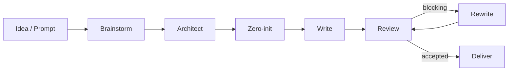
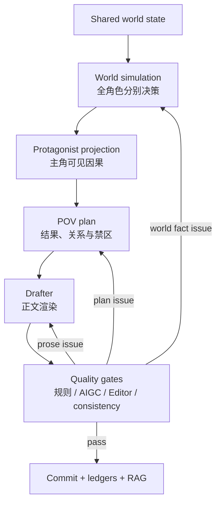

<div align="center">

# novel-studio

**单世界全角色推演驱动的 AI 长篇小说工程**

先让世界与角色作出有理由的决定，再把主角看得见的因果渲染成正文。

[](https://github.com/Xiaoyangy/novel-studio/releases/latest)
[](LICENSE)
[](go.mod)
[](https://github.com/Xiaoyangy/novel-studio/releases/latest)

[快速开始](#快速开始) · [工作流](#工作流) · [质量闭环](#质量闭环) · [进度看板](#进度看板) · [命令速查](#命令速查) · [文档](#文档)

</div>

---

novel-studio 是一个开源、自托管、local-first 的 AI 小说生产系统，面向百万字连载、长篇网文和整书工程化创作。

它不是“把上一段继续写长”的文本生成器。系统会先维护同一个世界中的角色状态、知识边界、资源、关系与独立决策，再将蝴蝶效应投影为主视角章节计划。正文、审核、返工、提交和 RAG 都绑定落盘事实与精确正文 SHA。

> [!IMPORTANT]
> 新书必须先完成 **Architect**，再完成 **zero-init**，之后才允许写正文。默认 pipeline 已固化这条阶段边界，不会让 Writer 临时代办前置设计。

> [!NOTE]
> 根 README 只保留稳定入口。`render_packet v9`、整章同稿门禁、结构返工升级、RAG receipt、可恢复提交与 2026-07 工程验证详见 [当前工程基线](README-20260714.md)。

## 核心能力

| 能力 | novel-studio 如何处理 |
|---|---|
| 单世界全角色推演 | 每个角色依据自己的目标、压力、知识、关系和资源作决定；离屏角色不会围着主角静止等待 |
| 主视角投影 | 完整世界决定留在模拟层，正文只接收主角可见事实、必要结果与人物声口 |
| 规划与渲染分离 | World Simulator、Planner、Drafter、Editor 使用独立角色、工具和上下文 |
| 长篇记忆 | 项目事实、写法资料、对标素材和审核校准分通道路由，支持 BM25、embedding、本地向量与 Qdrant |
| 质量闭环 | 机械规则、本地整章 AIGC、异模型裸正文判断、Editor 和 hard consistency 共同决定是否提交 |
| 断点恢复 | pipeline、章节、review、rewrite、commit 和 RAG 都有持久化状态与 checkpoint |
| 项目隔离 | 每本书拥有独立 prompt、世界、人物、计划、正文、审核、RAG 和交付快照 |
| 可观测性 | 浏览器看板统一展示世界推演、人物状态、章节计划、质量门禁、模型调用和运行错误 |

## 快速开始

### 安装

稳定版本建议从 [GitHub Releases](https://github.com/Xiaoyangy/novel-studio/releases/latest) 安装。

```bash
# macOS / Linux
curl -fsSL https://raw.githubusercontent.com/Xiaoyangy/novel-studio/main/scripts/install.sh | sh

# 从源码构建
git clone https://github.com/Xiaoyangy/novel-studio.git
cd novel-studio
go build -o novel-studio ./cmd/novel-studio
```

Windows 用户可从 [Releases](https://github.com/Xiaoyangy/novel-studio/releases) 下载对应 ZIP，将 `novel-studio.exe` 放入 `PATH`。

### 首次配置

```bash
novel-studio
novel-studio --check
```

配置默认读取 `~/.novel-studio/config.json`；项目目录中的 `./.novel-studio/config.json` 可覆盖全局配置。完整示例见 [config.example.jsonc](config.example.jsonc)。

### 新建一本书

```bash
# 从一句话想法开始：先 brainstorm，再进入正式 pipeline
novel-studio --pipeline --new-novel \
  --prompt "一个返乡青年得到只能投资家乡的系统，从夜市开始重建县城"

# 长期项目建议把完整创作契约放进文件
novel-studio --pipeline --new-novel --prompt-file prompt.md
```

新书默认执行：

```text
brainstorm
    ↓
architect
    ↓
zero-init
    ↓
write → review → rewrite → deliver
```

### 恢复现有项目

```bash
novel-studio --pipeline \
  --dir data/runs/<书名> \
  --prompt-file data/runs/<书名>/prompt.md
```

重复原命令即可按证据恢复。不要手工修改 `progress.json`，也不要在同一本书上同时启动两条写作 pipeline。

## 效果预览


<details>
<summary><strong>展开人物与离屏世界视图</strong></summary>


</details>

## 工作流

### 全书阶段



| 阶段 | 主要产物 | 硬边界 |
|---|---|---|
| `brainstorm` | 市场调研、题材候选、创作方向 | 只做题材与卖点决策，不写正文 |
| `architect` | premise、世界规则、角色体系、卷弧与章节骨架 | foundation readiness 通过后才能 zero-init |
| `zero-init` | 第一章角色动态、关系、资源、对话与写前资产 | readiness 完整通过后才能 write |
| `write` | 世界模拟、POV plan、render packet、draft、commit | 正文只能从冻结计划渲染 |
| `review` | Editor、AI gate、异模型判断、统一报告 | 所有证据绑定同一正文 SHA |
| `rewrite` | rewrite brief、重推演或重规划、替换稿 | 事实问题重推演，表达问题重渲染 |
| `deliver` | 交付检查与快照 | pending、门禁和一致性全部收口 |

### 单章因果链



正文只是主视角 plan 的渲染结果。完整角色决策、隐藏压力和离屏行动留在世界层，不能为了方便推进直接泄漏给主角。

## 质量闭环

每一章在进入正式正文前后都要回答四个问题：

1. **事实对不对**：金额、数量、时间、地点、知识边界、授权和因果顺序是否与正式 plan 一致。
2. **故事好不好看**：目标、阻力、爽点、关系变化、人物声口和章节钩子是否成立。
3. **文字像不像人**：是否存在对白传送带、流程报告、过度解释、同构节奏、客服式系统话术或元数据泄漏。
4. **证据是不是同一稿**：本地门禁、DeepSeek 裸正文、Editor、consistency 和 commit 是否绑定同一个 `body_sha256`。

```text
draft
  ├─ deterministic rules
  ├─ whole-text local AIGC gate
  ├─ independent bare-text judge
  ├─ Editor review
  └─ hard consistency receipt
          ↓
       commit
```

人工平台检测属于可选抽查。用户主动报告的结果必须绑定实际检测正文的 SHA；缺少人工抽查不会阻塞自动生产，旧 SHA 的分数也不会自动继承到新稿。

完整协议见 [外部检测抽查协议](docs/external-detector-protocol.md) 与 [写作审核工作流](docs/writing-review-workflow.md)。

## RAG 与长程记忆

novel-studio 将召回内容分开治理，避免“资料越多，正文越乱”：

| 通道 | 用途 |
|---|---|
| 项目事实 | 世界规则、人物状态、章节事实、资源、关系与伏笔 |
| 写法资料 | 对话、场景、节奏、类型文技巧和方法卡 |
| 对标资料 | 经隔离处理的参考作品拆解与结构样本 |
| 审核校准 | AIGC、可读性、平台反馈和历史修改建议 |

```bash
# 构建或刷新当前项目索引
novel-studio --build-rag --dir data/runs/<书名>/output/novel

# 修复 schema、回放 pending，并验证向量状态
novel-studio --rag-ready --dir data/runs/<书名>/output/novel

# 离线检查 RAG / embedding / vector store 工件
novel-studio eval inspect --cases evals/cases/harness
```

项目事实召回会做来源归一、近重复折叠和多样性选择；返工技法召回会生成可审计 receipt。Planner 必须引用实际命中的来源，Drafter 只接收压缩后的安全方法，不直接看到对标正文。

## 进度看板

```bash
novel-studio service start
novel-studio service status
novel-studio service open
novel-studio service url
```

默认地址：[http://127.0.0.1:8765/](http://127.0.0.1:8765/)

看板只读扫描 `data/runs/`，交叉核对正文、进度、评审、RAG、checkpoint 和运行事件，主要视图包括：

| 视图 | 内容 |
|---|---|
| 总览 | 当前章节、实际工作章、pipeline、RAG、成本与异常 |
| 设定 | premise、世界规则、地点、路线、势力和时间线 |
| 人物 | 档案、目标、压力、知识边界、关系契约和成长轨迹 |
| 计划 | 卷弧、章节 plan、伏笔和后续窗口 |
| 离屏世界 | 世界 tick、角色独立行动、社会情绪与信息传播 |
| 质量 | 逐章 review、AIGC、版本新鲜度和返工状态 |
| 运行 | 模型、reasoning effort、事件队列、错误和日志 |

## 命令速查

### 日常操作

| 命令 | 用途 |
|---|---|
| `novel-studio --pipeline --prompt-file prompt.md` | 运行或恢复默认完整 pipeline |
| `novel-studio --pipeline --new-novel --prompt "..."` | 从新题材开始一本书 |
| `novel-studio --check` | 检查 provider、model 和 fallback |
| `novel-studio --diag` | 只读诊断当前项目 |
| `novel-studio --steer "指令"` | 为下一次恢复排队用户干预 |
| `novel-studio list` | 列出 `data/runs/` 下的书目 |
| `novel-studio reader-metrics log ...` | 登记真实读者反馈 |

### 窄范围维护

```bash
# 只重建第 N 章当前正文的 review 证据
novel-studio --pipeline --dir data/runs/<书名> \
  --stages review --restart --from <N> --to <N>

# 首次明确授权：复用现有 plan，整章重新渲染
novel-studio --pipeline --dir data/runs/<书名> \
  --stages rewrite --restart --force-rerender \
  --from <N> --to <N> --max-rewrite-rounds 3

# 已有 pending 时从队首原位恢复，不跳章
novel-studio --pipeline --dir data/runs/<书名> \
  --stages rewrite --from <队首N> --to <目标N>
```

`--force-rerender` 只用于首次显式授权，不会清空世界事实或结构失败历史。若连续替换稿仍命中结构问题，pipeline 会使旧 plan 失效，并按缺口返回重规划或重推演。

完整参数以本机二进制为准：

```bash
novel-studio --help
novel-studio --pipeline --help
novel-studio service --help
novel-studio skills --help
```

## 输出结构

```text
data/runs/<书名>/
├── prompt.md
├── brainstorm.md
└── output/novel/
    ├── premise.md
    ├── characters.json
    ├── outline.json
    ├── layered_outline.json
    ├── world_rules.json
    ├── chapters/                  # 已提交正文
    ├── drafts/                    # 世界投影、plan、草稿和 partial
    ├── reviews/                   # Editor、AI gate、裸正文判断和统一报告
    ├── summaries/
    └── meta/
        ├── progress.json
        ├── pipeline.json
        ├── checkpoints.jsonl
        ├── architect_readiness.*
        ├── first_chapter_generation_readiness.*
        ├── chapter_simulations/
        ├── character_stage/
        ├── rag/
        └── delivery_snapshots/
```

项目真相以这些落盘工件为准，不以聊天历史或单个进度数字为准。

## 配置与模型

novel-studio 支持 OpenAI、Anthropic、Gemini、OpenRouter、DeepSeek、Qwen、GLM、Grok、MiniMax、Ollama、Bedrock、兼容代理，以及本机 Codex CLI。

常用配置：

| 配置 | 作用 |
|---|---|
| `providers` | API 凭证、协议、base URL、模型和附加参数 |
| `roles` | Coordinator、Architect、Writer、Drafter、Editor、Reviewer 的模型与 effort |
| `context_window` | 模型真实上下文窗口与压缩依据 |
| `rag.embedding` | 远程 embedding 或本地 GGUF embedding |
| `rag.qdrant` | Qdrant 地址、collection 和自动启动方式 |
| `budget` | 单书成本告警与硬停止 |
| `notify` | 桌面或自定义通知 |

是否完全离线取决于所选 provider。不要提交真实 API key。

## Skills

`skills/` 是可导出能力的唯一源目录。Skill 用于整理输入、写法与审核约束；任何能生成正文的任务最终都应回到 `novel-studio --pipeline`。

```bash
novel-studio skills list
novel-studio skills export --to ./exported-skills
python3 scripts/validate_skill_context.py
```

## 开发与验证

要求 Go 1.25；看板使用 Python 3；embedding 与 Qdrant 按配置启用。

```bash
go test -count=1 ./...
go vet ./...
go build -o /tmp/novel-studio ./cmd/novel-studio

python3 scripts/validate_skill_context.py
python3 -m unittest discover -s quality/audit/scripts -p 'test_*.py' -v
python3 -m unittest services.dashboard.test_server -v

git diff --check
```

## 文档

| 文档 | 内容 |
|---|---|
| [当前工程基线](README-20260714.md) | render packet、同稿门禁、结构升级、RAG receipt 与验证记录 |
| [系统架构](docs/architecture.md) | Host、Agent、Tools、Store 和上下文拓扑 |
| [项目结构](docs/project-structure.md) | 顶层目录与资料归属 |
| [设计阶段工作流](docs/design-stage-workflow.md) | Architect、zero-init 与写前设计 |
| [上下文管理](docs/context-management.md) | 阶段化压缩、收据与恢复包 |
| [数据生命周期](docs/data-lifecycle-and-progression.md) | 章节、角色、世界和推进台账 |
| [写作审核工作流](docs/writing-review-workflow.md) | draft、review、rewrite、commit 与 deliver |
| [外部检测协议](docs/external-detector-protocol.md) | 用户抽查、精确 SHA 登记与生产边界 |
| [评测系统](docs/evaluation-system.md) | Harness、指标与回归 |
| [可观测性](docs/observability.md) | 事件、usage、trace 和诊断 |
| [架构总览 HTML](docs/architecture-overview.html) | 浏览器可视化架构说明 |

## Release

```bash
novel-studio --version
novel-studio update
novel-studio update <version>
```

长任务运行中不要替换二进制。等待当前 checkpoint 落盘并退出，升级后先执行 `novel-studio --check`，再从原项目目录恢复。

## License

[Apache License 2.0](LICENSE)

问题与建议请提交到 [GitHub Issues](https://github.com/Xiaoyangy/novel-studio/issues)。
