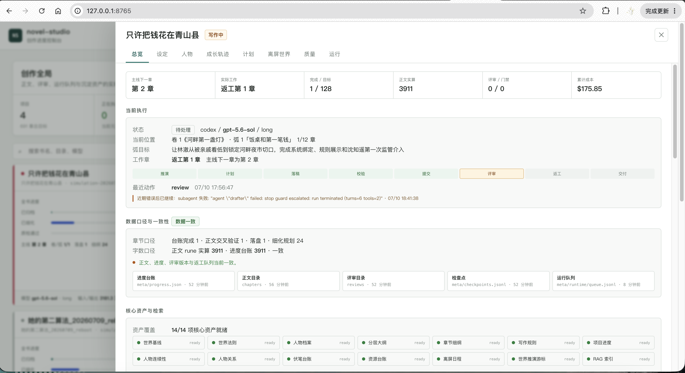
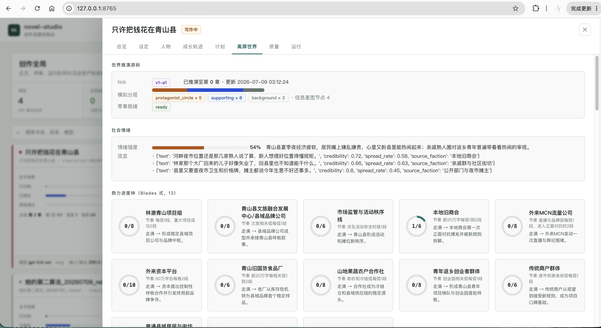
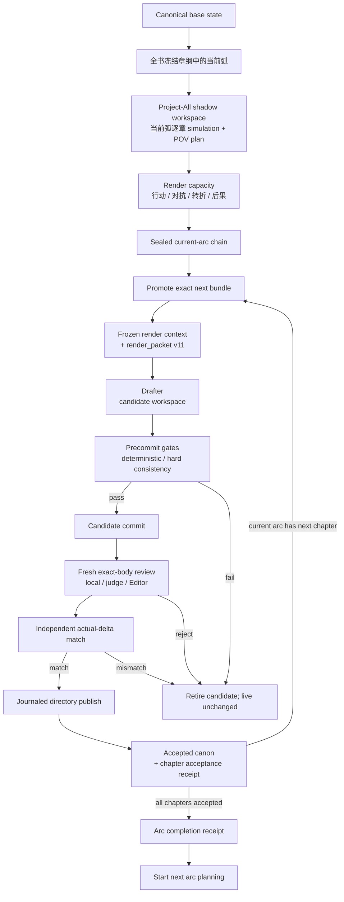

<div align="center">

# novel-studio

**单世界全角色推演驱动的 AI 长篇小说工程**

先让世界与角色作出有理由的决定，再把主角看得见的因果渲染成正文。

[](https://github.com/Xiaoyangy/novel-studio/releases/latest)
[](LICENSE)
[](go.mod)
[](https://github.com/Xiaoyangy/novel-studio/releases/latest)

[快速开始](#快速开始) · [工作流](#工作流) · [质量闭环](#质量闭环) · [进度看板](#进度看板) · [命令速查](#命令速查) · [文档](#文档)

</div>

---

novel-studio 是一个开源、自托管、local-first 的 AI 小说生产系统，面向百万字连载、长篇网文和整书工程化创作。

它不是“把上一段继续写长”的文本生成器。系统会先维护同一个世界中的角色状态、知识边界、资源、关系与独立决策，再将蝴蝶效应投影为主视角章节计划。正文、审核、返工、提交和 RAG 都绑定落盘事实与精确正文 SHA。

> [!IMPORTANT]
> 新书必须先完成 **Architect**，再完成 **zero-init**，之后才允许写正文。默认 pipeline 已固化这条阶段边界，不会让 Writer 临时代办前置设计。

> [!NOTE]
> 本页是当前 `main` 的合并参考。[README-20260714.md](README-20260714.md) 只保存 2026-07-14 当时的历史基线，其中的 `render_packet v9` 等旧描述不能代替当前行为。

## 核心能力

| 能力 | novel-studio 如何处理 |
|---|---|
| 单世界全角色推演 | 每个角色依据自己的目标、压力、知识、关系和资源作决定；离屏角色不会围着主角静止等待 |
| 主视角投影 | 完整世界决定留在模拟层，正文只接收主角可见事实、必要结果与人物声口 |
| 规划与渲染分离 | 全书章纲先冻结；此后每次只对当前一弧完成 `preplan → project-all → seal`，再按章 `promote → render → exact-body review`，弧内全章验收后才进入下一弧 |
| 长篇记忆 | 项目事实、写法资料、对标素材和审核校准分通道路由，支持 BM25、embedding、本地向量与 Qdrant |
| 质量闭环 | 机械规则、本地整章 AIGC、异模型裸正文判断、Editor 和 hard consistency 共同决定候选正文能否最终验收与交付 |
| 断点恢复 | pipeline、章节、review、rewrite、commit 和 RAG 都有持久化状态与 checkpoint |
| 项目隔离 | 每本书拥有独立 prompt、世界、人物、计划、正文、审核、RAG 和交付快照 |
| 可观测性 | 浏览器看板统一展示世界推演、人物状态、章节计划、质量门禁、模型调用和运行错误 |

## 当前规划—渲染边界

默认 pipeline 先冻结全书章纲，再以“一弧一弧”为唯一生产单元。`project-all` 是为兼容保留的 CLI 阶段名，在当前模式中它的边界是“当前整弧”，不是“从现在到全书末章”：

```text
全书章纲冻结
        ↓
当前弧 preplan → project-all → 承载力校验 → seal
                                                  ↓
                              第 1 章 promote → render → 单章审核
                              第 2 章 promote → render → 单章审核
                                                  …
                              弧内全章回执齐全 → 下一弧
```

当前弧的规划与承载力校验必须完整结束，该弧正文才有入口：

| 阶段 | 当前能力 | 硬边界 |
|---|---|---|
| `outline-all` / Architect | 固定全书卷、弧、章位与基础因果骨架 | 这是全书导航图，不是各章正式 plan，不能直接渲染 |
| `preplan` | 以已冻结的全书章纲和当前已验收正史为基准，定位当前弧边界、目标与承接义务 | 只能从弧起点或已验证的恢复点进入；不能跨过未完成的上一弧 |
| `project-all` | 分别冻结正史基线、foundation 和本地 RAG snapshot，在隔离工作区一次推演当前弧的全部章节；逐章建立 world simulation、角色选择、POV 信息边界、跨章义务、projected delta、正式 plan 与 render capacity；上一章发布明确后果 ID/文本，下一章必须逐字承接并由具体 causal beat 消费 | 不写正文、不推进 live progress、不连接 live RAG、不调用 Drafter；弧内任一章缺失或相邻章只是表面相关都不能 seal |
| 承载力校验 | 每章 plan 必须靠事件、行动、对抗、转折与后果自然支撑 `2000–3300` 中文字 | 禁止靠重复解释、同义复述、空对话或景物填充凑字数；承载力不足必须返回规划层 |
| `seal` | 校验当前弧的章节连续性、前后状态根、obligation registry、capacity、RAG fact receipt、simulation 身份、render context 和 digest chain，并发布不可变弧规划 | building generation 不可提升；sealed arc 不允许原地修改 |
| `promote` | 只将 realization cursor 指向的下一章机械安装为 live frozen plan，并写 exact promotion receipt | 不调用模型、不重新规划、不跳章；实际前态必须等于 projected 前态 |
| `render` | 只消费已封存的当前章 plan 与 draft context；候选正文完成 commit、fresh exact-body review 和 actual-delta 匹配后才原子替换 live，并产生章级不可变验收回执 | 审核始终按章、绑定该章最终 exact body SHA；禁止 live RAG、临时召回、重规划和重推演 |
| 弧完成 | 聚合弧内每章的 acceptance/outcome 回执，校验无缺章、无跳章、无 SHA 漂移后写入 arc completion receipt | 这是完整性检查，不是“弧级正文审核”；回执不齐不得进入下一弧 |

`project-all` 不是循环调用旧 `plan`，也不是一次性计算全书剩余章节。它使用独立 projected store、projection cursor 和 realization cursor，把当前弧作为一个联合因果窗口；弧内每章 bundle 都绑定前一章 digest、结构化前后状态与显式 `arc_transition_contract`。非弧首章必须逐字复制上一章的 outgoing consequence ID/文本，且 `consumed_by_cause` 必须精确等于本章某个 `causal_beats[].cause`；系统不再用 `goal`、`hook` 或相似措辞替规划者伪造因果连接。`seal` 之前没有正文，`seal` 之后当前弧规划不可变。

`source_snapshot.json` 分开保存 `base_canon_root`、`foundation_snapshot_root` 与 `rag_snapshot_root`。正史根回答“哪些结果已经真实发生”，foundation 根覆盖项目设定、人物与规划可读台账，本地 RAG 根只覆盖初始化时复制的检索工件；三者共同参与 generation 身份，但不会互相冒充。shadow 内后来增长的 projected ledger 或召回结果也不会反向改写这些基线根。

新鲜的 project-all 角色决定必须经过服务端生成的
`project-all-grounded-authority.v1` 回执。模型不能提交或伪造这份回执；它精确绑定
generation、上一章 projected context/state、foundation 输入、初始或连续态、当前章大纲、
被授权角色的真实决定、已消费的 context-access receipt 和当前 phase lock。工具先从已验证
的 `project_all_state` 固定 `generation_id`，再封存 authority receipt，最后才计算
`simulation_id`；bundle 不会在 ID 生成后偷偷改写 simulation 的 generation。

当正史基线为第 0 章时，第一投影章可以使用 zero-init 的角色种子；第二投影章起，以已提交
到 building chain 的 projected continuity、前章 world delta 和累计 state changes 为准。
zero-init 只允许作为“该角色此前从未产生连续态”的首次入场回退；只要该角色已有真实连续态
记录，即使记录不完整，也不能退回零章种子覆盖它。缺少权限的离屏角色可生成
`hold_baseline` 控制记录，但这类记录是“没有获准改变”的证明，不是剧情事件，永远不会写成
projected state delta。

`project_all_grounded` 只允许 `rewrite_source_absent=true` 的新推演，不能把返工章包装成
“新决定”来放松约束。真正的返工继续使用 exact rewrite source、`preserve_facts`、知识锁
和正文 SHA 的严格合同；sealed 模式下已有返工则按显式 restart/rebase 边界处理。

只要一次 pipeline 请求包含 `project-all`，系统就会在执行该阶段之前持久化 `sealed_two_pass_v2`。即使随后推演失败或进程退出，旧 `plan/write/rewrite` 和未封存 frozen plan 也不能绕回正文路径；兼容单章路径只适用于尚未启用该模式的旧项目。

渲染与审核仍严格逐章进行。当前章通过后只机械提升当前弧的下一份 sealed bundle；不会为这一章或整弧重做正文质量判定。若正文实现不了封存的事实变化，候选会被隔离并保留诊断；弧内任一章未通过，下一弧都不会开始。

每个 bundle 的伏笔 hard-change，以及资源、关系、知识中 POV 可见的 hard-change，必须与该章 `projected_delta` 精确同集；缺项和凭空增加项都会在 seal 前失败。`MustPreserve`、`RevealBudget`、POV unknown 与正文可见证据还会在 promote/render 边界继续复核。

崩溃恢复覆盖 project-all 的 registry/bundle/generation/cursor 多文件推进、seal/activation、promotion、候选目录发布和 outcome/cursor 写入。目录发布使用 `live → archive`、`candidate → live` 的 journaled transaction；进程在任一 rename 窗口退出，下一次 render 会在加载项目文件前完成恢复。PID 绑定的 phase execution lock 同时阻止另一进程借用当前 planning/render 能力。

完整数据合同见 [Project-All 架构规范](docs/project-all-architecture.md)。

### 青山县迁移输入与抽查基线

以下只记录 2026-07-16 架构迁移时使用的样本输入与旧稿抽查证据，不是实时执行进度，也不表示
128 章已经完成 project-all、seal 或 render：

| 项目 | 迁移时含义 |
|---|---|
| 稳定章位 | 128 |
| 迁移前正史样本 | 当时已有 1—3 章；受控全书 rebase 后应以新 generation 的实际 source snapshot 为准 |
| 迁移前未来范围 | 当时为 125 章（4—128）；全书 rebase 后目标范围会变为 1—128 |
| 旧 preplan 粒度 | 详细 21 章、粗槽 104 章；两者都只是待推演输入，不能计作 formal bundle |
| 第一章人工抽查 | 旧候选 SHA `c2c1c362…` 的用户报告值为 `0.82`，只否决该精确字节版本 |
| 第二章人工抽查 | 旧正式稿 SHA `b798734c…` 的用户报告值为 `0.83`，只否决该精确字节版本 |

替换稿取得新 SHA 后不继承旧分数，也不等待用户逐章复测；人工外部检测保持可选抽查，缺失或未知不会阻塞自动生产。系统与助手不调用或操作人工检测网页。

### 2026-07-16 主干升级摘要

- 新增 `ProjectedStoreV2`、正式 chapter bundle、obligation registry、projection/realization 双 cursor、immutable seal、promotion/outcome/lifecycle receipts。
- 将兼容阶段名 `project-all` 收紧为“当前弧全量推演”：全书章纲先冻结，然后每弧逐章物化完整世界推演、POV plan 和承载力合同，弧内全部完成后才能 seal。
- project-all source snapshot 分开绑定 canon、foundation 与本地 RAG；shadow 可读初始化时的检索副本，但不连接 live Qdrant，也不会把 projected 写入折回正史基线。
- 新增服务端 `project_all_grounded` authority receipt：绑定 generation/context/input/角色决定和 phase access；generation 先固定，再生成 simulation ID，任何身份漂移都 fail closed。
- 第二投影章起以逐角色 projected continuity 为权威；zero-init 只为从未出现过连续态的角色提供首次入场回退，`hold_baseline` 控制 no-op 不进入 state delta。
- 正文上下文升级到冻结 `render_packet v11`：保留 hard contract、事实锚点、人物声口与有来源的 craft methods；raw RAG、隐藏世界状态和检测指标不进入正文会话。
- render 改为候选目录生产：Drafter、commit、DeepSeek/Editor exact-body review、actual-delta 匹配都在副本内完成，通过后才原子发布。
- 新增多文件 project-all intent journal 与目录发布 transaction；覆盖 bundle/cursor 六个写入窗口、live archive/candidate promote 四个窗口、跨进程锁、幂等恢复和内容篡改检测。
- outline-all 的最后一条模型消息由宿主从唯一 `OUTLINE_ALL_INTENT` 重新生成，只包含本次 operation/type/volume/arc/span；即使前文含有大量旧弧，模型也不能把历史目标当成当前授权，原有候选与 operation receipt 可原样断点续跑。
- `ArcPlanningManifest` 额外封存章级字数区间与来源 `user_rules` 摘要；每份 chapter acceptance 记录并复算最终正文 Unicode rune 数，弧完成重放也会再次校验。已经被 acceptance 绑定的章级审核文件禁止被 standalone review 覆盖。
- 新增 `--rebase-all-chapters`：旧正史先做 exact-root 归档，再通过可恢复目录交换回到第 0 章；rebase 候选立即锁定 `sealed_two_pass_v2`，避免中断后退回旧写作路径。
- execution lock 增加当前进程身份和 foundation 工具白名单；planning、render、context receipt、hidden-state commit control 都不能借用另一进程的锁。
- promote 会先隔离目标章遗留 draft/parts；render 拒绝未封存 steer、实时 RAG、完整幕后状态和 compatibility frozen plan。伏笔 hard-change 与 POV 可见的资源/关系/知识变化必须和 projected delta 精确绑定，`MustPreserve`、`RevealBudget` 与 POV unknown 也由服务端复核。
- 规划与渲染使用不同输入摘要：Editor/Reviewer/Drafter 改动不会无谓作废已封存弧规划，Writer/Planner 或 Drafter 自身漂移仍会准确阻断对应阶段。
- 人工外部检测明确降为 SHA 绑定的可选抽查：用户报告只否决那一版正文，不形成逐章复测义务，也不授权系统操作检测网页。

### 2026-07-17 续跑稳定性修复

- `outline-all` 的单次 operation 最多执行四轮；每次 `save_foundation` 被拒后，下一轮最后一条 user 消息都会重新附上同一份精确授权与宿主原始错误，防止长上下文重试时漂移到其他卷弧。上限与回锚只属于运行时传输，不改变既有候选的 protocol digest，可从原 operation receipt 继续。
- 章纲占位符检查改为语义化处理：`占位`、`占位内容`、`此处占位` 等元写作壳仍会 fail closed；长而具体的经营事件中出现“拆单占位”“仓位占位”等正常叙事词不再被误杀。其他 `TODO`、`待细化`、`继续推进` 等空泛片段继续严格拦截。
- 指南针回收的逐弧保存、自动 `revise_arc` 定位与全书终局校验现在共用同一个确定性证据谓词：章级 ref 必须逐字段一致、落在冻结的全局章位且只出现一次，对应 `planned_resolution` 的行动者、行动与终态必须在该章 `core_event/scenes` 中形成跨首中尾的具体语义证据。自然改写可以通过；裸 ref、空泛“事情解决”以及带常见显式否定、方案引用、未采纳或未来态框架的字面复制不能冒充兑现。缺口会在目标弧内即时返工，不再等全书展开完才报错；它也不替代后续逐章推演、逐章渲染和 exact-body 审核。
- Project-Arc 的 world simulation 不再把一次 20-turn 会话当成唯一成败边界：每次成功工具调用继续落到同一 non-canon partial；会话预算耗尽后，宿主读取精确 gaps，用最多三次有界 fresh session 续接，恢复会话缩短到最多 6 turns。若最后一轮刚好补齐字段却没来得及 finalize，宿主会用当前 execution lease 刷新 `novel_context` access receipt 并原子收口，不要求人工重跑，也不复用旧 PID 的 token。
- `project_all_grounded` 主角只对 `protagonist_projection.chosen_decision` 做服务端精确绑定；options 和 reason 仍由模型按最终决定时点的可用选项与可见证据编写，再经知识边界、新奇事实和因果锚点校验，防止已失败或后见动作被固化成当前选项。任何显式提交的残缺 projection 都在落盘前原子拒绝，不再覆盖可恢复 partial；若所有有界会话仍不能收口，错误会同时报告剩余 gaps、agent error 与 host-finalize error。
- `blocking=true` 的 hold-baseline/rewrite-only 角色合同改由宿主在模型会话前按 8 名一批确定性物化，不消耗模型轮次，也不生成 grounded 决定或自动 finalize。Project-All generation identity 同时纳入 Simulator/Planner 实际可见的工具 description、schema 与逐角色 authority policy 摘要；选项语义、必填字段、权限规则或工具合同变化会正式生成新 generation，不会静默续用旧 partial。grounded 角色的 `location` 必须是 32 字以内、无句子标点的空间锚点，`decision/action` 不得复制 `current_goal`，`decision_reason` 与其余投影必须由至少两个当前因果锚点支持并禁止后见信息；模型可见政策与服务端校验现在保持同一合同。

## 快速开始

### 安装

稳定版本建议从 [GitHub Releases](https://github.com/Xiaoyangy/novel-studio/releases/latest) 安装。

```bash
# macOS / Linux
curl -fsSL https://raw.githubusercontent.com/Xiaoyangy/novel-studio/main/scripts/install.sh | sh

# 从源码构建
git clone https://github.com/Xiaoyangy/novel-studio.git
cd novel-studio
go build -o novel-studio ./cmd/novel-studio
```

Windows 用户可从 [Releases](https://github.com/Xiaoyangy/novel-studio/releases) 下载对应 ZIP，将 `novel-studio.exe` 放入 `PATH`。

### 首次配置

```bash
novel-studio
novel-studio --check
```

配置默认读取 `~/.novel-studio/config.json`；项目目录中的 `./.novel-studio/config.json` 可覆盖全局配置。完整示例见 [config.example.jsonc](config.example.jsonc)。

### 新建一本书

```bash
# 从一句话想法开始：先 brainstorm，再进入正式 pipeline
novel-studio --pipeline --new-novel \
  --prompt "一个返乡青年得到只能投资家乡的系统，从夜市开始重建县城"

# 长期项目建议把完整创作契约放进文件
novel-studio --pipeline --new-novel --prompt-file prompt.md
```

新书默认执行：

```text
brainstorm
    ↓
architect
    ↓
zero-init
    ↓
全书章纲冻结
    ↓
当前弧 preplan → project-all → capacity → seal
                                            ↓
                             逐章 promote → render → review
                                            ↓
                                  弧回执齐全 → 下一弧
```

### 恢复现有项目

```bash
novel-studio --pipeline \
  --dir data/runs/<书名> \
  --prompt-file data/runs/<书名>/prompt.md
```

重复原命令即可按证据恢复。不要手工修改 `progress.json`，也不要在同一本书上同时启动两条写作 pipeline。

## 效果预览



<details>
<summary><strong>展开人物与离屏世界视图</strong></summary>




</details>

## 工作流

### 全书定位、按弧生产

```mermaid
flowchart LR
    IDEA["Idea / Prompt"] --> BS["Brainstorm"]
    BS --> AR["Architect"]
    AR --> ZI["Zero-init"]
    ZI --> OA["冻结全书章纲"]
    OA --> PP["当前弧 Preplan"]
    PP --> PA["Project-All<br/>当前弧全量推演"]
    PA --> CP["逐章承载力校验<br/>2000–3300 字"]
    CP --> SE["Seal 当前弧"]
    SE --> PR["Promote 下一章"]
    PR --> RE["Render 候选"]
    RE --> RV["Exact-body review<br/>+ actual-delta match"]
    RV -->|accepted 且本弧仍有下一章| PR
    RV -->|candidate rejected| RE
    RV -->|弧内全章逐章通过| ACR["Arc completion receipt"]
    ACR -->|尚有下一弧| PP
    ACR -->|全书完成| DL["Deliver"]
```



| 阶段 | 主要产物 | 硬边界 |
|---|---|---|
| `brainstorm` | 市场调研、题材候选、创作方向 | 只做题材与卖点决策，不写正文 |
| `architect` / `outline-all` | premise、世界规则、角色体系以及冻结的全书卷—弧—章骨架 | 全书章位不完整不能启动弧生产 |
| `zero-init` | 第一章角色动态、关系、资源、对话与写前资产 | readiness 完整通过后才能进入 preplan/project-all |
| `preplan` | 当前弧范围、弧目标、弧内章位与上一弧承接 | 不能跨过未完成的上一弧，不能渲染 |
| `project-all` | 当前弧全部章节的正式 world simulation、POV plan、delta、capacity 与 render context | 必须完成弧内整条连续链，且不写正文 |
| `seal` | 当前弧的不可变 generation、arc manifest、obligation registry | 弧内 plan 或承载力缺失时禁止 promote/render |
| `promote` | 下一章 exact bundle、promotion receipt、live frozen plan | 不调用模型，不跳章 |
| `render` | 隔离候选正文、commit、当前章 exact-body 审核、实际状态回执 | accept 前不替换 live，不推进 realization cursor；不用弧级正文审核代替章级审核 |
| 弧完成 | 弧内全部章级 acceptance receipts 与 arc completion receipt | 任一章未通过、缺回执或正文 SHA 漂移都不能进入下一弧 |
| `deliver` | 交付检查与快照 | pending、门禁和一致性全部收口 |

### 单章因果链



正文只是主视角 plan 的渲染结果。完整角色决策、隐藏压力和离屏行动留在世界层，不能为了方便推进直接泄漏给主角。弧规划解决的是跨章因果完整性；正文质量仍由每一章自己的 final exact body 审核决定。

### 拆分阶段命令

`--dir` 指向书目运行目录，不是 `output/novel`。`preplan`、`project-all` 和 `seal` 都是当前弧阶段，弧边界由已冻结的全书章纲与当前正史决定，通常不要传 `--from/--to`。
`--restart` 只用于显式开启 successor generation；同一 building generation 的中断续跑必须去掉它，否则会旋转 attempt nonce 并放弃本可安全恢复的 partial。若模型可见协议或工具合同真的变化，新 protocol digest 会自动建立新 generation，也不需要额外传 `--restart`。

```bash
PROJECT='data/runs/你的书名'

# 1. 完成当前弧全部章节的正式推演、承载力校验与封存；不写正文
novel-studio --pipeline --dir "$PROJECT" \
  --stages preplan,project-all,seal --restart

# 2. 封存后每次只提升、渲染并审核当前弧的下一章；不用填章号
novel-studio --pipeline --dir "$PROJECT" \
  --stages preplan,project-all,seal,promote,render
```

第二条命令首次执行时会复核并跳过当前弧已完成的 `preplan/project-all/seal`，只运行本章 `promote/render`。本章 accepted 后，pipeline 只推进到当前弧的下一份 immutable bundle。到达弧末时，它必须先验证弧内所有章级 acceptance receipts 并写入 arc completion receipt，才会解锁下一弧的 `preplan/project-all`。

也可以从一开始使用完整阶段列表。执行顺序仍保证当前弧 `project-all` 全部完成、承载力通过且 `seal` 成功后，才会写该弧第一章候选正文：

```bash
novel-studio --pipeline --dir "$PROJECT" \
  --stages preplan,project-all,seal,promote,render --restart
```

一轮只验收一个正文章。跨进程执行锁、ProjectedStore CAS 和目录发布 journal 共同阻止并发双提升；恢复时会验证 arc/generation、bundle、promotion、正文 SHA、commit checkpoint、本章 review、actual outcome 和 cursor，已经提交的同稿不会重复生成。

若当前未验收 promotion 的 plan 必须改变，显式从当前已验收正史重建当前弧的 successor generation；不得原地修改 sealed bundle：

```bash
novel-studio --pipeline --dir "$PROJECT" \
  --stages preplan,project-all,seal,promote,render --restart
```

旧 `preplan → plan → render` 只为尚未启用 `sealed_two_pass_v2` 的旧项目保留兼容读取/运行能力。默认长篇路径已经是 `preplan → project-all → seal → promote → render`；模式一旦落盘，同一项目不能再调用旧 `plan/write/rewrite` 绕过 sealed generation。

### 把已有正文纳入新的按弧生产基线

若项目已经写了第 1—N 章，而这些章节也必须重新纳入生产基线，使用受控全书 rebase。它先保留旧工程的逐字节归档，再把活动正史回到第 0 章，确认全书章纲后只推演和封存第一弧；后续仍遵循“渲染一弧、弧内逐章验收、再进下一弧”：

```bash
novel-studio --pipeline --dir "$PROJECT" \
  --rebase-all-chapters \
  --stages architect,zero-init,preplan,project-all,seal \
  --restart
```

该开关是显式破坏性边界，不会由普通 render 或返工自动触发。rebase 会先拒绝仍有活动 execution lock 的项目，再计算 live content root、复制整棵旧工程并验证 archive root 完全相同，最后才准备 chapter-zero 候选。

旧工程保存在 `data/runs/<书名>/archives/sealed-rebase-*/output/novel/`。目录交换由 `.canon-rebase-publish/` journal 管理；即使进程停在 `intent_written`、`live_archived`、`candidate_promoted` 或 `receipt_written`，下次启动也会在加载项目文件前恢复并 finalize。

chapter-zero 候选在目录交换前就持久化 `sealed_two_pass_v2`，因此即使交换后立刻崩溃也不会退回旧写作路径。此后旧 `plan/write/rewrite`、未封存 `--steer`、跨进程借锁和旧草稿回读均被拒绝；目标章遗留 draft、parts、manual/candidate/hard-consistency/rerender 文件会在 promote 时移动到 `meta/quarantine/sealed_promotion/`，不会进入正文会话。

## 质量闭环

每一章在进入正式正文前后都要回答四个问题：

1. **事实对不对**：金额、数量、时间、地点、知识边界、授权和因果顺序是否与正式 plan 一致。
2. **故事好不好看**：目标、阻力、爽点、关系变化、人物声口和章节钩子是否成立。
3. **文字像不像人**：是否存在对白传送带、流程报告、过度解释、同构节奏、客服式系统话术或元数据泄漏。
4. **证据是不是同一稿**：本地门禁、DeepSeek 裸正文、Editor、consistency 和 commit 是否绑定同一个 `body_sha256`。

```text
draft
  ├─ deterministic / local hard gates
  └─ hard consistency receipt
          ↓
   candidate commit
          ↓
 fresh exact-body review
  ├─ whole-text local AIGC
  ├─ independent bare-text judge
  └─ Editor
          ↓
 independent actual-delta match
          ↓
 journaled publish / retire candidate
```

审核单位始终是“章”：每章渲染结束后，审核必须绑定该章最终 exact body SHA，该章通过后才能产生 chapter acceptance receipt。弧完成阶段只核对这些章级回执的完整性，不将整弧合并成一段重做正文审核。

朱雀等人工平台检测仅属于用户可选抽查。系统不会调用、提交或操作朱雀；用户主动报告的结果必须绑定实际检测正文的 SHA。缺少抽查或分数未知不会阻塞自动生产，旧 SHA 的分数也不会自动继承到新稿。

完整协议见 [外部检测抽查协议](docs/external-detector-protocol.md) 与 [写作审核工作流](docs/writing-review-workflow.md)。

### render_packet v11

正文模型只接收版本化、可审计的最小渲染合同：

- 完整保留当前章的强制结果、事实约束、连续性、知识与授权边界、禁行项，以及与现场对白相关的人物声口；
- 保留有限的软候选节拍、揭示预算、压缩建议和翻页问题，让正文仍有可写空间；
- 只注入已转换的 `fact_anchors` 与带 receipt 的 `craft_methods`，不暴露 raw hits、召回摘要、隐藏世界推演、主角不可见信息或反 AIGC 指标；
- 正式 plan receipt 是事实权威；render packet 是正文执行视图，不能反向改写 plan；
- project-all 会为当前弧每章封存完整 prose-facing `novel_context(profile=draft)` 与 render capacity；promote 只把该弧下一份精确 payload 发布到 `meta/planning/current_render_context.json`，render 不再现场重建上下文；
- 正文生成前会复核 arc/generation、bundle、promotion、plan digest/checkpoint、世界模拟 checkpoint、正史章节 SHA，以及 `meta/user_rules.json`、`meta/writing_assets.json`、`meta/style_rules.json` 和 Drafter 模型/prompt 的阶段专属摘要。Editor/Reviewer 的变化不会作废已封存弧规划；若 candidate commit 已经落盘，崩溃恢复只按当时消费的冻结快照补本章 exact-body review/receipt，不因之后 live 文件变化重写正文；
- render-only 连续触发结构性失败后立即停止，不会在渲染锁内偷偷回退到 Planner 或 World Simulator。

## RAG 与长程记忆

novel-studio 将召回内容分开治理，避免“资料越多，正文越乱”：

| 通道 | 用途 |
|---|---|
| 项目事实 | 世界规则、人物状态、章节事实、资源、关系与伏笔 |
| 写法资料 | 对话、场景、节奏、类型文技巧和方法卡 |
| 对标资料 | 经隔离处理的参考作品拆解与结构样本 |
| 审核校准 | AIGC、可读性、平台反馈和历史修改建议 |

每弧推演启动时会单独计算 `rag_snapshot_root`，并把本地 index/vector 工件复制进当前
arc generation 的隔离工作区；`foundation_snapshot_root` 和 `base_canon_root` 仍各自独立。
project-all 只在当前弧规划快照中使用这份冻结检索输入，逐章命中再以 fact/craft receipt 进入 bundle。
render 不启动 live RAG、embedding 或 Qdrant，不现场调用 `craft_recall`；它只读取规划阶段已转化、有回执、已封存的最小渲染输入。

```bash
# 构建或刷新当前项目索引
novel-studio --build-rag --dir data/runs/<书名>/output/novel

# 修复 schema、回放 pending，并验证向量状态
novel-studio --rag-ready --dir data/runs/<书名>/output/novel

# 离线检查 RAG / embedding / vector store 工件
novel-studio eval inspect --cases evals/cases/harness
```

项目事实召回会做来源归一、近重复折叠和多样性选择；返工技法召回会生成可审计 receipt。当前正文通路是：

```text
exact RAG hit refs
        ↓
content-addressed fact / craft receipts
        ↓
Planner 针对当前章转换
        ↓
render_packet v11.fact_anchors / craft_methods
        ↓
冻结渲染
```

只“挂上 receipt”不算真正使用 RAG：非空 fact receipt 必须在正式 plan 中消费实际命中的精确 ref，并转换成当前场景可见的外部事实、现实锚点或写法方法；否则 plan 不能进入冻结 render。Drafter 看不到 raw RAG，正文上下文中的 `rag_recall`、raw hits 和嵌套召回摘要会被递归剥离，冻结 render 也不能临时调用 `craft_recall` 或启动 embedding/Qdrant。

当前机制能机械证明 `exact ref → plan transformation → frozen render packet` 的可追溯注入；金额、数量等部分硬事实还能在正文层核对。软 `fact_anchor` 或 `craft_method` 是否在最终文字中产生了语义作用，目前不能逐项机械证明，因此它们仍是有来源的候选素材，不应被描述成每项都已被正文使用。

## 进度看板

```bash
novel-studio service start
novel-studio service status
novel-studio service open
novel-studio service url
```

默认地址：[http://127.0.0.1:8765/](http://127.0.0.1:8765/)

看板只读扫描 `data/runs/`，交叉核对正文、进度、评审、RAG、checkpoint 和运行事件，主要视图包括：

| 视图 | 内容 |
|---|---|
| 总览 | 当前章节、实际工作章、pipeline、RAG、成本与异常 |
| 设定 | premise、世界规则、地点、路线、势力和时间线 |
| 人物 | 档案、目标、压力、知识边界、关系契约和成长轨迹 |
| 计划 | 卷弧、章节 plan、伏笔和后续窗口 |
| 离屏世界 | 世界 tick、角色独立行动、社会情绪与信息传播 |
| 质量 | 逐章 review、AIGC、版本新鲜度和返工状态 |
| 运行 | 模型、reasoning effort、事件队列、错误和日志 |

## 命令速查

### 日常操作

| 命令 | 用途 |
|---|---|
| `novel-studio --pipeline --prompt-file prompt.md` | 运行或恢复默认完整 pipeline |
| `novel-studio --pipeline --stages preplan,project-all,seal` | 只完成当前弧全部章节的正式推演、承载力校验与封存，不写正文 |
| `novel-studio --pipeline --stages preplan,project-all,seal,promote,render` | 复核当前弧 sealed chain，并渲染、单章审核下一章 |
| `novel-studio --pipeline --rebase-all-chapters --stages architect,zero-init,preplan,project-all,seal --restart` | 完整归档已有正文，活动正史回到第 0 章，冻结全书章纲并只封存第一弧 |
| `novel-studio --pipeline --new-novel --prompt "..."` | 从新题材开始一本书 |
| `novel-studio --check` | 检查 provider、model 和 fallback |
| `novel-studio --diag` | 只读诊断当前项目 |
| `novel-studio --steer "指令"` | 仅在 legacy/unsealed 项目中为下一次恢复排队；sealed 项目需把变更纳入稳定规则后显式建立当前弧 successor generation |
| `novel-studio list` | 列出 `data/runs/` 下的书目 |
| `novel-studio reader-metrics log ...` | 登记真实读者反馈 |

### 窄范围维护

下面的 `review` 可用于重建审核证据而不改正文；`rewrite` / `--force-rerender` 示例只适用于尚未启用 `sealed_two_pass_v2` 的兼容项目。默认 sealed 项目若当前候选失败，应保持同一 promotion binding 重跑 `render`；若必须改变当前未验收计划，用包含 `preplan,project-all,seal` 的显式 `--restart` 建立当前弧 successor generation；若必须把已验收旧章也纳入重推演，则使用上面的 `--rebase-all-chapters`。

```bash
# 只重建第 N 章当前正文的 review 证据
novel-studio --pipeline --dir data/runs/<书名> \
  --stages review --restart --from <N> --to <N>

# 首次明确授权：复用现有 plan，整章重新渲染
novel-studio --pipeline --dir data/runs/<书名> \
  --stages rewrite --restart --force-rerender \
  --from <N> --to <N> --max-rewrite-rounds 3

# 已有 pending 时从队首原位恢复，不跳章
novel-studio --pipeline --dir data/runs/<书名> \
  --stages rewrite --from <队首N> --to <目标N>
```

`--force-rerender` 只用于首次显式授权，不会清空世界事实或结构失败历史。若连续替换稿仍命中结构问题，pipeline 会使旧 plan 失效，并按缺口返回重规划或重推演。

完整参数以本机二进制为准：

```bash
novel-studio --help
novel-studio --pipeline --help
novel-studio service --help
novel-studio skills --help
```

## 输出结构

```text
data/runs/<书名>/
├── prompt.md
├── brainstorm.md
├── archives/sealed-rebase-*/output/novel/  # rebase 前旧正史的精确归档
├── .canon-rebase/                          # chapter-zero rebase 候选
├── .canon-rebase-publish/                  # rebase 目录交换 journal
├── .project-all/<generation>/output/novel/  # 当前弧推演隔离工作区（保留兼容目录名）
├── output/.render-candidates/               # 未发布/拒绝的正文候选
├── output/.render-publish/                  # 目录发布 journal 与 receipt
└── output/novel/
    ├── premise.md
    ├── characters.json
    ├── outline.json
    ├── layered_outline.json
    ├── world_rules.json
    ├── chapters/                  # 已提交正文
    ├── drafts/                    # 当前章正式 plan、草稿和 partial
    ├── reviews/                   # Editor、AI gate、裸正文判断和统一报告
    ├── summaries/
    └── meta/
        ├── progress.json
        ├── pipeline.json
        ├── checkpoints.jsonl
        ├── architect_readiness.*
        ├── first_chapter_generation_readiness.*
        ├── chapter_simulations/
        ├── character_stage/
        ├── planning/
        │   ├── book_causal_skeleton.json
        │   ├── volumes/<volume>.json
        │   ├── chapters/             # staged manifest；不是正式正文 plan
        │   ├── generations/.../chapters/*.projected.json
        │   ├── preplan_receipt.json
        │   ├── current_frozen_plan.json
        │   ├── current_render_receipt.json
        │   ├── sealed_actual_match.json
        │   ├── v2/
        │   │   ├── .building/<generation>/
        │   │   ├── generations/<generation>/
        │   │   │   └── chapters/<NNNN>.bundle.json
        │   │   ├── projection_cursor.json
        │   │   ├── realization_cursor.json
        │   │   ├── intents/project_chapter/
        │   │   ├── intent_completions/project_chapter/
        │   │   ├── promotion_receipts/
        │   │   └── actual_outcomes/
        │   └── v3/arc_cycle/
        │       ├── manifests/<generation>/<digest>.json
        │       ├── acceptances/<generation>/<chapter>/<digest>.json
        │       └── completions/<generation>/<digest>.json
        ├── quarantine/sealed_promotion/
        ├── rag/
        │   ├── fact_receipts/
        │   │   ├── <receipt-id>.json
        │   │   └── latest/<chapter>.json
        │   ├── craft_receipts/
        │   └── retrieval_trace.jsonl
        └── delivery_snapshots/
```

项目真相以这些落盘工件为准，不以聊天历史或单个进度数字为准。

## 配置与模型

novel-studio 支持 OpenAI、Anthropic、Gemini、OpenRouter、DeepSeek、Qwen、GLM、Grok、MiniMax、Ollama、Bedrock、兼容代理，以及本机 Codex CLI。

常用配置：

| 配置 | 作用 |
|---|---|
| `providers` | API 凭证、协议、base URL、模型和附加参数 |
| `roles` | Coordinator、Architect、Writer、Drafter、Editor、Reviewer 的模型与 effort |
| `context_window` | 模型真实上下文窗口与压缩依据 |
| `rag.embedding` | 远程 embedding 或本地 GGUF embedding |
| `rag.qdrant` | Qdrant 地址、collection 和自动启动方式 |
| `budget` | 单书成本告警与硬停止 |
| `notify` | 桌面或自定义通知 |

是否完全离线取决于所选 provider。不要提交真实 API key。

## Skills

`skills/` 是可导出能力的唯一源目录。Skill 用于整理输入、写法与审核约束；任何能生成正文的任务最终都应回到 `novel-studio --pipeline`。

```bash
novel-studio skills list
novel-studio skills export --to ./exported-skills
python3 scripts/validate_skill_context.py
```

## 开发与验证

要求 Go 1.25；看板使用 Python 3；embedding 与 Qdrant 按配置启用。

```bash
go test -count=1 ./...
go vet ./...
go build -o /tmp/novel-studio ./cmd/novel-studio

python3 scripts/validate_skill_context.py
python3 -m unittest discover -s quality/audit/scripts -p 'test_*.py' -v
python3 -m unittest services.dashboard.test_server -v

git diff --check
```

## 文档

| 文档 | 内容 |
|---|---|
| [2026-07-14 历史基线](README-20260714.md) | 当日 `render_packet v9`、同稿门禁、结构升级和验证记录；仅供追溯，不代表当前 `main` |
| [系统架构](docs/architecture.md) | Host、Agent、Tools、Store 和上下文拓扑 |
| [项目结构](docs/project-structure.md) | 顶层目录与资料归属 |
| [设计阶段工作流](docs/design-stage-workflow.md) | Architect、zero-init 与写前设计 |
| [上下文管理](docs/context-management.md) | 阶段化压缩、收据与恢复包 |
| [数据生命周期](docs/data-lifecycle-and-progression.md) | 章节、角色、世界和推进台账 |
| [按弧 Project-All 架构规范](docs/project-all-architecture.md) | 全书章纲冻结、当前弧推演与封存、逐章 exact-body 验收、弧完成回执与下一弧解锁 |
| [写作审核工作流](docs/writing-review-workflow.md) | draft、review、rewrite、commit 与 deliver |
| [外部检测协议](docs/external-detector-protocol.md) | 用户抽查、精确 SHA 登记与生产边界 |
| [评测系统](docs/evaluation-system.md) | Harness、指标与回归 |
| [可观测性](docs/observability.md) | 事件、usage、trace 和诊断 |
| [架构总览 HTML](docs/architecture-overview.html) | 浏览器可视化架构说明 |

## Release

```bash
novel-studio --version
novel-studio update
novel-studio update <version>
```

长任务运行中不要替换二进制。等待当前 checkpoint 落盘并退出，升级后先执行 `novel-studio --check`，再从原项目目录恢复。

## License

[Apache License 2.0](LICENSE)

问题与建议请提交到 [GitHub Issues](https://github.com/Xiaoyangy/novel-studio/issues)。
