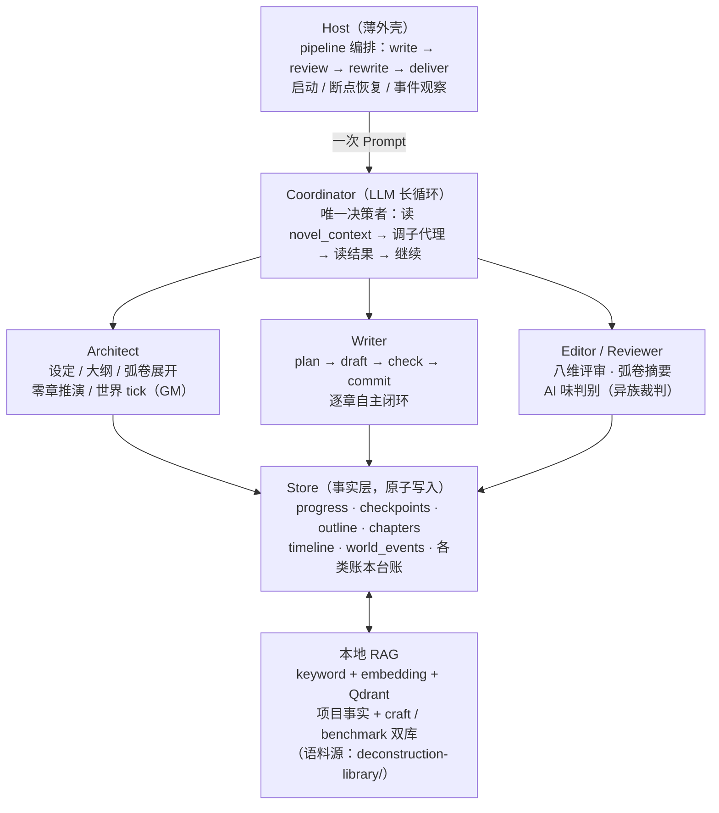
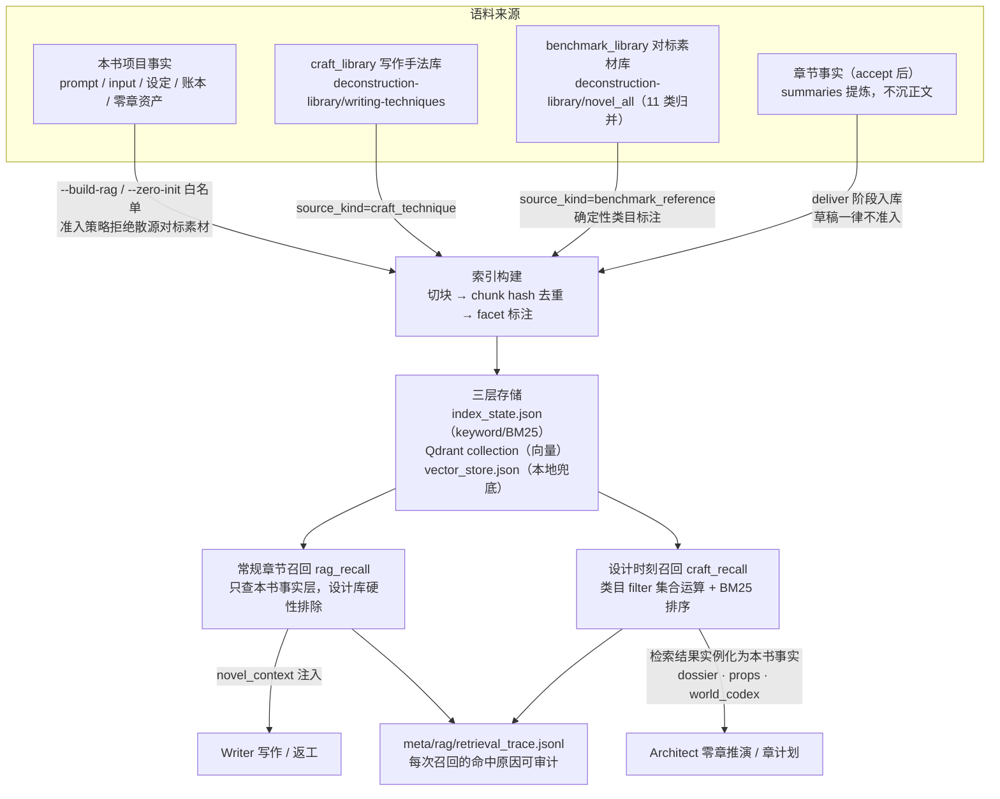

# novel-studio

全自动 AI 长篇小说创作引擎。Coordinator 在一次 Prompt 里驱动 Architect / Writer / Editor 三个子代理完成整本书的创作，Host 只做启动、恢复和观察。与"逐段生成文本"的工具不同，novel-studio 的核心是一套**动态世界推演系统**：先推演世界，再落笔正文——正文永远只写主角能感知到的世界。

## 动态推演：镜头外的世界不等主角

绝大多数 AI 写作工具的世界是"舞台布景"：主角走到哪里，世界才在哪里生成，配角在下场后就停止存在。novel-studio 把世界当作**独立于镜头持续运转的模拟系统**，写作只是对这个系统的采样：


### 1. 零章推演（`--zero-init`）：世界先于第一章存在

写第 1 章之前，系统先把"第 0 章时刻"的世界完整推演出来：

- **分层名单** —— 全部角色按 LOD 分为三层：主角圈（全推演）、supporting（弧级日程）、background（群体状态机），成本随层级递减；
- **离屏日程（offscreen_agenda）** —— supporting 层每个在册角色带着自己的 goal→steps 日程入场，而不是等主角遇到才被发明出来；
- **故事日历（story_calendar）** —— 纪元 / 起始日期 / 一章≈几天，让"事件何时发生、何时传开"可以被算出来；
- **信息差图（info_graph）** —— 谁知道什么、读者视角领先或落后于主角多少；
- **物理公理（physics_axioms）** —— 距离、传信速度、物价、物候等一致性公理，是后续信息传播推算的依据；
- **势力进度钟、社会情绪、仪式日历、道德天花板、tick 零点、第一章推演草案与 RAG 白名单索引**。

这不是可选的"世界观填表"，而是**硬门禁**：`meta/first_chapter_generation_readiness` 就绪工件由三个消费方共用同一判定——Writer 派发守卫拒绝在未就绪时写第 1 章、Coordinator StopGuard 在该场景放行收工交还宿主、pipeline write 阶段自动补跑 `--zero-init` 后续跑。foundation 文件（premise / characters / world_rules / book_world / 大纲）在 readiness 之后被重写会使就绪状态**自动过期**，防止零章资产引用旧设定。需要推倒重来时，`--zero-init --reset-simulation-state` 切换新的推演线（generation_id），旧章节数据只保留为背景种子，不允许恢复旧进度。

### 2. 弧 / 卷边界世界 tick（`save_world_tick`）：GM 裁决，不是续写

写作推进到弧 / 卷边界时，Architect 切换为 **Game Master 身份**做一次世界推演，只裁决镜头外的世界，绝不复写已发布正文的事实：

- 每条离屏事件必须按 `physics_axioms.info_propagation` 推算 **visibility_chapter**（该消息最早可能传到主角处的章号）与 **visibility_path**（谣言 / 信使 / 亲见 / 官报）；
- supporting 层角色按各自日程推进 1-2 步并回写；background 层不逐角色推演，只更新社会情绪与谣言；
- **势力进度钟**按 Blades in the Dark 模式拨动：每个势力一个"目标 + 进度 + 走满后果"的钟，走满的钟**必须**转化为镜头外事件——反派不会在主角练级时静止等待；
- 与既有事实（timeline / relationship_state / resource_ledger / info_graph / 已发布章节）冲突时，一律以既有事实为准，调整推演而不是账本；
- 有回收价值的事件标记 `foreshadow_candidate`，成为下一弧规划的伏笔素材——伏笔不是硬编的"梗"，而是世界运转的自然产物。

`--diag` 持续监控**世界停摆**：镜头外世界长期未推进会作为诊断发现报出，提示 Architect 在下一次弧边界先把世界推到弧末再展开规划。

### 3. 信息地平线：正文只写主角能感知的世界

Writer 写每一章时，`novel_context` 只注入**已越过信息地平线**的离屏事件（越线后保留 5 章消化窗口）。主角只能通过事件的传播路径（谣言 / 信使 / 亲见 / 官报）得知消息，感知程度与渠道可信度匹配；未列入地平线表的离屏事件，主角一概不知、**不得写入正文**。事件在正文落地后，由 `commit_chapter` 的 state_changes / knowledge 同步主角认知——信息差从"作者脑内设定"变成了**可校验的数据结构**。

### 4. 交付沉淀：推演事实反哺召回

章节通过评审（accept）后，`deliver` 阶段做交付沉淀：刷新章级 / 项目级推进台账，把本章事实 chunk 沉入本地 RAG 索引（只准 accept 后入库，杜绝草稿污染召回），落交付快照与 `meta/delivery_log.md`。后续章节写作时，这些事实与零章推演资产、拆文库素材一起参与召回——推演、写作、沉淀构成闭环。

## 优势与不同点

| 维度 | 常见做法 | novel-studio |
|---|---|---|
| 世界模拟 | 世界随主角视角即时生成 | 零章推演 + 弧边界世界 tick，离屏角色有独立日程，势力有进度钟 |
| 信息差 | 靠作者提示词自觉维持 | visibility_chapter / visibility_path / info_graph 数据化，未越地平线的事件不进上下文 |
| 一致性 | 依赖模型记忆 | 物理公理 + 时间线 / 关系 / 资源账本 + `check_consistency` 机械校验 |
| 质量控制 | 生成后人工把关 | 八维 Editor 评审 + 机械门禁（每章 `ai_gate` 不过不放行）+ 异族裁判（reviewer 与 writer 用不同模型家族，对冲 LLM judge 75-84% 的自我偏好） |
| 去 AI 味 | 后置润色 | 写前规避清单注入 → 写中语义变体族计数（not-x-but-y 防换皮）→ 写后书级同质度统计 + 外部检测器校准，slop 词表以人类拆文语料为基线再生成 |
| 长篇上下文 | 无限拼接直到溢出 | 按总章数自动切换全量 / 滑窗 / 分层摘要，四级压缩管线 + Lost-in-the-Middle 治理（关键信息头尾、参考资料居中），支撑 500+ 章 |
| 断点恢复 | 从头再来或手工找进度 | 每个工具成功后写 checkpoint，崩溃后精确到 plan/draft/check/commit 步骤级恢复；文件写入 temp + fsync + rename，断电不损坏 |
| 编排哲学 | 复杂工作流引擎 | LLM 驱动长循环：一次 Prompt 写完整本书，Host 不介入调度；工具只返事实，指令由 Reminder 每轮从事实层重算 |
| 记忆 | 对话历史即记忆 | 本地 RAG（keyword + embedding + Qdrant）：accept 后事实入库 + 拆文手法库 / 对标素材库双通道，检索有 trace 可审计 |
| 成本 | 跑完才知道花了多少 | token / 费用按角色按模型累计，预算越线告警 / 熔断，无人值守告警推系统通知或自定义命令 |

## 系统架构

核心设计：**LLM 驱动，Host 服务**。Coordinator 在一次 Run 中自主决策整本书的创作流程，Host 只做启动、恢复和事件观察，不做任何调度决策。



| 智能体 | 职责 | 关键工具 |
|--------|------|------|
| **Coordinator** | 调度全局，处理评审裁定和用户干预 | `subagent` `novel_context` |
| **Architect** | 前提 / 大纲 / 角色档案 / 世界规则；零章推演与弧边界世界 tick | `novel_context` `save_foundation` `save_world_tick` |
| **Writer** | 自主完成一章的构思、写作、自审和提交 | `novel_context` `read_chapter` `plan_chapter` `draft_chapter` `check_consistency` `commit_chapter` |
| **Editor / Reviewer** | 章级八维评审、弧卷评审与摘要、AI 味盲测 | `novel_context` `read_chapter` `save_review` `save_arc_summary` `save_volume_summary` |

Writer 每章的工具调用顺序是刚性的（写作内容完全自主）：`novel_context` 加载上下文 → `read_chapter` 找回语气 → `plan_chapter` 构思 → `draft_chapter` 落稿 → `check_consistency` 对照事实校验 → `commit_chapter` 提交并回刷时间线 / 伏笔 / 关系 / 角色状态。每章必须通过 Editor 章级审阅（`reviews/NN_ai_gate.json` + `reviews/NN.md`）才允许续写。

## 流水线


`novel-studio --pipeline` 把各功能串成一条**可恢复的流水线**：状态存 `meta/pipeline.json`，已完成阶段重跑时先复核产物证据再决定跳过或重跑；阶段内部各自还有更细的恢复（write 走 checkpoint、review/rewrite 按章号），两层恢复叠加。

```bash
# 标准：写作 → 评审 → 重写 → 交付（中断后重跑同一命令即续跑）
novel-studio --pipeline --prompt "写一本东方玄幻长篇，主角从边陲小城起步"

# 先共创澄清再一条龙
novel-studio --pipeline --stages cocreate,write,review,rewrite,deliver

# 自定义阶段子集；--restart 从头重跑
novel-studio --pipeline --prompt "..." --stages write,deliver
```

启动时按配置确保本机 Qdrant 可用；进入 `write` 前构建或刷新当前项目 RAG。

## 快速开始

```bash
# 源码构建（Go 1.25+）
git clone https://github.com/Xiaoyangy/novel-studio.git
cd novel-studio && go build ./cmd/novel-studio

# 首次运行：交互终端走一次 stdin 引导（选 Provider → 填 API Key → 模型名）
./novel-studio

# 创作前自检 LLM 是否真的可用
./novel-studio --check

# 开写
./novel-studio --pipeline --prompt "写一本东方玄幻长篇，主角从边陲小城起步"
```

### 常用命令

```bash
novel-studio --zero-init [--dir d]           # 第一章前的零章推演资产 + 白名单 RAG（写前硬门禁）
novel-studio --pipeline --stages review      # 逐章 Editor 评审（不改原文）
novel-studio --pipeline --stages rewrite     # 按评审反馈逐章重写
novel-studio --pipeline --stages deliver     # 交付沉淀：台账 + RAG 事实 + 快照
novel-studio --cocreate                      # 多轮对话澄清需求，定稿创作指令
novel-studio --steer "<指令>"                # 排队一条干预，下次启动生效
novel-studio --diag                          # 诊断项目产物（含世界停摆、流水线证据漂移）
novel-studio --refresh-progress [--dir d]    # 回填章节推进 / 人物变化 / 下一章计划台账
novel-studio --build-rag [--dir d]           # 构建本书 RAG 索引并可探测召回
novel-studio --simulate / --import-sim <p>   # 仿写画像合成 / 导入
novel-studio --writing-assets list           # 查看 / 启停 / 组合 / 试写写法资产
novel-studio service start                   # 浏览器进度看板
novel-studio skills list / export --to <dir> # 列出 / 导出内置 skills
novel-studio eval inspect --cases evals/cases/harness   # harness 检查既有项目产物
```

> `--headless --prompt`、`--review-existing`、`--rewrite-existing` 是兼容别名，内部委派到 pipeline。

### Docker

```bash
mkdir -p config workspace
docker run --rm \
  -v "$PWD/config:/root/.novel-studio" \
  -v "$PWD/workspace:/workspace" \
  ghcr.io/chenhongyang/novel-studio:latest \
  --pipeline --prompt "写一本东方玄幻长篇"
```

每本小说绑定到启动目录，产物落在 `{cwd}/output/novel/`；换目录运行 = 换一本，`cd` 回去运行 = 自动从最近 checkpoint 恢复。

## 配置

首次运行自动引导生成 `~/.novel-studio/config.json`，后续直接编辑。完整示例见 [`config.example.jsonc`](config.example.jsonc)。

> 从旧版（配置目录为 `~/.ainovel/`）迁移：`mv ~/.ainovel ~/.novel-studio`（项目内如有 `./.ainovel/` 同理改名），内容格式不变。

```jsonc
{
  "provider": "minimax",
  "model": "MiniMax-M3[1M]",
  "providers": { "minimax": { "api_key": "sk-xxx", "models": ["MiniMax-M3[1M]", "MiniMax-M3"] } },
  "roles": {                                  // 角色级模型覆盖 + 请求级 failover
    "writer":   { "provider": "minimax", "model": "MiniMax-M3[1M]", "reasoning_effort": "high" },
    "reviewer": { "provider": "minimax", "model": "MiniMax-M3[1M]", "reasoning_effort": "max" }
  },
  "rag": {
    "embedding": { "enabled": true, "local_gguf": "models/embedding/Qwen3-Embedding-0.6B-Q8_0.gguf",
                   "local_port": 18434, "model": "qwen3-embedding-0.6b" },
    "qdrant":    { "enabled": true, "url": "http://127.0.0.1:6333" },
    "craft_library":     "deconstruction-library/writing-techniques",
    "benchmark_library": "deconstruction-library/novel_all"
  },
  "budget": { "book_usd": 20, "warn_ratio": 0.8 },   // 挂机保险丝
  "notify": { "enabled": true }                       // 无人值守告警
}
```

配置查找顺序（后者覆盖前者）：`~/.novel-studio/config.json` → `./.novel-studio/config.json`（项目级，含密钥已默认 gitignore）→ `--config <path>`。`providers` / `roles` 按 key 合并；`provider` 的值是 `providers` 里的 key 名（指针），角色可配 `fallbacks` 做请求级故障切换。支持 OpenRouter / Anthropic / Gemini / OpenAI / DeepSeek / Qwen / GLM / Grok / MiniMax / Ollama / Bedrock 及任意自定义代理（`type` + `extra` 透传 UA / headers）。

## RAG：构造与使用

要 RAG 化的语料统一放在 **`deconstruction-library/`**（长篇拆解固定工作区：每本书一个目录，保存黄金三章、逐章摘要、角色 / 剧情 / 设定 / 文风和拆文报告）。RAG 分两条互相隔离的通道：**本书事实层**（写作中途召回）与**设计时刻双库**（只服务设计，不进章节召回）。



### 构造：什么能进索引，什么时候进

- **`--build-rag`** 构建本书主索引：默认只扫当前项目的 `prompt.md`、`input/*.md` 与 `output/novel` 关键设定 / 账本文件，写入 `meta/rag/index_state.json/md`。**准入策略是代码级的**：拆解库散源（novel_sucai 等）、外部参考库一律拒绝进入写作 RAG，仅 `writing-techniques`（纯手法，无情节事实）与 `novel_all`（归并对标库）豁免、且分别打上 `craft_technique` / `benchmark_reference` 的 source_kind 标记供后续路由隔离；
- **`--zero-init`** 附带白名单索引：只索引当前项目设定与零章推演资产，防止旧代次数据污染新推演线；
- **持续沉淀**：写作过程中 `save_foundation` / `commit_chapter` / `save_review` 挂了 RAG sink，foundation、章节、评审、返工产生的事实增量 upsert；章级事实 chunk 以 accept 后的 `deliver` 阶段为准入口（来源是章节摘要提炼的事实，`uses_body=false` 不沉正文），草稿不入库；
- **三层存储**：keyword/BM25 索引（`index_state.json`）始终可用；配置 embedding 后（本地 Qwen3-Embedding GGUF，llama-server 自动拉起）向量写 Qdrant collection，同时落 `vector_store.json` 本地兜底；chunk 按内容 hash 去重，重建幂等；
- pipeline 进入 `write` 前自动检查 / 刷新索引并确保本机 Qdrant 可用（`--pipeline` / rewrite 共用同一就绪检查）。

### 使用：两条召回通道，路由隔离

- **常规章节召回（`rag_recall`）** —— Writer 写每章时，`novel_context` 从本章推进焦点（伏笔 / 角色 / 状态变化 / 关系）提取查询词与 facet 提示，对**本书事实层**做混合检索：BM25 关键词 + 向量语义加性混合；`craft_technique` / `benchmark_reference` 两类设计库 chunk 被**硬性排除**——写作中途的一致性只信本书事实，不信参考素材；
- **设计时刻召回（`craft_recall`）** —— 只在零章初始化、新角色 / 新武器 / 新能力首次出场的章计划时刻走设计双库：每个设计字段绑定固定类目 filter（集合运算，命中与否确定），BM25 只在命中子集内排序，查不到返回显式 `no_material` 而不是静默降级；检索结果**立刻实例化为本书事实**（人物 dossier、道具、视觉设计、world_codex），此后写作只引用实例化产物——对标素材只可迁移手法 / 结构 / 节奏，情节、人名与专有设定禁止照搬；
- **降级链**：Qdrant 不可用 → 读 `vector_store.json` 本地向量兜底；未启用 embedding → 纯 BM25 / 关键词策略，链路永不因向量服务缺席而中断；
- **可审计**：每次召回追加一条 `meta/rag/retrieval_trace.jsonl`（query、策略、每条命中的 chunk / 得分 / 命中原因 / facet / source_kind）；`--build-rag --probe-chapter N` 可离线探测某章的召回结果。

## 质量门禁与用户规则

- **八维评审** —— 设定一致性、角色行为、节奏、叙事连贯、伏笔、钩子、审美品质（必须引用原文举证）、AI 腔检测（比喻密度 / 对话占比 / 格言命中 / 章末钩子等量化结论）；
- **机械门禁** —— 内置去 AI 味基线（套句 / 疲劳词黑名单 + 语义判据），每章 commit 时自检，违规按固定映射分级（禁用词 → error，疲劳词超阈 → warning，字数偏差 ≥20% → error）；
- **用户规则零格式** —— 在 `~/.novel-studio/rules/`（全局）或 `./.novel-studio/rules/`（本书）放任意 `.md`，大白话写偏好（「主角别写成圣母」「每章 3000 字左右」），系统归一化成本书规则快照自动遵循，详见 [`docs/user-rules-runtime.md`](docs/user-rules-runtime.md)；
- **审核闭环** —— 审核历史零丢失归档（`reviews/NN.history.jsonl`），复审自动注入上一轮 issues 做回归验证（防"修了 A 换挑 B"），第 3 轮循环刹车；
- **Prompt 运行时覆盖** —— `~/.novel-studio/prompts/` → `./.novel-studio/prompts/` 覆盖链，指纹落 `meta/prompt_manifest.json`，精确回答"这次 run 用的是哪版 prompt"。

## 断点恢复

写一部长篇可能需要数天，中途崩溃 / 断网 / Ctrl+C 都是常态。所有产物持久化在 `output/`，每个工具执行成功后写 checkpoint（`meta/checkpoints.jsonl`）；同一目录再次运行时读取 `progress.json` + 最近 checkpoint + 待处理信号，精确到 step 级生成恢复指令（如"第 7 章 draft 已落盘，请继续 check_consistency"）。文件写入使用 temp + fsync + rename 原子操作，断电也不会损坏已有数据。

## 输出结构（`output/novel/`）

```
premise.md / characters.json / world_rules.json / book_world.json   # 设定事实层
outline.json / layered_outline.json / timeline.json                 # 规划与时间线
relationship_state.json / foreshadow_ledger.json / resource_ledger.json
chapters/          # 章节终稿（01.md ...）
summaries/         # 章节摘要
reviews/           # NN.md + NN_ai_gate.json + NN.history.jsonl
meta/              # progress / pipeline / checkpoints / usage / delivery_log
                   # world tick 事实、rag 索引状态、sessions 与 llm_calls 全量 trace
```

可观测性：Coordinator 与每个子代理的完整工具调用日志（`meta/sessions/*.jsonl`）、LLM 调用级 trace（`meta/runtime/llm_calls.jsonl`，字段对齐 OTel gen_ai.* 语义约定）、`--diag` 脱敏导出可直接贴 issue。

## Skills

每个功能在 [`skills/`](skills/README.md) 下有一份入口 SKILL.md（novel-* 原生命令入口 + story 网文工具箱：拆文 / 长短篇写作方法论 / 去 AI 味 / 审查），外部 agent（Claude Code / Codex / OpenCode / OpenClaw）读后直接拼命令行调用；`novel-studio skills export --to <dir>` 一键导出到目标项目。

## 文档索引

| 文档 | 内容 |
|---|---|
| [`docs/architecture.md`](docs/architecture.md) | 架构全貌与合宪约束 |
| [`docs/project-structure.md`](docs/project-structure.md) | 目录分层说明 |
| [`docs/design-stage-workflow.md`](docs/design-stage-workflow.md) | 长短篇统一规划口径 |
| [`docs/writing-review-workflow.md`](docs/writing-review-workflow.md) | 写作审核一体化执行方案 |
| [`docs/data-lifecycle-and-progression.md`](docs/data-lifecycle-and-progression.md) | 数据沉淀与推进机制 |
| [`docs/capability-inventory.md`](docs/capability-inventory.md) | 工程能力清单 |
| [`docs/observability.md`](docs/observability.md) | 运行观测排查手册 |

## 技术栈

- **Go 1.25** —— 主语言（~8.6 万行，350 个源文件）
- **[agentcore](https://github.com/voocel/agentcore)** —— 极简 Agent 内核（tool-calling + streaming + StopGuard/ToolGate）
- **[litellm](https://github.com/voocel/litellm)** —— 统一 LLM 接口适配（经 `third_party/litellm` 仓内 fork 引入，修复空参 tool_use 回放丢 input 字段的问题）
- **Qdrant + llama.cpp** —— 本地向量检索与 embedding 推理，全链路可离线

## License

[Apache-2.0](LICENSE)

本项目积极参与并认可 [linux.do 社区](https://linux.do/)。
