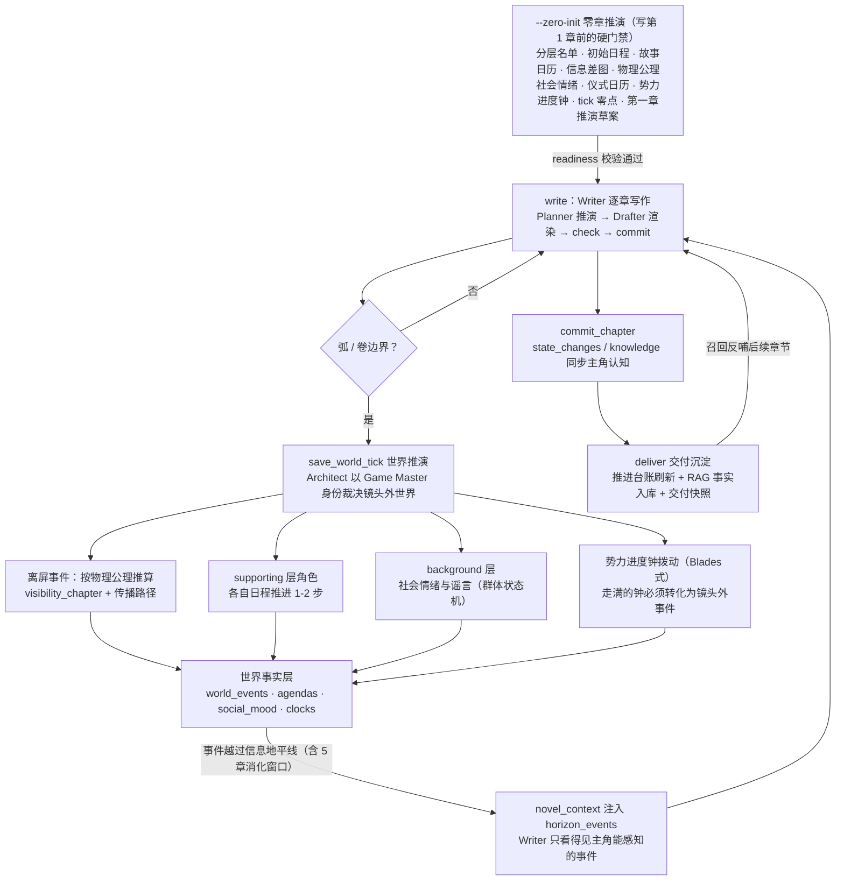
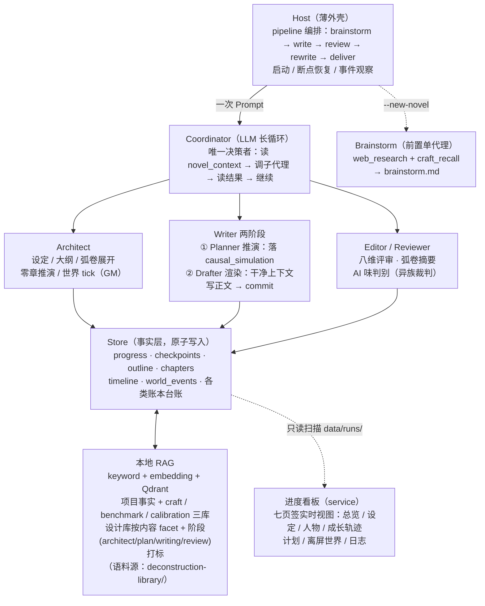
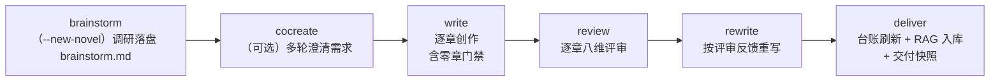
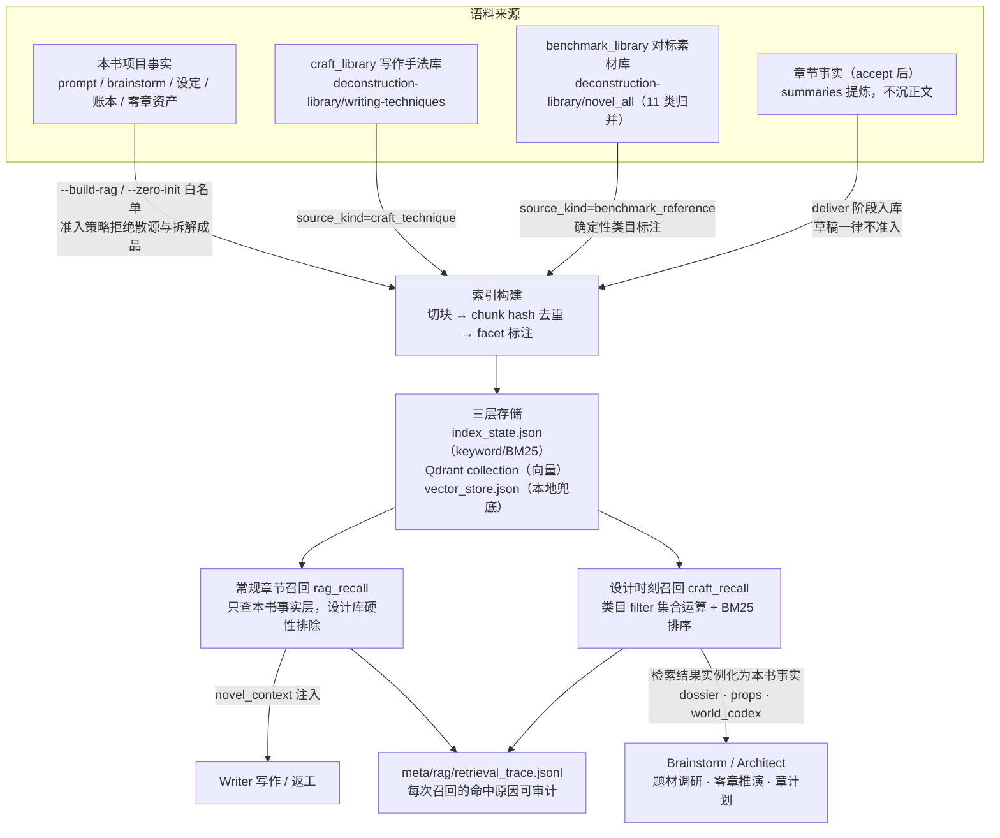

# novel-studio

[](https://github.com/Xiaoyangy/novel-studio/releases/latest)
[](LICENSE)
[](go.mod)
[](https://github.com/Xiaoyangy/novel-studio/releases/latest)

全自动 AI 长篇小说创作引擎。给一句话想法，它自己调研题材、推演世界、写完整本书、逐章审核返工——`--new-novel` 到 `deliver` 全程无需人工干预。与"逐段生成文本"的工具不同，novel-studio 的内核是一套**动态世界推演系统**：先推演世界，再落笔正文——正文永远只写主角能感知到的世界。

> An autonomous long-form novel engine in Go: from a one-line idea to a finished book — dynamic world simulation, multi-agent long-run loop, mechanical quality gates and local RAG.

## 2026-07-10 全量工程升级

本轮把可恢复 pipeline、全角色章节推演、返工事实保护、RAG/Qdrant 就绪链、审核版本新鲜度、AIGC/DeepSeek 门禁和进度看板 3.0 合并为同一套执行契约。完整变更、迁移方式、持久化产物和验证命令见 [README-20260710.md](README-20260710.md)。

## 2026-07-08 工程交付

本轮把《她的第二算法》第一章审核链路、DeepSeek v4 Pro 复审、3000 字整章 AI 检测口径、拦截与展示一致性、新建小说 brainstorm 流水线和架构图统一整理到一份交付文档：见 [docs/engineering-delivery-20260708.md](docs/engineering-delivery-20260708.md)。文档开头包含第一章进度图、AI 门禁占比图、审核前后对比和最新系统流程图。

## 动态推演：镜头外的世界不等主角

绝大多数 AI 写作工具的世界是"舞台布景"：主角走到哪里，世界才在哪里生成，配角在下场后就停止存在。novel-studio 把世界当作**独立于镜头持续运转的模拟系统**，写作只是对这个系统的采样：



### 1. 零章推演（`--zero-init`）：世界先于第一章存在

写第 1 章之前，系统先把"第 0 章时刻"的世界完整推演出来：

- **分层名单** —— 全部角色按 LOD 分为三层：主角圈（全推演）、supporting（弧级日程）、background（群体状态机），成本随层级递减；
- **离屏日程（offscreen_agenda）** —— supporting 层每个在册角色带着自己的 goal→steps 日程入场，而不是等主角遇到才被发明出来；
- **故事日历（story_calendar）** —— 纪元 / 起始日期 / 一章≈几天，让"事件何时发生、何时传开"可以被算出来；
- **信息差图（info_graph）** —— 谁知道什么、读者视角领先或落后于主角多少；
- **物理公理（physics_axioms）** —— 距离、传信速度、物价、物候等一致性公理，是后续信息传播推算的依据；
- **势力进度钟、社会情绪、仪式日历、道德天花板、tick 零点、第一章推演草案与 RAG 白名单索引**。

这不是可选的"世界观填表"，而是**硬门禁**：`meta/first_chapter_generation_readiness` 就绪工件由多个消费方共用同一判定——Writer 派发守卫拒绝在未就绪时写第 1 章，Coordinator StopGuard 在该场景放行收工交还宿主，pipeline 必须先独立完成 `architect`，再完成 `zero-init`，`write` 阶段只验收前置证据、绝不代办。缺失或旧版 `schema_version` 的 `ready:true` 一律不可信。foundation 文件（premise / characters / world_rules / world_codex / 大纲）在 readiness 之后被重写会使就绪状态**自动过期**，防止零章资产引用旧设定。需要推倒重来时，`--zero-init --reset-simulation-state` 切换新的推演线（generation_id），旧章节数据只保留为背景种子，不允许恢复旧进度。

### 2. 弧 / 卷边界世界 tick（`save_world_tick`）：GM 裁决，不是续写

写作推进到弧 / 卷边界时，Architect 切换为 **Game Master 身份**做一次世界推演，只裁决镜头外的世界，绝不复写已发布正文的事实：

- 每条离屏事件必须按 `physics_axioms.info_propagation` 推算 **visibility_chapter**（该消息最早可能传到主角处的章号）与 **visibility_path**（谣言 / 信使 / 亲见 / 官报）；
- supporting 层角色按各自日程推进 1-2 步并回写；background 层不逐角色推演，只更新社会情绪与谣言；
- **势力进度钟**按 Blades in the Dark 模式拨动：每个势力一个"目标 + 进度 + 走满后果"的钟，走满的钟**必须**转化为镜头外事件——反派不会在主角练级时静止等待；
- 与既有事实（timeline / relationship_state / resource_ledger / info_graph / 已发布章节）冲突时，一律以既有事实为准，调整推演而不是账本；
- 有回收价值的事件标记 `foreshadow_candidate`，成为下一弧规划的伏笔素材——伏笔不是硬编的"梗"，而是世界运转的自然产物。

`--diag` 持续监控**世界停摆**：镜头外世界长期未推进会作为诊断发现报出，提示 Architect 在下一次弧边界先把世界推到弧末再展开规划。

### 3. 信息地平线：正文只写主角能感知的世界

Writer 写每一章时，`novel_context` 只注入**已越过信息地平线**的离屏事件（越线后保留 5 章消化窗口）。主角只能通过事件的传播路径（谣言 / 信使 / 亲见 / 官报）得知消息，感知程度与渠道可信度匹配；未列入地平线表的离屏事件，主角一概不知、**不得写入正文**。事件在正文落地后，由 `commit_chapter` 的 state_changes / knowledge 同步主角认知——信息差从"作者脑内设定"变成了**可校验的数据结构**。

### 4. 交付沉淀：推演事实反哺召回

章节通过评审（accept）后，`deliver` 阶段做交付沉淀：刷新章级 / 项目级推进台账，把本章事实 chunk 沉入本地 RAG 索引（只准 accept 后入库，杜绝草稿污染召回），落交付快照与 `meta/delivery_log.md`。后续章节写作时，这些事实与零章推演资产、拆文库素材一起参与召回——推演、写作、沉淀构成闭环。

## 完整生命周期：一句话想法 → 成书

一条命令跑完从想法到成书的全过程，长短篇统一分流（设计总字数 ≤ 30000 走短篇压缩粒度，> 30000 走长篇分层滚动）。每个阶段落盘可恢复，中途崩溃 `cd` 回目录重跑即续：


- **brainstorm（`--new-novel`）** —— 一个专注单代理用 `web_research` + `craft_recall` + `novel_context` 调研题材、推敲逻辑，`save_brainstorm` 落盘 `data/runs/<书名>/brainstorm.md`，后续 Architect 据此初始化世界；
- **foundation → zero-init → write → review → rewrite → deliver** —— 详见「[动态推演](#动态推演镜头外的世界不等主角)」与「[流水线](#流水线)」；
- **`list` / `novels`** —— 一览 `data/runs/` 下全部书目的阶段（brainstorm / foundation / zero-init / writing / complete）、章节进度与字数，随时知道每本书写到哪。

## 优势与不同点

| 维度 | 常见做法 | novel-studio |
|---|---|---|
| 起步 | 人写大纲喂给 AI | 一句话想法 → 自动调研题材、推敲逻辑、初始化世界 |
| 世界模拟 | 世界随主角视角即时生成 | 零章推演 + 弧边界世界 tick，离屏角色有独立日程，势力有进度钟 |
| 信息差 | 靠作者提示词自觉维持 | visibility_chapter / visibility_path / info_graph 数据化，未越地平线的事件不进上下文 |
| 一致性 | 依赖模型记忆 | 物理公理 + 时间线 / 关系 / 资源账本 + `check_consistency` 机械校验 |
| 质量控制 | 生成后人工把关 | 八维 Editor 评审 + 机械门禁（每章 `ai_gate` 不过不放行）+ 异族裁判（reviewer 与 writer 用不同模型家族，对冲 LLM judge 75-84% 的自我偏好） |
| 去 AI 味 | 后置润色 | 写前规避清单注入 → 写中语义变体族计数（not-x-but-y 防换皮）→ 写后书级同质度统计 + 外部检测器校准，slop 词表以人类拆文语料为基线再生成 |
| 长篇上下文 | 无限拼接直到溢出 | 按总章数自动切换全量 / 滑窗 / 分层摘要，四级压缩管线 + Lost-in-the-Middle 治理（关键信息头尾、参考资料居中），支撑 500+ 章 |
| 断点恢复 | 从头再来或手工找进度 | 每个工具成功后写 checkpoint，崩溃后精确到 plan/draft/check/commit 步骤级恢复；文件写入 temp + fsync + rename，断电不损坏 |
| 编排哲学 | 复杂工作流引擎 | LLM 驱动长循环：一次 Prompt 写完整本书，Host 不介入调度；工具只返事实，指令由 Reminder 每轮从事实层重算 |
| 记忆 | 对话历史即记忆 | 本地 RAG（keyword + embedding + Qdrant）：accept 后事实入库 + 拆文手法库 / 对标素材库 / 审核校准库三通道，设计库按**内容级 facet + 可用阶段**打标（Architect / plan / writing / review 各取所需），检索有 trace 可审计 |
| 成本 | 跑完才知道花了多少 | token / 费用按角色按模型累计，预算越线告警 / 熔断；支持 codex-cli 订阅接入省 API 费 |

### 生态位：和主流工具比，它站在哪

- **对比商业写作副驾**（[Sudowrite](https://www.sudowrite.com/)、[NovelAI](https://novelai.net/)、[novelcrafter](https://www.novelcrafter.com/) 等）——它们定位"人写 AI 辅"：作者逐章驱动，一致性靠手工维护的 Story Bible / Codex 注入提示词，按订阅或点数计费。novel-studio 定位**无人值守生产**：一句话想法跑完整本书，一致性由工具写入的事实层 + 机械校验保证而非人工登记；开源自托管、BYOK（自带任意厂商 key），成本以 token 实价按角色记账。
- **对比国内网文 AI 工具**（笔灵、蛙蛙写作、彩云小梦等）——它们是面向手机 / 网页的续写与润色助手，强在"接住作者当下这一段"。novel-studio 强在**工程化整书生产**：平台节奏契约、机械审核门禁、评审-返工闭环、拆文库 RAG 化沉淀，产物是带完整证据链（评审报告 / ai_gate / 交付快照）的仓库级工程，而不是一段段可复制的文本。
- **对比开源长篇生成器**（[Long-Novel-GPT](https://github.com/MaoXiaoYuZ/Long-Novel-GPT)、[AI_NovelGenerator](https://github.com/YILING0013/AI_NovelGenerator)、[NovelForge](https://github.com/RhythmicWave/NovelForge) 等）——同类项目多为"大纲 → 逐章生成"的编排器，记忆靠摘要与向量检索。novel-studio 的结构性差异在于：**动态世界推演**（离屏世界独立运转 + 信息地平线，同类项目普遍没有这一层）、**质量是门禁而非建议**（每章 `ai_gate` 不过不放行、异族裁判对冲自评偏好）、**工业级运行时**（step 级 checkpoint 断点恢复、OTel 对齐的调用 trace、预算熔断、eval harness）。

一句话定位：别人做的是"写作副驾"或"生成脚本"，novel-studio 做的是**可无人值守的世界模拟 + 小说生产流水线**。

## 系统架构

核心设计：**LLM 驱动，Host 服务**。Coordinator 在一次 Run 中自主决策整本书的创作流程，Host 只做启动、恢复和事件观察，不做任何调度决策。



| 智能体 | 职责 | 关键工具 |
|--------|------|------|
| **Brainstorm** | 新建小说前置：调研题材、推敲逻辑、落盘 brainstorm.md（一次性单代理） | `web_research` `craft_recall` `novel_context` `save_brainstorm` |
| **Coordinator** | 调度全局，处理评审裁定和用户干预 | `subagent` `novel_context` |
| **Architect** | 前提 / 大纲 / 角色档案 / 世界规则；零章推演与弧边界世界 tick | `novel_context` `save_foundation` `save_world_tick` `web_research` |
| **Writer · Planner（推演）** | 读全量规划上下文，产出完整 `chapter_plan.causal_simulation`（40+ 字段：因果链 / 声口 / 对话蓝图 / 情感逻辑 / 视觉设计 / 证据回收 / 章末后果契约…）后停 | `novel_context` `plan_chapter` `plan_structure` `plan_details` `craft_recall` `web_research` |
| **Writer · Drafter（渲染）** | 起干净会话，只读定稿计划 + 精要写法上下文，把推演渲染成正文并自审提交 | `novel_context` `read_chapter` `draft_chapter` `edit_chapter` `check_consistency` `commit_chapter` |
| **Editor / Reviewer** | 章级八维评审、弧卷评审与摘要、AI 味盲测 | `novel_context` `read_chapter` `save_review` `save_arc_summary` `save_volume_summary` |

**逐章两阶段拆分**：写一章分成独立上下文的两步——**Planner 推演** 吃全量规划上下文，把"要发生什么、谁怎么想、怎么说话、哪些物件承载信息"全部推演成 `causal_simulation` 落盘即停（长章可用 `plan_structure` + `plan_details` 分批补齐）；**Drafter 渲染** 起一个干净会话，只读已定稿计划把它写成正文，`check_consistency` 对照事实校验后 `commit_chapter` 提交并回刷时间线 / 伏笔 / 关系 / 角色状态。commit 会核对 consistency checkpoint 的草稿指纹，并拒绝正文标题偏离 `plan.title`。好处：drafter 不背规划对话的历史 token，长章不撑爆窗口、注意力集中在正文；planner 与 drafter 共用 writer 角色的模型配置。每章的机械门禁、AI voice、Editor JSON、异模型裸正文判定和统一报告必须全部绑定当前正文 SHA-256，且章审 `accept` 后才允许续写或交付。

## 流水线



`novel-studio --pipeline` 把各阶段串成一条**可恢复的流水线**：状态存 `meta/pipeline.json`，已完成阶段重跑时先复核产物证据再决定跳过或重跑；阶段内部各自还有更细的恢复（write 走 checkpoint、review/rewrite 按章号），两层恢复叠加。

```bash
# 从一句话想法新建一本书（brainstorm → 设计 → 零章 → 写作 → 评审 → 重写 → 交付）
novel-studio --pipeline --new-novel --prompt "一个会算命的程序员穿越到修真界靠代码逻辑破局"

# 已有创作指令，直接跑主链路（中断后重跑同一命令即续跑）
novel-studio --pipeline --prompt "写一本东方玄幻长篇，主角从边陲小城起步"

# 自定义阶段子集；--restart 从头重跑
novel-studio --pipeline --prompt "..." --stages write,deliver
```

默认阶段 `write,review,rewrite,deliver`。启动时按配置确保本机 Qdrant 可用；进入 `write` 前构建或刷新当前项目 RAG。

### 执行入口一览

全部入口在 `cmd/novel-studio` 单一二进制内路由：

| 入口 | 做什么 | 落点 / 产物 |
|---|---|---|
| `--pipeline --new-novel` | 从一句话想法新建：brainstorm → 设计 → 零章 → 写作 → 交付 | `data/runs/<书名>/` 全套工件 |
| `--pipeline` | 主链路：write → review → rewrite → deliver，断点续跑 | `output/novel/` 全套工件 + `meta/pipeline.json` |
| `--cocreate` | 多轮对话澄清需求，定稿创作指令 | `meta/cocreate-prompt.txt`（可接 `--pipeline`） |
| `--zero-init` | 零章推演资产 + 白名单 RAG（写第 1 章前的硬门禁） | `meta/first_chapter_generation_readiness` 等 |
| `list` / `novels` | 一览 `data/runs/` 下全部书目的阶段与进度 | 终端表格 |
| `--steer "<指令>"` | 排队一条干预，下次启动注入 Coordinator | `run.json` |
| `--check` | LLM 连通性自检（含 fallback 验证） | 终端报告，退出码可入 CI |
| `--diag` | 只读诊断（流程 / 质量 / 规划 / 上下文 + 世界停摆、证据漂移） | `meta/diag-export.md`（脱敏可分享） |
| `--refresh-progress` | 回填章节推进 / 人物变化 / 下一章计划台账 | `meta/*_progress.*` |
| `--build-rag` | 构建本书 RAG 索引，`--probe-chapter N` 探测召回 | `meta/rag/index_state.json` + Qdrant |
| `--simulate` / `--import-sim` | 仿写画像合成 / 导入 | `meta/simulation_profile.json` |
| `--writing-assets` | 写法资产查看 / 启停 / 组合 / 试写 / seed-defaults | `meta/writing_assets.json` |
| `eval inspect / run` | 评测 harness（产物断言 / stylestat 门禁 / prompt A/B） | 评测报告 |
| `reader-metrics log` | 登记真实读者指标（读完率 / 评论 / 收藏），供校准 | 项目 meta 台账 |
| `service start/status/stop` | 进度看板（只读扫描 `data/runs/`） | `http://127.0.0.1:8765/` |
| `skills list/context/export` | 内置 skills 查看与一键部署到外部 agent | 目标项目的 skills 目录 |
| `update` / `--version` | 原地自更新 / 版本信息 | — |

`--headless --prompt`、`--review-existing`、`--rewrite-existing` 是兼容别名，内部委派到 pipeline 对应阶段。恢复语义全线一致：同目录重跑同一命令即续跑（pipeline 看阶段证据，write 看 step 级 checkpoint，review/rewrite 按章号）。

## 适用平台

**运行环境** —— macOS / Linux / Windows 全平台，x86_64 与 arm64 双架构 [Release 二进制](https://github.com/Xiaoyangy/novel-studio/releases/latest)；一键安装脚本与 `novel-studio update` 原地自更新；Docker 镜像适合服务器 / NAS 挂机长任务。检索与 embedding 全部本地化（Qdrant + llama.cpp GGUF），书稿、设定与索引不出本机——搭配 Ollama 本地模型可完全离线运行。

**模型接入** —— OpenRouter / Anthropic / Gemini / OpenAI / DeepSeek / Qwen / GLM / Grok / MiniMax / Ollama / Bedrock 及任意 OpenAI / Anthropic 协议自定义代理；另支持 **codex-cli 订阅接入**（走本机 Codex CLI 复用 ChatGPT / Codex 订阅额度，不走 HTTP key）。五个角色（coordinator / architect / writer / editor / reviewer）可各配不同模型并带请求级 failover。

**创作与发布形态** —— 长篇连载与短篇双模式，按设计总字数统一分流：≤ 30000 字走短篇压缩粒度（1 卷 1 弧、全文终审），> 30000 字走长篇分层滚动规划（上下文治理支撑 500+ 章）。针对国内网文平台内置六档**节奏契约预设**（起点玄幻 / 起点都市 / 晋江 / 豆瓣 / 出版 / 短篇：章末钩子要求、大钩子间隔、单章字数区间逐档不同），配套番茄 / 起点 / 知乎盐言的平台审稿 rubric 与豆瓣阅读原创长篇专项入口；产物为带完整审核证据链的章节 Markdown 工程，可直接用于各平台投稿与申诉举证。

## 功能全景

**创作引擎**

- **一句话新建** —— `--new-novel` 从想法起步：brainstorm 代理 web 调研题材 + craft 库检索，落盘 brainstorm.md 供 Architect 初始化世界
- **推演 / 渲染两阶段写作** —— 每章拆成 Planner 推演（落 `causal_simulation` 40+ 字段）与 Drafter 渲染（干净上下文只读定稿计划写正文）两个独立上下文，长章不撑爆窗口、注意力集中在正文
- **联网研究（web_research）** —— brainstorm 与推演阶段可实时检索网页补题材现实支架、行业 / 地域 / 制度细节，结果登记 `meta/web_research_log.md` 可审计来源
- **多智能体协作** —— Coordinator 在一次长循环中调度 Architect / Writer / Editor 子代理，自主决策创作流程
- **LLM 驱动长循环** —— 一次 Prompt 写完整本书，Host 不介入调度；越简单越稳定，拒绝复杂编排
- **卷弧双层滚动规划** —— 初始只规划前 2 卷弧骨架 + 第 1 弧详细章节，后续弧 / 卷在写作推进到时再由 Architect 展开，远期规划不空洞
- **相关章节智能推荐** —— 每章写作时从伏笔、角色出场、状态变化、关系四个维度自动推荐相关历史章节，配合下一章预告，支撑 500+ 章连续性
- **自适应上下文策略** —— 根据总章节数自动切换全量 / 滑窗 / 分层摘要，四级压缩管线支撑 500+ 章长篇
- **Lost-in-the-Middle 治理** —— novel_context 注入按"关键信息在头尾、参考资料居中"有序序列化，附阅读指引，对抗长上下文 U 形注意力衰退
- **工具参数容错解析** —— LLM 工具参数经代理 / 弱模型出现围栏包裹、尾逗号、字符串化 JSON 时自动修复（纯 Go、零依赖），修复失败返回结构化错误交 LLM 自主重试

**世界与角色建模**

- **世界模拟（离屏推演）** —— 零章推演 + 弧边界世界 tick + 信息地平线，详见开篇「[动态推演](#动态推演镜头外的世界不等主角)」
- **世界建模纵深** —— 势力矛盾网（立场 / 内部张力 / 冲突类型与烈度）、显规则 / 潜规则 / 隐秘规则三层可见性、物理一致性公理、宇宙观公理、道德天花板、仪式日历、NPC 生态、文化脚注、信息差图等可选工件，写前注入预防设定崩塌
- **角色动态档案** —— 角色不是静态人设标签，而是包含知识账本、决策框架、关系契约、情绪评价、长期弧线的变化决策系统
- **定量心理画像** —— 角色可选配大五人格（OCEAN）、依恋类型、Schwartz 价值观、道德基础（MFT）、认知偏差、能力偏科矩阵和显性 / 隐性 / 突变三维 DNA 分组；画像注入写作上下文并附行为化指引，commit 时与 Writer 自报表现做确定性一致性提醒
- **本书世界资产** —— `book_world` 保存地图、地点、路线和势力图谱，章节上下文按本章相关性裁剪注入

**质量与审核**

- **八维质量评审** —— 设定一致性、角色行为、节奏、叙事连贯、伏笔、钩子、审美品质、AI 腔检测；审美维度必须引用原文举证，AI 腔检测给出比喻密度、对话占比、格言命中、章末钩子等量化结论
- **机械门禁 + 用户规则** —— 内置去 AI 味基线（套句 / 疲劳词黑名单 + 语义判据），用户用大白话写偏好即自动归一化为本书规则快照，commit 时机械自检
- **叙事量化 lint** —— 每章可选自报场景动力四参数（冲突引擎 / 压力 / 信息释放 / 熵变）与 POV，配合六档体裁节奏契约做跨章确定性趋势检测：连续低压、信息过载、缺喘息、钩子超期、POV 越界轮换全部产出 warning 级事实透传 Editor
- **异族裁判（reviewer 角色）** —— LLM judge 对同族输出有 75-84% 自我偏好：可配独立 reviewer 角色用于三采样 pairwise 终选与 AI 味盲测，推荐与 writer 用不同模型家族
- **AI 味防线（写前-写中-写后闭环）** —— slop 词表语料化（内置 embed + 项目级覆盖 + `lexicon_version` 入门禁报告，以人类拆文语料为基线再生成）；写前规避清单注入、返工时注入命中明细；not-x-but-y 等句式按语义变体族合并计数防换皮；书级同质度统计；外部检测器（朱雀）人工抽检登记与本地分相关性校准
- **审核闭环强化** —— 审核历史零丢失归档，复审自动注入上一轮 issues 做回归验证（防"修了 A 换挑 B"），第 3 轮循环刹车；锚定 rubric（四档描述符 + 证据先于评分）修复分数聚簇

**记忆与检索**

- **本地 RAG + Qdrant 召回** —— 构造与使用详见「[RAG](#rag构造与使用)」一节；foundation、章节、评审、返工持续增量沉淀
- **交付沉淀** —— accept 后 `deliver` 阶段刷新推进台账、事实 chunk 入库、落交付快照与 delivery_log
- **仿写画像** —— `--simulate` 分析 `simulate/` 目录参考语料合成画像，注入各 Agent 借鉴结构 / 节奏 / 钩子；`--import-sim` 按语料指纹增量合并

**运行时与运维**

- **书目一览** —— `list` / `novels` 扫 `data/runs/`，一屏看清每本书的阶段（brainstorm / foundation / zero-init / writing / complete）、章节进度与字数
- **进度看板** —— `service start` 起浏览器实时看板（只读扫描 `data/runs/`）：书目卡片展示三层进度（目标 / 规划 / 完成 / 落盘）与当前章步骤链，七页签抽屉动态查看——总览 / 设定（世界背景 MD + 背景时间线）/ 人物（分层画像 + 状态情绪）/ **成长轨迹（人物出场生命线 + 三段弧向 + 决策流 old→new+理由）** / 计划 / 离屏世界（SVG 环形进度钟）/ 日志
- **Step 级断点恢复** —— 每个工具执行成功后写 checkpoint，崩溃后精确到 plan/draft/check/commit 步骤级恢复；文件写入 temp + fsync + rename 原子操作
- **实时干预（Steer）** —— `--steer "<指令>"` 排队干预，下次启动注入 Coordinator，由其评估影响范围决定改设定 / 重写 / 后续调整
- **成本与预算** —— token / 费用按角色、按模型累计，OpenRouter 价格自动拉取，`budget.book_usd` 越线告警 / 熔断；codex-cli 订阅接入复用订阅额度
- **无人值守告警** —— 完成 / 空转 / 预算事件推送 macOS / Linux 桌面通知，或经自定义命令推手机（Bark / ntfy）
- **可观测 / 可诊断** —— 全量工具调用日志、LLM 调用级 trace（对齐 OTel gen_ai.* 语义约定）、`--diag` 规则化诊断与脱敏导出、`eval` 评测 harness 与 prompt A/B
- **Prompt 运行时覆盖** —— `~/.novel-studio/prompts/` → `./.novel-studio/prompts/` 覆盖链，指纹落 manifest，改 prompt 实验不必重编译
- **写法资产** —— `--writing-assets` 查看 / 启停 / 组合 / 绑定 / 试写本书写法特征池，`seed-defaults` 注入人工感与去 AI 味基线
- **功能 skill 化** —— 每个功能一份 SKILL.md，外部 agent（Claude Code / Codex / OpenCode / OpenClaw）读后直接拼命令行调用，`skills export` 一键部署

## 快速开始

```bash
# 源码构建（Go 1.25+）
git clone https://github.com/Xiaoyangy/novel-studio.git
cd novel-studio && go build ./cmd/novel-studio

# 首次运行：交互终端走一次 stdin 引导（选 Provider → 填 API Key → 模型名）
./novel-studio

# 创作前自检 LLM 是否真的可用
./novel-studio --check

# 从一句话想法新建一本书（自动调研 → 设计 → 零章 → 写作 → 交付）
./novel-studio --pipeline --new-novel --prompt "一个会算命的程序员穿越修真界靠代码逻辑破局"

# 随时看所有书写到哪
./novel-studio list
```

### 常用命令

```bash
novel-studio --pipeline --new-novel --prompt "<想法>"   # 从头脑风暴新建一本书
novel-studio list                            # 一览 data/runs/ 下全部书目进度
novel-studio --zero-init [--dir d]           # 第一章前的零章推演资产 + 白名单 RAG（写前硬门禁）
novel-studio --pipeline --stages review      # 逐章 Editor 评审（不改原文）
novel-studio --pipeline --stages rewrite     # 按评审反馈逐章重写
novel-studio --pipeline --stages deliver     # 交付沉淀：台账 + RAG 事实 + 快照
novel-studio --cocreate                      # 多轮对话澄清需求，定稿创作指令
novel-studio --steer "<指令>"                # 排队一条干预，下次启动生效
novel-studio --diag                          # 诊断项目产物（含世界停摆、流水线证据漂移）
novel-studio --build-rag [--dir d]           # 构建本书 RAG 索引并可探测召回
novel-studio service start                   # 浏览器进度看板
novel-studio skills list / export --to <dir> # 列出 / 导出内置 skills
```

> `--headless --prompt`、`--review-existing`、`--rewrite-existing` 是兼容别名，内部委派到 pipeline。

### Docker

```bash
mkdir -p config workspace
docker run --rm \
  -v "$PWD/config:/root/.novel-studio" \
  -v "$PWD/workspace:/workspace" \
  ghcr.io/xiaoyangy/novel-studio:latest \
  --pipeline --new-novel --prompt "写一本东方玄幻长篇"
```

每本小说落在 `data/runs/<书名>/`，产物在 `output/novel/`；`cd` 回目录重跑 = 从最近 checkpoint 自动恢复。

## 配置

首次运行自动引导生成 `~/.novel-studio/config.json`，后续直接编辑。完整示例见 [`config.example.jsonc`](config.example.jsonc)。

> 从旧版（配置目录为 `~/.ainovel/`）迁移：`mv ~/.ainovel ~/.novel-studio`（项目内如有 `./.ainovel/` 同理改名），内容格式不变。

```jsonc
{
  "provider": "minimax",
  "model": "MiniMax-M3[1M]",
  "providers": {
    "minimax": { "api_key": "sk-xxx", "models": ["MiniMax-M3[1M]", "MiniMax-M3"] },
    // 订阅接入：走本机 Codex CLI 复用 ChatGPT/Codex 订阅额度，base_url 为 codex 二进制路径（空=自动探测）
    "codex": { "type": "codex-cli", "base_url": "", "models": ["gpt-5.6-sol"] }
  },
  "roles": {                                  // 角色级模型覆盖 + 请求级 failover
    "writer":   { "provider": "minimax", "model": "MiniMax-M3[1M]", "reasoning_effort": "high" },
    "reviewer": { "provider": "minimax", "model": "MiniMax-M3[1M]", "reasoning_effort": "max" }
  },
  "rag": {
    "embedding": { "enabled": true, "local_gguf": "models/embedding/Qwen3-Embedding-0.6B-Q8_0.gguf",
                   "local_port": 18434, "model": "qwen3-embedding-0.6b" },
    "qdrant":    { "enabled": true, "url": "http://127.0.0.1:6333" },
    "craft_library":     "deconstruction-library/writing-techniques",
    "benchmark_library": "deconstruction-library/novel_all"
  },
  "budget": { "book_usd": 20, "warn_ratio": 0.8 },   // 挂机保险丝
  "notify": { "enabled": true }                       // 无人值守告警
}
```

配置查找顺序（后者覆盖前者）：`~/.novel-studio/config.json` → `./.novel-studio/config.json`（项目级，含密钥已默认 gitignore）→ `--config <path>`。`providers` / `roles` 按 key 合并；`provider` 的值是 `providers` 里的 key 名（指针），角色可配 `fallbacks` 做请求级故障切换。支持 OpenRouter / Anthropic / Gemini / OpenAI / DeepSeek / Qwen / GLM / Grok / MiniMax / Ollama / Bedrock、codex-cli 订阅接入及任意自定义代理（`type` + `extra` 透传 UA / headers）。

## RAG：构造与使用

要 RAG 化的语料统一放在 **`deconstruction-library/`**（写作方法与拆解成品语料库：craft / benchmark 双库 + 每本书一目录的拆解成品文档，长文拆解在工程外完成后放入）。RAG 分两条互相隔离的通道：**本书事实层**（写作中途召回）与**设计时刻双库**（只服务设计，不进章节召回）。



### 构造：什么能进索引，什么时候进

- **`--build-rag`** 构建本书主索引：默认只扫当前项目的 `prompt.md`、`input/*.md` 与 `output/novel` 关键设定 / 账本文件，写入 `meta/rag/index_state.json/md`。**准入策略是代码级的**：拆解库散源（novel_sucai 等）、外部参考库一律拒绝进入写作 RAG，仅 `writing-techniques`（纯手法，无情节事实）与 `novel_all`（归并对标库）豁免、且分别打上 `craft_technique` / `benchmark_reference` 的 source_kind 标记供后续路由隔离；
- **`--zero-init`** 附带白名单索引：只索引当前项目设定与零章推演资产，防止旧代次数据污染新推演线；
- **持续沉淀**：写作过程中 `save_foundation` / `commit_chapter` / `save_review` 挂了 RAG sink，foundation、章节、评审、返工产生的事实增量 upsert；章级事实 chunk 以 accept 后的 `deliver` 阶段为准入口（来源是章节摘要提炼的事实，`uses_body=false` 不沉正文），草稿不入库；
- **三层存储**：keyword/BM25 索引（`index_state.json`）始终可用；配置 embedding 后（本地 Qwen3-Embedding GGUF，llama-server 自动拉起）向量写 Qdrant collection，同时落 `vector_store.json` 本地兜底；schema v2 语义 hash 覆盖 context / summary / keywords / metadata，重建幂等；
- pipeline 进入 `write` / `deliver` 前自动检查索引与本机 Qdrant；本地向量完整时直接复用，Qdrant 丢库则从 fallback 重放，不重复 embedding。增量回填永久失败时写 `meta/rag/pending_upserts.json`，下次自动补偿。

### 使用：两条召回通道，路由隔离

- **常规章节召回（`rag_recall`）** —— Writer 写每章时，`novel_context` 从本章推进焦点（伏笔 / 角色 / 状态变化 / 关系）提取查询词与 facet 提示，对**本书事实层**做混合检索：BM25 关键词 + 向量语义加性混合；`craft_technique` / `benchmark_reference` 两类设计库 chunk 被**硬性排除**——写作中途的一致性只信本书事实，不信参考素材；
- **设计时刻召回（`craft_recall`）** —— 只在头脑风暴、零章初始化、新角色 / 新武器 / 新能力首次出场的章计划时刻走设计双库：每个设计字段绑定固定类目 filter（集合运算，命中与否确定），BM25 只在命中子集内排序，查不到返回显式 `no_material` 而不是静默降级；检索结果**立刻实例化为本书事实**（人物 dossier、道具、视觉设计、world_codex），此后写作只引用实例化产物——对标素材只可迁移手法 / 结构 / 节奏，情节、人名与专有设定禁止照搬；
- **降级链**：Qdrant EOF/空结果 → `vector_store.json` 本地向量 → 缓存 BM25 / 关键词；embedding EOF 直接走 BM25。网络 EOF、截断 JSON、429/5xx 使用有界退避重试，召回不会因单个语义后端失效而返回空白；
- **可审计**：每次召回追加一条 `meta/rag/retrieval_trace.jsonl`（query、策略、每条命中的 chunk / 得分 / 命中原因 / facet / source_kind）；`--build-rag --probe-chapter N` 可离线探测某章的召回结果。

## 质量门禁与用户规则

- **八维评审** —— 设定一致性、角色行为、节奏、叙事连贯、伏笔、钩子、审美品质（必须引用原文举证）、AI 腔检测（比喻密度 / 对话占比 / 格言命中 / 章末钩子等量化结论）；
- **机械门禁** —— 内置去 AI 味基线（套句 / 疲劳词黑名单 + 语义判据），每章 commit 时自检，违规按固定映射分级（禁用词 → error，疲劳词超阈 → warning，字数偏差 ≥20% → error）；
- **用户规则零格式** —— 在 `~/.novel-studio/rules/`（全局）或 `./.novel-studio/rules/`（本书）放任意 `.md`，大白话写偏好（「主角别写成圣母」「每章 3000 字左右」），系统归一化成本书规则快照自动遵循，详见 [`docs/user-rules-runtime.md`](docs/user-rules-runtime.md)；
- **审核闭环** —— 审核历史零丢失归档（`reviews/NN.history.jsonl`），复审自动注入上一轮 issues 做回归验证（防"修了 A 换挑 B"），第 3 轮循环刹车；
- **Prompt 运行时覆盖** —— `~/.novel-studio/prompts/` → `./.novel-studio/prompts/` 覆盖链，指纹落 `meta/prompt_manifest.json`，精确回答"这次 run 用的是哪版 prompt"。

## 断点恢复

写一部长篇可能需要数天，中途崩溃 / 断网 / Ctrl+C 都是常态。所有产物持久化在 `output/`，每个工具执行成功后写 checkpoint（`meta/checkpoints.jsonl`）；同一目录再次运行时读取 `progress.json` + 最近 checkpoint + 待处理信号，精确到 step 级生成恢复指令（如"第 7 章 draft 已落盘，请继续 check_consistency"）。文件写入使用 temp + fsync + rename 原子操作，断电也不会损坏已有数据。

## 输出结构（`data/runs/<书名>/`）

```
brainstorm.md                                                       # 新建时的题材调研与逻辑推敲
output/novel/
├── premise.md / characters.json / world_rules.json / book_world.json   # 设定事实层
├── outline.json / layered_outline.json / timeline.json                 # 规划与时间线
├── relationship_state.json / foreshadow_ledger.json / resource_ledger.json
├── chapters/          # 章节终稿（01.md ...）
├── summaries/         # 章节摘要
├── reviews/           # NN.md + NN.json + NN_ai_gate.json + NN_ai_voice_redflags.json + NN_deepseek_ai_judge.json
└── meta/              # progress / pipeline / checkpoints / usage / delivery_log
                       # world tick 事实、rag 索引状态、sessions 与 llm_calls 全量 trace
```

可观测性：Coordinator 与每个子代理的完整工具调用日志（`meta/sessions/*.jsonl`）、LLM 调用级 trace（`meta/runtime/llm_calls.jsonl`，字段对齐 OTel gen_ai.* 语义约定）、`--diag` 脱敏导出可直接贴 issue。

## Skills

每个功能在 [`skills/`](skills/README.md) 下有一份入口 SKILL.md（novel-* 原生命令入口 + story 网文工具箱：长短篇写作方法论 / 去 AI 味 / 审查 / 短篇拆文），外部 agent（Claude Code / Codex / OpenCode / OpenClaw）读后直接拼命令行调用；`novel-studio skills export --to <dir>` 一键导出到目标项目。

## 文档索引

| 文档 | 内容 |
|---|---|
| [`docs/architecture.md`](docs/architecture.md) | 架构全貌与合宪约束 |
| [`docs/project-structure.md`](docs/project-structure.md) | 目录分层说明 |
| [`docs/design-stage-workflow.md`](docs/design-stage-workflow.md) | 长短篇统一规划口径 |
| [`docs/writing-review-workflow.md`](docs/writing-review-workflow.md) | 写作审核一体化执行方案 |
| [`docs/data-lifecycle-and-progression.md`](docs/data-lifecycle-and-progression.md) | 数据沉淀与推进机制 |
| [`docs/capability-inventory.md`](docs/capability-inventory.md) | 工程能力清单 |
| [`docs/observability.md`](docs/observability.md) | 运行观测排查手册 |
| [`deconstruction-library/README.md`](deconstruction-library/README.md) | RAG 语料源与拆解成品约定 |
| [`services/dashboard/README.md`](services/dashboard/README.md) | 进度看板服务与 API |

## 技术栈

- **Go 1.25** —— 主语言（~8.8 万行，360+ 个源文件）
- **[agentcore](https://github.com/voocel/agentcore)** —— 极简 Agent 内核（tool-calling + streaming + StopGuard/ToolGate）
- **[litellm](https://github.com/voocel/litellm)** —— 统一 LLM 接口适配（经 `third_party/litellm` 仓内 fork 引入，修复空参 tool_use 回放丢 input 字段的问题）
- **Codex CLI**（可选）—— codex-cli 订阅接入复用 ChatGPT / Codex 订阅额度
- **Qdrant + llama.cpp** —— 本地向量检索与 embedding 推理，全链路可离线

## 联系方式

问题反馈优先走 [Issues](https://github.com/Xiaoyangy/novel-studio/issues)；交流合作可加微信：


## License

[Apache-2.0](LICENSE)

本项目积极参与并认可 [linux.do 社区](https://linux.do/)。
