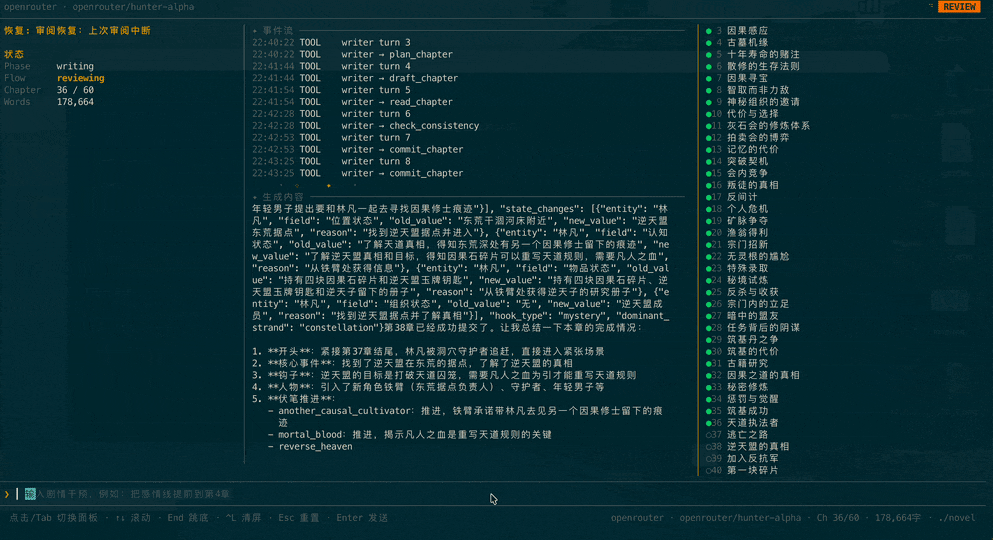
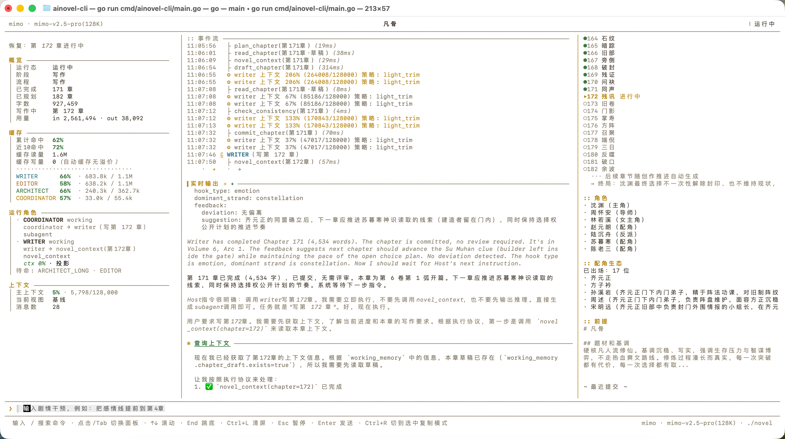

# novel-studio

全自动 AI 长篇小说创作引擎。Coordinator 在一次 Prompt 里驱动 Architect / Writer / Editor 三个子代理完成整本书的创作，Host 只做启动、恢复和观察。从一句话需求到完整小说，全程无需人工干预。

<p align="center">
  
  
</p>

## 项目定位

`novel-studio` 由两层能力组成：

- Go CLI 主运行时，提供 headless 创作、评审、重写和交付沉淀能力。
- 网文写作 skill 包，覆盖拆文、长短篇写作、去 AI 味和审查。

全部 skill 归入 [`skills/`](skills/README.md) 单一源目录，可通过 `novel-studio skills` 子命令导出到 Claude Code / Codex / OpenCode / OpenClaw 能扫描的项目目录。

工程内其他工作区：

- `services/short-story-dashboard/` — 浏览器进度看板：展示长篇 `output/novel` 创作进度和全部产物资料，也保留短篇项目服务能力。`novel-studio service start` 启动。
- `data/generated-output/` — 历史短篇正文、短篇服务项目、工作流状态、审核报告和配图方案。
- `data/reference-library/` — 写作技巧源材料、题材参考库和拆书样本；生成时只提炼结构和技法，不照抄正文。
- `quality/audit/` — 本地 AIGC / AI 味 / 重复 / 内容逻辑 / 错别字审核脚本与参考资料。
- `deconstruction-library/` — 长篇拆解固定工作区（见 [`deconstruction-library/README.md`](deconstruction-library/README.md)）：每本书一个目录，保存原文备份、黄金三章、逐章摘要、角色、剧情、设定、文风和拆文报告；真实原文和产物默认不提交。
- `assets/references/` — 运行时通用写作参考；题材流程参考保留在对应 `skills/*/references/`。

统一规划口径：长篇和短篇只在写作前分流，设计阶段交付物同名同构（见 [`docs/design-stage-workflow.md`](docs/design-stage-workflow.md)）。两者都先落盘 `premise`、`characters`、`world_rules`、`book_world`、`outline`、`layered_outline`、`timeline`、`relationship_state`、`foreshadow_ledger`、`compass` 和 `故事圣经.md`。设计总字数 ≤ 30000 字走短篇压缩粒度（1 卷 1 弧、伏笔短链闭合、写完汇总 `正文.md` 并全文终审）；> 30000 字走长篇分层/滚动粒度。进入章节写作后，两者使用同一套逐章写作、机械审核、Editor 复审、返工和解锁逻辑：每章必须有 `reviews/NN_ai_gate.json` 与统一审核报告 `reviews/NN.md`，未过门禁不允许继续。

目录分层说明见 [`docs/project-structure.md`](docs/project-structure.md)，写作审核一体化执行方案见 [`docs/writing-review-workflow.md`](docs/writing-review-workflow.md)，数据沉淀与推进机制见 [`docs/data-lifecycle-and-progression.md`](docs/data-lifecycle-and-progression.md)，工程能力清单见 [`docs/capability-inventory.md`](docs/capability-inventory.md)。

## 特性

- **多智能体协作** — Coordinator 在一次长循环中调度 Architect / Writer / Editor 三个子代理，自主决策创作流程
- **LLM 驱动长循环** — 一次 Prompt 写完整本书，Host 不介入调度。越简单越稳定，拒绝复杂编排
- **Step 级断点恢复** — 每个工具执行成功后写入 checkpoint，崩溃后精确到 plan/draft/check/commit 步骤级恢复
- **卷弧双层滚动规划** — 初始只规划前 2 卷弧骨架 + 第 1 弧详细章节，后续弧/卷在写作推进到时再由 Architect 展开，远期规划不空洞
- **相关章节智能推荐** — 每章写作时从伏笔、角色出场、状态变化、关系四个维度自动推荐相关历史章节，配合下一章预告，支撑 500+ 章连续性
- **本地 RAG + Qdrant 召回** — pipeline 启动时确保本机 Qdrant，写作前构建当前项目 RAG；foundation、chapter、review、rewrite 持续 upsert 到本地索引、Qdrant 和 `vector_store.json` fallback
- **自适应上下文策略** — 根据总章节数自动切换全量 / 滑窗 / 分层摘要，四级压缩管线支撑 500+ 章长篇
- **八维质量评审** — Editor 从设定一致性、角色行为、节奏、叙事连贯、伏笔、钩子、审美品质、AI 腔检测八个维度评审；审美维度必须引用原文举证，AI 腔检测给出比喻密度、对话占比、格言命中、主角动摇和章末钩子等量化结论
- **机械门禁 + 用户规则** — 内置去 AI 味基线（套句/疲劳词黑名单 + 语义判据），用户用大白话写偏好即可自动归一化为本书规则快照，commit 时机械自检
- **角色动态档案** — 角色不是静态人设标签，而是包含知识账本、决策框架、关系契约、情绪评价、长期弧线的变化决策系统
- **定量心理画像** — 角色可选配大五人格（OCEAN）、依恋类型、Schwartz 价值观、道德基础（MFT）、认知偏差、能力偏科矩阵和显性/隐性/突变三维 DNA 分组；画像注入写作上下文并附行为化指引，commit 时与 Writer 自报表现做确定性一致性提醒
- **叙事量化 lint** — 每章可选自报场景动力四参数（冲突引擎/压力/信息释放/熵变）与 POV，配合体裁节奏契约（起点/晋江/豆瓣/出版等六预设）做跨章确定性趋势检测：连续低压、信息过载、缺喘息、钩子超期、POV 越界轮换全部产出 warning 级事实透传 Editor
- **世界建模纵深** — 势力矛盾网（立场/内部张力/冲突类型与烈度）、显规则/潜规则/隐秘规则三层可见性、物理一致性公理（距离/传信/物价/物候）、宇宙观公理、道德天花板、仪式日历、NPC 生态、生态分层、文化脚注、信息差图（谁知道什么/读者视角）等可选工件，写前注入预防设定崩塌
- **Lost-in-the-Middle 治理** — novel_context 注入按"关键信息在头尾、参考资料居中"有序序列化，附阅读指引，对抗长上下文 U 形注意力衰退
- **世界模拟（离屏推演）** — 镜头外的世界不等主角：Architect 在弧/卷边界以 Game Master 身份做世界推演（`save_world_tick`），推进离屏角色各自的日程（goal→steps）、拨动势力进度钟（Blades 式：每势力一个"目标+进度+走满后果"的时钟，走满必须转化为镜头外事件）、更新社会情绪；每条事件按故事日历（`story_calendar`，一章≈几天）与路线旅行天数推算"最早传到主角处的章号"，Writer 只看得见已越过地平线的事件——正文永远只写主角能感知的世界。LOD 三层控成本（主角圈全推演 / 配角弧级日程 / 背景群体状态机），离屏事件天然成为伏笔素材，diag 监控世界停摆；`--zero-init` 一次产出全部初始状态（分层名单/初始日程/日历骨架/tick 零点 + 信息差图/社会情绪/仪式日历/物理公理/道德天花板）
- **异族裁判（reviewer 角色）** — LLM judge 对同族输出有 75-84% 自我偏好：可配独立 `reviewer` 角色（未配置自动回落 editor），用于三采样 pairwise 终选（随机换位正反两轮、不一致回退确定性分）与 AI 味判别，推荐与 writer 用不同模型家族
- **AI 味防线（写前-写中-写后闭环）** — slop 词表语料化（embed 内置 + 项目级覆盖 + `lexicon_version` 入门禁报告，语料驱动再生成以deconstruction-library为人类基线）；Writer 生成时上下文即带规避清单、返工时再注入命中明细与规避策略；not-x-but-y 等句式按语义变体族合并计数防换皮；书级统计（跨章口头禅/开头结尾结构同质度）；外部检测器（朱雀）人工抽检登记与本地分相关性校准
- **审核闭环强化** — 审核历史零丢失归档（`reviews/NN.history.jsonl`），Editor 复审自动注入上一轮 issues 做回归验证（防"修了 A 换挑 B"循环），`review_round` 轮次事实 + 第 3 轮循环刹车提示；锚定 rubric（四档描述符 + 证据先于评分）修复分数聚簇
- **成本与预算** — token/费用按角色、按模型累计（`meta/usage.json`），OpenRouter 价格自动拉取，`budget.book_usd` 越线告警/熔断，无人值守告警可推到系统通知或自定义命令
- **可观测 / 可诊断** — Coordinator 与每个子代理的完整工具调用日志（`meta/sessions/*.jsonl`）、LLM 调用级 trace（`meta/runtime/llm_calls.jsonl`，字段对齐 OTel gen_ai.* 语义约定）、规则化诊断（`--diag`）、脱敏导出（`diag-export.md`）、harness 评测（`eval inspect`）与 prompt A/B（`eval run --variant`）
- **Prompt 运行时覆盖** — 核心提示词支持 `~/.novel-studio/prompts/` → `./.novel-studio/prompts/` 覆盖链（与 config/rules 同一分层惯例），每次运行落盘 `meta/prompt_manifest.json` 内容指纹，精确回答"这次 run 用的是哪版 prompt"
- **工具参数容错解析** — LLM 工具参数经代理/弱模型出现围栏包裹、尾逗号、字符串化 JSON 时自动修复（纯 Go、零依赖），修复失败返回结构化错误交 LLM 自主重试
- **pipeline / 子命令入口** — 无 TTY 的命令行入口：所有原生写作能力统一经 `--pipeline` 编排；`--headless --prompt`、`--review-existing`、`--rewrite-existing` 仅作兼容别名
- **功能 skill 化** — 每个功能在 [`skills/`](skills/README.md) 下有一份入口 SKILL.md，外部 agent（Claude Code / Codex / OpenCode）读后直接拼命令行调用
- **多 LLM 支持** — OpenRouter / Anthropic / Gemini / OpenAI / DeepSeek / Qwen / GLM / Grok / Ollama / Bedrock 及任意自定义代理，角色级模型覆盖 + 请求级 failover

## 架构

核心设计：**LLM 驱动，Host 服务**。Coordinator 在一次 Run 中自主决策整本书的创作流程，Host 只做启动、恢复和事件观察。

```
┌─────────────────────────────────────────────────┐
│                Host（薄外壳）                     │
│              启动 / 恢复 / 观察                    │
└──────────────────────┬──────────────────────────┘
                       │ 一次 Prompt
┌──────────────────────▼──────────────────────────┐
│              Coordinator（LLM 长循环）            │
│    读 novel_context → 调子代理 → 读结果 → 继续     │
└────┬──────────┬──────────┬──────────────────────┘
     │          │          │
 ┌───▼────┐ ┌───▼───┐ ┌────▼────┐
 │Architect│ │Writer │ │ Editor  │
 └───┬────┘ └───┬───┘ └────┬────┘
     └──────────┼──────────┘
                │ 工具调用（IO + checkpoint）
┌───────────────▼─────────────────────────────────┐
│                   Store                         │
│  Progress / Checkpoint / Outline / Drafts / ... │
└─────────────────────────────────────────────────┘
```

- **Host** — 启动 Coordinator、崩溃恢复、把运行事件投影为结构化流供上层入口（pipeline / 子命令）消费。不做任何调度决策
- **Coordinator** — 唯一的决策者，在一次 Run 里驱动规划→写作→评审→总结的完整流程
- **SubAgents** — Architect / Writer / Editor 各自独立 context，通过 Store 中的工件协作
- **Tools** — 原子 IO + checkpoint 写入，只返事实 JSON，不夹带指令

### 智能体职责

| 智能体 | 职责 | 工具 |
|--------|------|------|
| **Coordinator** | 调度全局，处理评审裁定和用户干预 | `subagent` `novel_context` |
| **Architect** | 生成前提、大纲、角色档案、世界规则 | `novel_context` `save_foundation` |
| **Writer** | 自主完成一章的构思、写作、自审和提交 | `novel_context` `read_chapter` `plan_chapter` `draft_chapter` `check_consistency` `commit_chapter` |
| **Editor** | 阅读原文，从结构和审美两个层面审阅 | `novel_context` `read_chapter` `save_review` `save_arc_summary` `save_volume_summary` |

### 写作流程

```
用户需求 → Architect 前置设计（前提/人物/背景/大纲） → Writer 写一章 → Editor 章级审阅
                                                        ↑             │
                                                        ├── 重写/打磨 ◄┘
                                                        │
                     短篇：全部章审通过 → Editor 全文终审 → 正文.md + complete
                     长篇：弧/卷边界 → Editor 弧卷评审/摘要 → Architect 展开下一弧/卷
```

Writer 按固定顺序完成每章（写作内容完全自主，工具调用顺序严格）：

1. `novel_context` — 加载上下文（前情摘要、伏笔、角色状态、风格规则、相关章节推荐）
2. `read_chapter` — 回读前文找回语气和节奏
3. `plan_chapter` — 构思本章目标、冲突、情绪弧线
4. `draft_chapter` — 写入整章正文
5. `check_consistency` — 对照状态数据检查一致性（必须在 draft 之后）
6. `commit_chapter` — 提交终稿，回刷时间线、伏笔、关系、角色状态和进度；每章必须通过 Editor 章级审阅后才允许续写、弧末处理或完结

### 状态迁移规则

运行状态拆成两层：**Phase**（大阶段）与 **Flow**（当前活跃流程），由代码中的轻量校验统一约束。

#### Phase（只前进不回退）

```text
init -> premise -> outline -> writing -> complete
  \-------> outline ------^
  \--------------> writing
```

- `init` 任务已创建 → `premise` 已保存前提 → `outline` 已保存大纲 → `writing` 章节创作期 → `complete` 全书结束
- 允许同态更新（`writing -> writing`）和前进，不允许回退
- 唯一合法回退出口是 `reopen_book`：只允许已完结作品进入返工态，把目标章节放入 `pending_rewrites`

#### Flow（写作期内的活跃流程）

```text
writing   -> reviewing / rewriting / polishing / steering / writing
reviewing -> writing / rewriting / polishing / steering / reviewing
rewriting -> writing / steering / rewriting
polishing -> writing / steering / polishing
steering  -> writing / reviewing / rewriting / polishing / steering
```

`writing` 正常推进 / `reviewing` Editor 评审中 / `rewriting` 处理必须重写的章节 / `polishing` 处理只需打磨的章节 / `steering` 评估处理用户干预。明显反常的跳转（如 `rewriting -> reviewing`）会被拒绝。

### 长篇滚动规划

传统方案一次规划所有章节，300+ 章时大纲空洞。本系统采用**指南针 + 视野滚动规划**：

```
初始规划                     弧结束时                      卷结束时
┌────────────────────┐    ┌─────────────────────┐    ┌─────────────────────┐
│ 终局方向（指南针）    │    │ Editor 弧级评审      │    │ Editor 卷级评审       │
│ 起步 2 卷，后续按需   │    │ 弧摘要 + 角色快照     │    │ 卷摘要               │
│ 第1弧详细章节        │ →  │ Architect 展开下一弧  │ →  │ Architect 自主创建   │
│ 角色 + 世界观        │    │ Writer 继续写作      │    │ 下一卷 + 更新指南针    │
└────────────────────┘    └─────────────────────┘    └─────────────────────┘
```

- **指南针（Compass）** — 终局方向 + 活跃长线 + 规模估计，每次卷边界由 Architect 更新
- **按需生成** — 当前卷写完后，Architect 根据已写内容自主创建下一卷
- **骨架弧** — 只有 goal + 预估章数，到达时再展开详细章节
- **渐进细化** — 每次展开都参考前文摘要、角色快照、风格规则
- **通用节奏模板** — 成长突破弧 / 竞技对抗弧 / 探索发现弧 / 恩怨冲突弧 / 日常过渡弧，每种弧型有参考密度和适用题材映射

### 长篇上下文管理

500+ 章小说采用三级摘要 + 四级压缩管线 + 智能推荐：

```
卷（Volume）→ 卷摘要
└── 弧（Arc）→ 弧摘要 + 角色快照 + 风格规则
    └── 章（Chapter）→ 章摘要（滑窗最近3章）
```

- **分层摘要** — 近处用章摘要，中距离用弧摘要，远处用卷摘要
- **相关章节推荐** — 从伏笔、角色出场、状态变化、关系四个维度反查历史章节
- **下一章预告** — 加载下一章大纲，帮 Writer 设计章末钩子和伏笔衔接
- **弧边界检测** — 自动识别弧/卷结束，触发评审、摘要生成和下一弧/卷展开
- **钩子/叙事线历史** — `progress.json` 按章记录 `hook_history` / `strand_history`，避免连续章节结构雷同

#### 上下文压缩管线

当对话超出模型上下文窗口时，按代价从低到高逐级压缩：

```
ToolResultMicrocompact → LightTrim → StoreSummaryCompact → FullSummary
     清理旧工具结果        截断长文本      store 零 LLM 压缩      LLM 摘要兜底
```

- **StoreSummaryCompact** — Writer 专用，用 store 中已有的章节摘要、角色快照、伏笔台账直接替换旧消息，零 LLM 开销
- **FullSummary 小说定制** — 面向叙事连续性的摘要提示词，保留角色状态、伏笔线索、审稿待修项、风格锚点
- **压缩后恢复包** — FullSummary 后自动注入当前章节计划、大纲和角色快照，防止压缩后"失忆"
- **熔断器** — 压缩连续失败时自动跳过并显式告警，半开模式下轮自动重试
- **CJK Token 估算** — 中文 `runes × 1.5`，不因 `bytes/4` 低估导致压缩滞后
- **上下文健康度** — 状态快照携带上下文占用比例（<70% / 70-85% / >85% 三档）

详见 [`docs/context-management.md`](docs/context-management.md)。

## 快速开始

```bash
# 一键安装（macOS / Linux，无需 Go）
curl -fsSL https://raw.githubusercontent.com/chenhongyang/novel-studio/main/scripts/install.sh | sh

# 或通过 Go 安装
go install github.com/chenhongyang/novel-studio/cmd/novel-studio@latest

# 查看版本 / 更新
novel-studio --version
novel-studio update

# 首次运行：交互终端走一次 stdin 引导（选 Provider → 填 API Key → Base URL → 模型名）
# 配置完成后再次无参运行会打印用法（TUI 已移除）
novel-studio

# 创作前自检 LLM 是否真的可用（代理未起 / key 失效在这里暴露）
novel-studio --check

# 一条龙：写作→评审→重写→交付，可断点续跑
novel-studio --pipeline --prompt "写一本东方玄幻长篇，主角从边陲小城起步"

# 需求模糊？先多轮对话澄清，定稿创作指令
novel-studio --cocreate "我想写一个赛博朋克悬疑长篇"
```

### 命令一览

写作与规划：

```bash
novel-studio --pipeline --prompt <text>      # 可恢复流水线：写作→评审→重写→交付
novel-studio --pipeline --prompt-file p.md   # 从文件读 prompt
novel-studio --cocreate                      # 多轮对话澄清需求，--start 直接进创作
novel-studio --zero-init [--dir d]           # 第一章前的角色/关系/资源推演资产 + 白名单 RAG
novel-studio --steer "<指令>"                # 排队一条干预，下次启动生效
```

评审与重写：

```bash
novel-studio --pipeline --stages review      # 逐章 Editor 评审（不改原文）
novel-studio --pipeline --stages rewrite     # 按评审反馈逐章重写
novel-studio --pipeline --stages deliver     # 交付沉淀：刷新推进台账 + RAG 事实入库 + 交付快照
```

诊断与运维：

```bash
novel-studio --check                         # LLM 连通性自检（含 fallback 验证）
novel-studio --diag                          # 诊断当前项目产物（只读）
novel-studio --refresh-progress [--dir d]    # 回填章节推进/人物变化/下一章计划台账
novel-studio --build-rag [--dir d]           # 构建本书 RAG 索引并可探测召回
novel-studio eval inspect --cases evals/cases/harness   # Harness 检查既有项目产物
```

风格与资产：

```bash
novel-studio --simulate [--no-diag]          # 分析 simulate/ 语料合成仿写画像
novel-studio --import-sim <profile.json>     # 导入此前生成的仿写画像
novel-studio --writing-assets list           # 查看/启停/组合/绑定/试写写法资产
novel-studio --writing-assets seed-defaults  # 初始化本书基础写法资产
```

看板与 skills：

```bash
novel-studio service start                   # 启动浏览器进度看板
novel-studio service open                    # 手动打开小说项目看板
novel-studio service status                  # 检查看板服务健康状态
novel-studio skills list                     # 列出内置 skills
novel-studio skills context <name> [--json]  # 输出某个 skill 的上下文
novel-studio skills export --to <dir>        # 导出 skills 到项目目录
```

> Windows 或手动安装：前往 [Releases](https://github.com/chenhongyang/novel-studio/releases/latest) 下载对应平台的包。
> `--headless --prompt`、`--review-existing`、`--rewrite-existing` 是兼容别名，内部委派到 pipeline。

### Docker

Docker 镜像适合在服务器/NAS 上跑 headless 长任务。首次配置引导需要交互终端，建议在宿主机先生成好 `~/.novel-studio/config.json` 再挂载进容器：

```bash
mkdir -p config workspace

docker run --rm \
  -v "$PWD/config:/root/.novel-studio" \
  -v "$PWD/workspace:/workspace" \
  ghcr.io/chenhongyang/novel-studio:latest \
  --pipeline --prompt "写一本东方玄幻长篇，主角从边陲小城起步"

# 或 Compose
docker compose run --rm novel-studio --pipeline --prompt "写一本悬疑短篇"
```

### 管理多本小说

每本小说绑定到启动目录，产物落在 `{cwd}/output/novel/`。换目录运行 = 换一本，`cd` 回去运行 = 自动从最近 checkpoint 恢复。配置 `~/.novel-studio/config.json` 全局共享。

## 配置

首次运行自动引导生成 `~/.novel-studio/config.json`，后续直接编辑。完整示例见仓库根目录 [`config.example.jsonc`](config.example.jsonc)（首次引导也会复制一份到 `~/.novel-studio/`）。

> 从旧版（配置目录为 `~/.ainovel/`）迁移：`mv ~/.ainovel ~/.novel-studio`（项目内如有 `./.ainovel/` 同理改名），内容格式不变。

```jsonc
{
  "provider": "minimax",
  "model": "MiniMax-M3[1M]",
  "reasoning_effort": "medium",
  "providers": {
    "minimax": {
      "api_key": "sk-xxx",
      "models": ["MiniMax-M3[1M]", "MiniMax-M3"]
    }
  },
  "style": "default",
  "context_window": 0,                  // 0=按模型自动解析；可显式钉小值提前触发压缩
  "budget": { "book_usd": 20, "warn_ratio": 0.8, "hard_stop": false },
  "notify": { "enabled": true, "events": ["run_end", "repeat", "budget"] },
  "rag": {
    "embedding": { "enabled": true, "local_gguf": "models/embedding/Qwen3-Embedding-0.6B-Q8_0.gguf", "local_port": 18434, "model": "qwen3-embedding-0.6b" },
    "qdrant": { "enabled": true, "url": "http://127.0.0.1:6333" },
    "craft_library": "deconstruction-library/writing-techniques",
    "benchmark_library": "deconstruction-library/novel_all"
  }
}
```

### 配置查找顺序（后者覆盖前者）

1. `~/.novel-studio/config.json` — 全局配置
2. `./.novel-studio/config.json` — 项目级覆盖（可选）
3. `--config path/to/config.json` — 命令行指定

> 项目级 `.novel-studio/` 是全局 `~/.novel-studio/` 的镜像：配置放 `./.novel-studio/config.json`，写作规则放 `./.novel-studio/rules/*.md`。该目录含密钥，已默认加入 `.gitignore`。

覆盖规则：标量字段按后者覆盖前者；`providers` 和 `roles` 按 key 合并，同名项内部按字段覆盖；未填写字段继承上层。**注意** `provider`（及 `roles.*.provider`）的值是 `providers` 里的 key 名——一根指针；项目级切到全局不存在的账号时必须同时补凭证。

`reasoning_effort` 可选 `off` / `low` / `medium` / `high` / `xhigh` / `max`，`roles.<role>.reasoning_effort` 可按角色覆盖。

### 按角色使用不同模型

```jsonc
{
  "provider": "openrouter",
  "model": "google/gemini-2.5-flash",
  "providers": {
    "openrouter": { "api_key": "sk-or-v1-xxx", "base_url": "https://openrouter.ai/api/v1" },
    "anthropic": { "api_key": "sk-ant-xxx" }
  },
  "roles": {
    "writer":    { "provider": "anthropic", "model": "claude-sonnet-4", "reasoning_effort": "high" },
    "architect": { "provider": "openrouter", "model": "google/gemini-2.5-pro", "reasoning_effort": "low" }
  }
}
```

可配置角色：`coordinator` / `architect` / `writer` / `editor` / `reviewer`。
`reviewer` 是异族裁判（pairwise 终选与 AI 味判别专用），未配置自动回落 editor；推荐与 writer
用不同模型家族（同族 judge 自我偏好 75-84%），示例见 `config.example.jsonc`。

### 兜底 provider（failover）

给角色配 `fallbacks`，主 provider 因网络/限流/超时/过载失败时，**该次请求自动切到兜底**（请求级 failover，不改全局配置）：

```jsonc
{
  "roles": {
    "writer": {
      "provider": "cc-codex-proxy", "model": "claude-opus-4-8",
      "fallbacks": [{ "provider": "minimax", "model": "ultra" }]
    }
  }
}
```

`novel-studio --check` 会同时验证主模型与兜底，按角色汇总"主可用 / 主挂走兜底 / 全挂"。

### 自定义代理

支持 `openrouter` / `anthropic` / `gemini` / `openai` / `deepseek` / `qwen` / `glm` / `grok` / `ollama` / `bedrock` 及任意自定义代理。要点：

- `providers.<name>.type` 指定协议（`openai` / `anthropic`），显式指定 type 的自定义代理允许不填 `api_key`
- `providers.<name>.api` 仅对 openai 协议生效：`chat`（默认）或 `responses`（Codex 类代理）
- `providers.<name>.extra` 是 provider 级配置（`user_agent`、`headers`、`anthropic_beta` 等代理识别字段）；`extra_body` 才是请求体扩展参数，两者不要混用
- `ollama` / `bedrock` 允许不填 `api_key`；Bedrock 在 `extra` 中配 `region`、`access_key_id`、`secret_access_key`

<details>
<summary>Claude Code 协议代理示例</summary>

```jsonc
{
  "provider": "claude-code-proxy",
  "model": "claude-sonnet-4-6",
  "providers": {
    "claude-code-proxy": {
      "type": "anthropic",
      "api_key": "sk-xxx",
      "base_url": "https://proxy.example.com",
      "extra": {
        "user_agent": "claude-code/2.1.183",
        "anthropic_beta": "claude-code-20250219",
        "headers": {
          "X-Stainless-Lang": "js",
          "X-Stainless-Package-Version": "0.94.0",
          "X-Stainless-Runtime": "node"
        }
      }
    }
  }
}
```

</details>

<details>
<summary>Codex 协议代理示例</summary>

```jsonc
{
  "provider": "codex-proxy",
  "model": "gpt-5.4",
  "providers": {
    "codex-proxy": {
      "type": "openai",
      "api_key": "sk-xxx",
      "base_url": "https://proxy.example.com/v1",
      "api": "responses",
      "extra": {
        "user_agent": "codex-tui/0.142.3 (Mac OS 26.5.1; arm64) Apple_Terminal/470.2 (codex-tui; 0.142.3)",
        "headers": {
          "Originator": "codex-tui",
          "Session_id": "replace-with-random-session-id",
          "X-Codex-Turn-Metadata": "replace-with-random-turn-metadata"
        }
      }
    }
  }
}
```

`Session_id` 和 `X-Codex-Turn-Metadata` 应换成稳定的随机值，兼容 New API 的 Codex 透传模板和 sub2api 的指纹检查。

</details>

<details>
<summary>本地 Ollama 示例</summary>

```jsonc
{
  "provider": "ollama",
  "model": "qwen3:latest",
  "providers": {
    "ollama": { "base_url": "http://localhost:11434/v1" }
  }
}
```

</details>

### 写作风格

配置 `style` 字段切换：`default`（通用）/ `suspense`（悬疑推理）/ `fantasy`（奇幻仙侠）/ `romance`（言情）。

### 去 AI 味与自定义规则

内置去 AI 味基线（出厂默认）：机械黑名单（套句/疲劳词，`rules.SystemDefaults()`，commit 时确定性检查）+ 语义判据 `assets/references/anti-ai-tone.md`（注入 writer / editor 规避与举证）。

叠加自己的偏好**无需改源码**：在 `~/.novel-studio/rules/`（全局）或 `./.novel-studio/rules/`（本书）放任意 `.md`，**用大白话写偏好**（「主角别写成圣母」「每章 3000 字左右」「不要出现『某种程度上』」）——零格式、零 YAML。系统用模型把自然语言归一化成本书规则快照（字数范围 / 禁用词 / 疲劳词阈值等结构化约束 + 风格偏好），写作时自动遵循、提交时机械自检。违规按固定映射分级：禁用字符/短语 → error，疲劳词超阈值 → warning，字数偏差 ≥20% → error。详见 [`docs/user-rules-runtime.md`](docs/user-rules-runtime.md)。

## 成本、预算与告警

- **用量统计** — token/费用按角色、按模型累计到 `meta/usage.json`（input / output / cache_read / cache_write / cost_usd / saved_usd），进程重启从 sessions 回放重建
- **价格表** — OpenRouter 模型价格自动拉取并本地缓存，未知模型 cost 记 0
- **预算熔断** — `budget.book_usd > 0` 启用：到 `warn_ratio`（默认 0.8）告警，越线后默认等当前子代理任务结束再停，`hard_stop: true` 立即停
- **无人值守告警** — `notify` 缺省启用系统通知，可配 `command` 转发到任意命令（手机推送等），事件类型：`run_end` / `repeat` / `budget`。告警是纯观察层动作，永不介入控制流

## LLM 自检

创作要花数小时，最怕"配置看着对、一调用就崩"。`novel-studio --check` 在创作前对默认模型与各角色模型（含 fallback）做一次最小真实调用，逐一报告可用性：

```bash
novel-studio --check                                  # 测当前配置的所有模型目标
novel-studio --check --provider minimax --model M3    # 只验证某个备用 provider（不改配置）
```

全部可用退出码 0，任一失败非 0 并提示常见原因。详见 [`skills/novel-check`](skills/novel-check/SKILL.md)。

## 流水线

`novel-studio --pipeline` 把各功能串成一条**可恢复的流水线**：按阶段顺序执行，状态存 `meta/pipeline.json`，已完成阶段重跑时先复核产物证据，再决定跳过或重跑。

```bash
# 标准：写作 → 评审 → 重写 → 交付（中断后重跑同一命令即续跑）
novel-studio --pipeline --prompt "写一本东方玄幻长篇，主角从边陲小城起步"

# 先共创澄清再一条龙
novel-studio --pipeline --stages cocreate,write,review,rewrite,deliver

# 自定义阶段子集；--restart 从头重跑
novel-studio --pipeline --prompt "..." --stages write,deliver
```

阶段：`cocreate`（可选）→ `write` → `review` → `rewrite` → `deliver`，默认 `write,review,rewrite,deliver`。`deliver` 做交付沉淀：刷新章节/项目推进台账、把已接受章节的事实 chunk 沉入 RAG 索引、落交付快照与 `meta/delivery_log.md`。流水线只做阶段编排，阶段内部各自还有更细的恢复（write 走 checkpoint、review/rewrite 按章号），两层恢复叠加。阶段标记完成前必须通过轻量证据校验；`--diag` 会只读报告流水线证据漂移。

启动时按配置确保本机 Qdrant 可用；进入 `write` 前构建或刷新当前项目 RAG。详见 [`skills/novel-pipeline`](skills/novel-pipeline/SKILL.md)。

## 诊断与可观测性

**诊断**（`--diag`）对 output 产物做只读分析，覆盖四个维度：

- **流程** — 改写循环卡顿、未消费的转向指令、阶段/流程状态异常、章节跳号、流水线证据漂移
- **质量** — 评审维度持续低分、合同履约率、改写率、章节字数异常
- **规划** — 伏笔停滞、指南针过时、大纲耗尽、摘要缺失
- **上下文** — 角色消失、时间线缺口、关系数据停滞

每条发现包含问题描述、数据证据、改进建议。诊断同时写出**已脱敏**的 `meta/diag-export.md`（移除小说正文，仅保留行为骨架），可直接贴 GitHub issue。

**运行观测**：Coordinator 会话日志在 `meta/sessions/coordinator.jsonl`，每个子代理一份 `meta/sessions/agents/{agent}-*.jsonl`，包含完整工具调用记录。排查手册（跑到第 N 章该看哪个文件、哪个字段）见 [`docs/observability.md`](docs/observability.md)。

**评测**：`internal/eval` 提供 Case/Expect/Gate 评测框架，支持产物断言、stylestat 门禁、usage 指标和 RAG 召回检查：

```bash
novel-studio eval inspect --cases evals/cases/harness   # 只读检查既有项目产物
```

case 定义在 [`evals/cases/`](evals/cases/)，评测体系说明见 [`docs/evaluation-system.md`](docs/evaluation-system.md)。

## 仿写画像

把参考文章放到启动目录的 `simulate/` 文件夹，系统递归读取 `.txt`、`.md`、`.markdown`，用 architect 模型分析语料写入 `meta/simulation_profile.json`。合成按 `relative_path + sha256` 跳过未变化文件；已有画像时增量合成。也可用 `--import-sim` 导入之前生成的画像（按语料指纹合并、重复来源跳过）。

画像以 compact 形式注入 `novel_context`，四个 Agent 都能读取；各 Agent 只借鉴结构、节奏、钩子和吸引读者手法，不复制原文表达或专有设定。详见 [`skills/novel-simulate`](skills/novel-simulate/SKILL.md)。

## 实时干预（Steer）

`novel-studio --steer "<指令>"` 排队一条干预，持久化到 `run.json`，下次 `--pipeline` 启动/恢复时自动注入 Coordinator，由其评估影响范围，决定是修改设定、重写已有章节，还是在后续章节调整。

| 干预指令 | 系统可能的响应 |
|---|---|
| "主角改成女性" | 修改角色设定，评估已写章节是否需要重写 |
| "把感情线提前到第4章" | 调整大纲，可能重写第4章及后续 |
| "加入一个反派角色" | 更新角色档案和世界规则，在后续章节引入 |
| "节奏太慢了，加快推进" | 调整后续章节的大纲密度 |

## 输出结构

所有创作数据保存在 output 目录。中断后重新运行自动续写；删除 output 目录将重新开始。

```
output/{novel_name}/
├── 正文.md              # 短篇/三万字内项目全文终审通过后的合并正文
├── premise.md           # 故事前提
├── outline.json/md      # 扁平章节大纲（仅含已展开章节）
├── layered_outline.json/md # 分层大纲（当前卷 + 预览卷，长篇模式）
├── characters.json/md   # 角色档案
├── world_rules.json/md  # 世界规则
├── book_world.json/md   # 地点、势力、路线等本书世界资产
├── timeline.json/md     # 时间线
├── foreshadow_ledger.json/md # 伏笔台账
├── relationship_state.json/md # 人物关系长期状态
├── chapters/            # 终稿（01.md ...）
├── summaries/           # 章节摘要（JSON）
├── drafts/              # 章节草稿（含 01.zero_init.plan.json 零章推演草案）
├── reviews/             # 统一审核报告（NN.md + NN_ai_gate.json + NN.history.jsonl 复审历史）
├── meta/
│   ├── progress.json     # 进度状态（phase/flow/hook_history/strand_history）
│   ├── pipeline.json     # --pipeline 阶段状态与证据
│   ├── compass.json      # 终局方向指南针（长篇模式）
│   ├── checkpoints.jsonl # Step 级 checkpoint（每个工具成功后追加）
│   ├── usage.json        # token / 费用累计（按角色、按模型）
│   ├── state_changes.json / resource_ledger.json / cast_ledger.json
│   ├── chapter_progress.json / project_progress.json # 章级/项目级推进台账
│   ├── evolution_report.json # 自动进化观察报告
│   ├── style_rules.json  # 写作风格规则（弧边界时提炼）
│   ├── prompt_manifest.json # 本次运行各核心 prompt 的来源与内容指纹
│   ├── runtime/llm_calls.jsonl # LLM 调用级 trace（gen_ai.* 字段）
│   ├── scene_dynamics/   # 每章场景动力四参数（Writer 自报时落盘）
│   ├── pacing_contract.json / moral_ceiling.json / physics_axioms.json # 可选写前约束工件
│   ├── cosmology.json / ritual_calendar.json / crowd_life.json / social_mood.json # 可选世界建模工件
│   ├── world_events.jsonl / world_tick.json / offscreen_agenda.json / simulation_tiers.json # 世界模拟（离屏推演）
│   ├── story_calendar.json  # 故事内时间基线（纪年/开场日期/每章天数换算）
│   ├── slop_lexicon.json    # 项目级 slop 词表覆盖（可选，与内置合并）
│   ├── external_detection_log.jsonl # 外部检测器（朱雀等）人工抽检登记
│   ├── info_graph.json / ecological_map.json / cultural_footnotes.json # 可选叙事/生态/跨文化工件
│   ├── initial_character_dynamics.json # 初始人物动态：知识账本/决策框架/关系契约/情绪评价/长期弧线
│   ├── initial_resource_ledger.json / character_return_plan.json / crowd_role_policy.json
│   ├── ch01_zero_init_plan.md / first_chapter_generation_readiness.md
│   ├── zero_chapter_context_manifest.json # 零章上下文/RAG 白名单清单
│   ├── rag/              # RAG 索引、向量 fallback、retrieval trace
│   ├── sessions/         # Agent 会话与工具调用日志（coordinator.jsonl + agents/*.jsonl）
│   └── diag-export.md    # 脱敏诊断导出（报 issue 用）
```

## 断点恢复

写一部长篇可能需要数小时甚至数天，中途崩溃、断网、Ctrl+C 都是常见情况。系统在**同一目录再次运行时自动恢复**：

| 中断时机 | 恢复行为 |
|---|---|
| 规划阶段 | 检查已保存的设定，自动补全缺失项 |
| 某章正在写作（有草稿未提交） | 从该章续写，读取已有草稿继续 |
| 审阅进行中 | 重新触发 Editor 评审 |
| 重写/打磨队列未清空 | 继续处理待重写的章节 |
| 弧/卷展开中断 | 自动检测骨架弧/卷，触发 Architect 展开 |
| 用户干预未完成 | 重新注入上次的干预指令 |
| 正常写作中断 | 从下一章继续 |

工作原理：所有产物持久化在 `output/`，每个工具执行成功后写 checkpoint（`meta/checkpoints.jsonl`）。重启时读取 `progress.json` + 最近 checkpoint + 待处理信号，精确到 step 级生成恢复指令（如"第 7 章 draft 已落盘，请继续 check_consistency"），一次 Prompt 启动 Coordinator 继续创作。

> 文件写入使用 temp + fsync + rename 原子操作，写入过程中断电也不会损坏已有数据。

## 设计理念

> **把复杂度从代码搬到模型里。** 代码越少，能坏的地方越少。决策权交给更擅长做决策的角色。

### LLM 驱动，越简单越稳定

- **决策权归 LLM** — 流程决策全部由 Coordinator 自主判断，Host 不介入。工具失败返回结构化错误，由 LLM 自行决定重试或调整策略
- **工具只返事实** — 原子 IO + checkpoint，返回值是 JSON 事实字段（`final_verdict` / `pending_rewrites` / `arc_end_reached`），不夹带任何指令字符串
- **Reminder 驱动每轮** — Host 在每轮 LLM 调用前读事实层，运行纯函数 generator 生成 `<system-reminder>` 注入；指令不进持久历史、每轮从事实重算
- **StopGuard 物理守门** — `Phase ≠ Complete` 时 Coordinator 物理上不可 `end_turn`，连续阻拦超限才升级终止
- **拒绝复杂编排** — 没有 task queue、没有 scheduler、没有 policy engine。Coordinator 的一次 Run 就是唯一的控制流
- **模型越强收益越大** — 架构把决策权留在 prompt 和工具语义里，模型升级后直接吃到收益，Host 一行不用改

### 全自动闭环

```
"写一部悬疑小说" → 构建世界观 → 设计角色 → 规划大纲
                → 逐章写作 → 质量评审 → 自动重写
                → 弧级摘要 → 角色快照 → 完整成书
```

- **Writer 自主创作** — 每章独立完成 plan → draft → check → commit 闭环
- **Editor 自主评审** — 跨章节分析结构问题，输出裁定及影响范围
- **Architect 自主构建** — 从一句话需求推导完整设定，弧/卷边界自主展开后续规划
- **自动伏笔管理** — 埋设、推进、回收全程由 Agent 自行追踪
- **自动节奏调控** — 追踪叙事线和钩子类型历史，避免连续章节结构雷同
- **项目级规划仪表盘** — 章级 accept 后刷新 `meta/project_progress.json/md`，把交付口径、卷弧进度、主角变化路线图、承诺兑现、钩子疲劳、资源清账、伏笔优先级、关系张力和资产运营动作注入下一章上下文
- **可审计自动进化** — 章级 accept 后刷新 `meta/evolution_report.json/md`，观察近章问题、诊断模式、提出 proposed 候选改动和验证计划；默认不自动修改规则、提示词或代码

### 事实与指令解耦

工具只返事实，指令由 Reminder 每轮从事实层重算：

- `commit_chapter` / `save_review` 返回结构化事实，不夹带任何 `[系统]` 字符串
- `internal/host/reminder/` 下的纯函数 generator 读 `Progress` + `Outline`，每轮 pre-turn 生成 `<system-reminder>`：`flow`（当前该做什么 / 弧末刹车）、`queue_guard`（队列未清禁止新章）、`book_complete`（全书完成才放行）；物理兜底由 StopGuard 承担
- Reminder 只存活一轮，不进历史、不参与压缩；规则有单元测试，退化可被回归捕获

架构全貌与合宪约束见 [`docs/architecture.md`](docs/architecture.md)。

## 技术栈

- **Go 1.25** — 主语言（~8.6 万行，350 个源文件）
- **[agentcore](https://github.com/voocel/agentcore)** — 极简 Agent 内核（tool-calling + streaming + StopGuard/ToolGate）
- **[litellm](https://github.com/voocel/litellm)** — 统一 LLM 接口适配（经 `third_party/litellm` 仓内 fork 引入，修复空参 tool_use 回放丢 input 字段的问题）

## License

MIT

本项目积极参与并认可 [linux.do 社区](https://linux.do/)。
