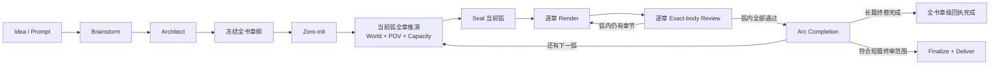

<div align="center">


# novel-studio — 开源、本地优先的 AI 长篇小说创作引擎

**先推演世界，再规划弧线，最后把主角真正看见的因果写成正文。**

Open-source, local-first AI novel generator with self-hosted orchestration for long-form fiction, web novels and story production.

[](https://github.com/Xiaoyangy/novel-studio)
[](https://github.com/Xiaoyangy/novel-studio/releases/latest)
[](go.mod)
[](#运行要求)
[](LICENSE)

[简体中文](README.md) · [English](README_EN.md)

[为什么是 novel-studio](#为什么是-novel-studio) · [效果预览](#效果预览) · [快速开始](#快速开始) · [工作流](#从世界到正文) · [RAG](#rag-不是装饰) · [文档](#文档与社区)

</div>

---

novel-studio 是一个面向**长篇小说、网文连载、短篇整书和故事工作室**的开源 AI 写作系统。它把通常散落在聊天记录里的大纲、人物、世界状态、RAG 记忆、正文审核和返工过程，变成可落盘、可验证、可恢复的生产流水线。

它不是“把上一段继续写长”的聊天壳。系统先冻结全书导航，再按弧推演所有角色的选择与后果；一弧规划完整并封存后，才逐章渲染、逐章审核。正文只看到主视角有权知道的事实，隐藏世界状态不会为了方便推进而直接泄漏。

> 如果你也在寻找一个能写长篇、记得住前文、处理人物蝴蝶效应，而且中断后还能继续的 AI 小说生成器，欢迎 [⭐ Star novel-studio](https://github.com/Xiaoyangy/novel-studio)。你的反馈会直接影响下一轮能力优先级。

## 为什么是 novel-studio

普通 AI 写作很擅长生成一段“像小说”的文字，真正困难的是让几十万字以后的人物仍然知道自己为什么行动、拥有什么、错过了什么，以及一个离屏决定如何改变下一章。

novel-studio 把这些问题拆成独立且可审计的工程层：

| 长篇创作难题 | novel-studio 的处理方式 |
|---|---|
| 角色只围着主角转 | 每名角色拥有自己的目标、压力、资源、知识与行动；离屏角色也会推进世界 |
| 大纲写完，正文还是自由发挥 | 全书章纲先冻结；当前弧的 world simulation、POV plan、承载力与跨章义务全部完成后才能写正文 |
| RAG 召回很多，正文却像没用 | 命中必须转换成带来源的事实锚点或写法方法，并封存进当前章 render packet |
| 模型偷看未来或泄漏秘密 | 世界层与主视角层分离，角色知识、首登场、关系和 reveal budget 都有机械边界 |
| 返工后审核的不是同一稿 | 计划、正文、审核、commit 与交付都绑定 exact body SHA-256 |
| 长任务卡住只能重跑 | pipeline、弧规划、候选正文、审核、发布与 RAG 都有 checkpoint、租约和恢复回执 |
| 一直重试，调用成本失控 | 每个 sealed candidate 的完整正文 realization 有持久预算，超限会在 provider 前熔断 |

### 核心能力

| 能力 | 你得到什么 |
|---|---|
| 🌍 单世界全角色推演 | 角色不再是剧情按钮；人物选择、关系、资源、知识和离屏行动共同形成下一章因果 |
| 🧭 全书定位、按弧生产 | 先冻结全书卷—弧—章导航，再执行“一弧推演、一弧渲染”；弧内每章仍单独审核 |
| 🧠 RAG 长程记忆 | 项目事实、写法资料、对标素材和审核校准分通道路由，支持 BM25、embedding、本地向量与 Qdrant |
| 🎭 主视角投影 | 完整世界决定留在模拟层，Drafter 只接收当前 POV 可见的事实、声口、约束与可写节拍 |
| ✅ Exact-body 质量闭环 | 机械规则、本地整章检查、独立 Reviewer、Editor、一致性和实际状态变化共同决定正文能否发布 |
| 🛟 可恢复生产 | 崩溃、超时或进程退出后按持久证据继续；不会把聊天历史当成项目真相 |
| 📊 实时进度看板 | 查看弧规划、正文章号、角色状态、离屏世界、RAG、审核、模型调用、成本和错误 |
| 🔒 Local-first / 自托管编排 | 世界设定、章节、索引和生产凭证保存在自己的项目目录；模型与向量服务由你配置 |

## 效果预览


<details>
<summary><strong>展开人物与离屏世界视图</strong></summary>


</details>

看板只读交叉核对正文、进度、弧规划、评审、RAG、checkpoint 和运行事件。冻结的全书大纲、当前弧正式 plan、正在渲染的章节和已验收正文分别统计，不会把“有章纲”误报成“已经写完”。

## 快速开始

### 运行要求

- macOS 或 Linux；Windows 请使用 WSL2，不要使用旧 Release 中的原生 Windows ZIP。
- 使用 Release 安装无需本地 Go 工具链；从源码构建需要 Go 1.25.5。
- 至少配置一个可用的文本模型 provider；完整 sealed pipeline 的 `reviewer` 必须显式使用 DeepSeek。
- 是否完全离线还取决于 provider、embedding、向量服务，以及本次流程是否调用 `web_research` 等联网能力。
- 进度看板使用 Python 3，当前需从源码 checkout 的项目根目录启动；Release 一键安装目前只安装 CLI 二进制。RAG embedding 与 Qdrant 按配置启用。

### 1. 安装

本页描述当前 `main`。想体验这里介绍的最新生产合同与看板，请选择源码构建；GitHub Release 更适合只需要稳定 CLI 的用户，但可能晚于主干能力。下面两种方式二选一。

```bash
# 方式 A：当前 main + 完整看板
git clone https://github.com/Xiaoyangy/novel-studio.git
cd novel-studio
mkdir -p "$HOME/.local/bin"
go build -o "$HOME/.local/bin/novel-studio" ./cmd/novel-studio
export PATH="$HOME/.local/bin:$PATH"
```

```bash
# 方式 B：稳定 Release，仅安装 CLI
curl -fsSL https://raw.githubusercontent.com/Xiaoyangy/novel-studio/main/scripts/install.sh | sh
```

### 2. 配置并检查模型

```bash
novel-studio
novel-studio --check
```

全局配置位于 `~/.novel-studio/config.json`；项目中的 `./.novel-studio/config.json` 可以覆盖它。完整字段见 [配置示例](config.example.jsonc)。

### 3. 开始一本新书

```bash
novel-studio --pipeline --new-novel \
  --prompt "写一部 12 章完结的双女主都市悬疑短篇；每章 2000—2500 中文字；人物边界和结局回收必须先在章纲中冻结"
```

长期项目建议把完整创作契约放进文件：

```bash
novel-studio --pipeline --new-novel --prompt-file prompt.md
```

这条命令会创建书目并进入**有界、可恢复**的生产流程，不会在一个无限上下文里盲写整本书。默认每次只推进当前合法阶段，并最多验收下一章正文。

### 4. 恢复下一步

```bash
novel-studio --pipeline --dir data/runs/<书名>
```

重复同一条命令即可从落盘证据继续。不要手改 `progress.json`，也不要同时为同一本书启动两条写作 pipeline。

### 5. 打开进度看板（源码 checkout）

```bash
novel-studio service start
novel-studio service open
```

默认地址是 [http://127.0.0.1:8765/](http://127.0.0.1:8765/)。

## 从世界到正文



这里最关键的边界是：

1. **全书章纲先冻结**：提供全局方向与章节位置，但它不等于各章已经正式规划。
2. **推演一弧，渲染一弧**：当前弧全部章节的角色决定、跨章因果、POV 信息边界和正文承载力完成后，才允许 seal。
3. **渲染仍然逐章**：每次只提升下一份不可变 chapter bundle，生成隔离候选正文，并对该章最终 body 做审核。
4. **审核通过才进入正史**：候选正文、实际状态变化与 sealed plan 一致后才原子发布；失败稿保留诊断但不污染 live canon。
5. **一弧结束再进入下一弧**：弧内缺章、缺 acceptance receipt 或正文 SHA 漂移，都会阻止下一弧启动。当前全书 exact-book finalize / publication package 仅用于满足短篇终审合同的项目，不能冒充长篇全书终审。

### 为什么按弧，而不是全书一次推演？

全书章纲适合固定方向，单章计划适合执行，但真正决定故事是否完整的是“这一段因果如何跨越多章并收束”。按弧推演让角色选择、伏笔、资源变化与章节钩子在一个联合窗口内互相校验；按章渲染又把正文质量和返工成本限制在可控范围内。

完整的 generation、bundle、obligation registry、promotion、actual outcome 和恢复协议见 [Project-All 按弧架构](docs/project-all-architecture.md)。

## 正文质量闭环

```text
sealed chapter plan + exact frozen render context
                    ↓
        typed preflight + one-shot permit
                    ↓
              isolated draft
                    ↓
 deterministic gates + hard consistency
                    ↓
             candidate commit
                    ↓
 local whole-chapter checks + independent Reviewer + Editor
                    ↓
     actual-delta match + journaled publish
```

每章都要回答四个问题：

- **事实对不对**：金额、数量、时间、地点、授权、知识边界与因果顺序是否符合 sealed plan。
- **故事好不好看**：目标、阻力、行动、转折、关系位移、读者回报和章末钩子是否成立。
- **文字像不像人写的小说**：是否出现流程报告、同构节奏、过度解释、对白传送带或元数据泄漏。
- **审核的是不是同一稿**：plan、正文、Reviewer、Editor、consistency、commit 和交付是否绑定同一个 SHA。

外部人工检测属于用户可选抽查。novel-studio 不自动操作第三方检测网站，也不会因为用户没有逐章上报外部得分而阻塞生产。完整边界见 [外部检测协议](docs/external-detector-protocol.md)。

## RAG 不是装饰

novel-studio 的检索增强生成面向长篇小说的“可追溯使用”，而不是把一堆相似文本塞进正文上下文：

```text
BM25 / embedding / Qdrant 命中
              ↓
 exact source ref + content-addressed receipt
              ↓
 Planner 转换成当前章事实锚点或写法方法
              ↓
 sealed render_packet
              ↓
 Drafter 只消费最小、可见、已转化的输入
```

| RAG 通道 | 用途 |
|---|---|
| 项目事实 | 世界规则、人物状态、章节事实、资源、关系和伏笔 |
| 写法资料 | 对话、场景、节奏、类型文技巧与方法卡 |
| 对标素材 | 隔离处理后的结构样本与参考作品拆解 |
| 审核校准 | 可读性、AIGC、平台反馈和历史修改建议 |

每次当前弧推演都会冻结独立的 `rag_snapshot_root`。Drafter 看不到 raw hits，也不会在 render 阶段临时连接 live Qdrant；真正进入正文执行层的是已经有来源、有用途、有边界的最小输入。

这条证据链能证明资料被检索、转化并受控注入规划，不会机械声称每个软性事实锚点或写法建议都已经改变最终正文。

```bash
# 构建或刷新项目索引
novel-studio --build-rag --dir data/runs/<书名>/output/novel

# 修复并验证 RAG / embedding / vector store 状态
novel-studio --rag-ready --dir data/runs/<书名>/output/novel
```

## 模型与部署

novel-studio 可以按角色选择不同 provider、model 和 reasoning effort。当前适配包括 OpenAI、Anthropic、Gemini、OpenRouter、DeepSeek、Qwen、GLM、Grok、MiniMax、Mimo、Ollama、Bedrock、OpenAI-compatible 代理，以及本机 Codex CLI。适配器存在不等于所有模型版本都已在每个生产角色上完成验证。

| 配置 | 作用 |
|---|---|
| `providers` | API key、协议、base URL、模型和附加参数 |
| `roles` | Coordinator、Architect、Writer（World Simulator / Planner 共用）、Drafter、Editor、Reviewer 的模型分工 |
| `context_window` | 真实上下文窗口与压缩依据 |
| `rag.embedding` | 远程 embedding 或本地 GGUF embedding |
| `rag.qdrant` | Qdrant 地址、collection 与自动启动方式 |
| `budget` | 单书成本告警与硬停止 |
| `notify` | 桌面或自定义通知 |

**Local-first / 自托管编排不等于默认完全离线或完全私密。** 项目文件与状态保存在本机；文本是否离线生成，取决于你是否选择 Ollama、本地兼容服务或远程 API。完整 sealed pipeline 的独立裸正文审核要求 `reviewer` 角色显式指向 DeepSeek，其他生产角色仍可独立路由。即使模型、embedding 与 Qdrant 都在本地，brainstorm 或返工阶段调用 `web_research` 时仍会联网。不要把真实 API key 提交到仓库。

## 适合谁

- 想写几十章到数百章网文、长篇小说或系列故事的作者。
- 需要人物状态、知识边界、关系、伏笔和资源长期一致的创作团队。
- 想自托管 AI 写作流程，并掌控模型、RAG、成本和项目文件的开发者。
- 在研究多智能体写作、世界模拟、长上下文治理与可恢复 Agent pipeline 的工程师。
- 需要把短篇生产拆成规划、渲染、审核、全文终审和交付包的内容工作室。

它目前不是拖拽式桌面写作软件，也不承诺“一条提示词无人值守产出完美百万字成书”。百万字级项目是架构目标，不代表已经完成百万字成书质量验证；最终质量仍取决于创作契约、模型能力、RAG 资料、审核标准、预算和作者抽查。

## 常用命令

| 命令 | 用途 |
|---|---|
| `novel-studio --pipeline --new-novel --prompt "..."` | 新建书目并启动生产流程 |
| `novel-studio --pipeline --dir data/runs/<书名>` | 从可信证据恢复下一步 |
| `novel-studio --pipeline --stages preplan,project-all,seal` | 只完成当前弧全部章节的正式推演与封存，不写正文 |
| `novel-studio --pipeline --stages preplan,project-all,seal,promote,render` | 复核 sealed arc，并渲染、审核下一章 |
| `novel-studio --pipeline --stages finalize,deliver` | 仅对满足全局终审范围的短篇，在逐章通过后执行 exact-book 终审并生成出版包 |
| `novel-studio --build-rag --dir .../output/novel` | 构建项目 RAG 索引 |
| `novel-studio --rag-ready --dir .../output/novel` | 验证 embedding 与向量状态 |
| `novel-studio service open` | 打开进度看板 |
| `novel-studio --diag` | 只读诊断当前项目 |
| `novel-studio --check` | 检查 provider、model 与 fallback 配置 |

高级 rebase、outline repair、successor generation、慢章诊断、完整输出树和 execution receipt 说明集中在 [生产与运维参考](README-TECHNICAL.md)，避免产品 README 退化成长篇变更日志。

## 项目数据

```text
data/runs/<书名>/
├── brainstorm.md
├── prompt.md                       # 可选的稳定创作契约
├── archives/                       # rebase 前精确归档
└── output/
    ├── .render-candidates/         # 未发布或拒绝的候选正文
    ├── .render-transactions/       # 不可变阶段回执
    └── novel/
        ├── premise.md
        ├── characters.json
        ├── layered_outline.json
        ├── world_rules.json
        ├── chapters/               # 已验收正文
        ├── reviews/                # 章级审核证据
        ├── 正文.md                 # 短篇 finalize 后的全文
        └── meta/                   # 进度、世界状态、RAG、规划、凭证与交付包
```

项目真相以落盘工件为准，不以聊天历史、模型自述或单个进度数字为准。

## 文档与社区

| 文档 | 内容 |
|---|---|
| [English README](README_EN.md) | English overview, quick start and architecture |
| [生产与运维参考](README-TECHNICAL.md) | execution lock、receipt、恢复、rebase、outline repair、命令和完整输出结构 |
| [系统架构](docs/architecture.md) | Host、Agent、Tools、Store 与上下文拓扑 |
| [Project-All 按弧架构](docs/project-all-architecture.md) | 全书定位、当前弧推演/seal、逐章验收与下一弧解锁 |
| [设计阶段工作流](docs/design-stage-workflow.md) | Architect、outline-all 与 zero-init |
| [上下文管理](docs/context-management.md) | 阶段化压缩、收据与恢复包 |
| [数据生命周期](docs/data-lifecycle-and-progression.md) | 章节、角色、世界和推进台账 |
| [写作审核工作流](docs/writing-review-workflow.md) | draft、review、rewrite、commit 与 deliver |
| [RAG Pipeline Audit](docs/design-audits/harness-rag-pipeline-audit.md) | RAG、Harness 与 pipeline 审计 |
| [评测系统](docs/evaluation-system.md) | 测试案例、指标与回归 |
| [可观测性](docs/observability.md) | 事件、usage、trace 和诊断 |

发现问题或有功能建议，请提交 [GitHub Issue](https://github.com/Xiaoyangy/novel-studio/issues)。代码贡献欢迎先说明使用场景、当前行为和期望边界；涉及 pipeline 的改动请同时附上回归测试。

### Roadmap

- 更轻量的新手模板与示例书目。
- 可公开复现的长篇连续性、RAG grounding 与正文质量 benchmark。
- 更完整的英文文档和跨平台安装体验。
- 看板中的运行诊断与人工确认工作流。

## FAQ

<details>
<summary><strong>novel-studio 是 AI 小说生成器还是写作助手？</strong></summary>

两者都是，但更准确地说，它是一个 AI 小说生产引擎：从 brainstorm、世界设定、全书章纲、按弧角色推演，到逐章正文和审核都由同一套可恢复数据合同连接；满足短篇终审合同的项目还可执行全文终审与交付。

</details>

<details>
<summary><strong>它能一键写完一本百万字小说吗？</strong></summary>

不能把它理解成“点击一次，自动交付百万字成书”。系统为长周期项目设计，通过多次有界调用逐弧、逐章推进；目前没有宣称已完成一部百万字成书的生产级质量验证，质量、速度和成本仍取决于模型、题材、创作契约、RAG 与审核要求。

</details>

<details>
<summary><strong>它真的使用 RAG 吗？</strong></summary>

使用。项目支持 BM25、embedding、本地向量与 Qdrant，并要求召回命中经过 exact ref、receipt 和 Planner 转换后才能进入 sealed render packet。正文模型不会直接看到 raw RAG 命中。

</details>

<details>
<summary><strong>可以使用本地模型或完全离线运行吗？</strong></summary>

可以配置 Ollama、本地 OpenAI-compatible 服务、本地 GGUF embedding 和自托管 Qdrant。只有所有角色与检索组件都在本地，并且本次流程没有调用 `web_research` 或其他联网安装/拉取动作时，才能称为完全离线。

</details>

<details>
<summary><strong>为什么要绑定正文 SHA？</strong></summary>

因为“审核通过”只有在审核对象与最终发布正文逐字相同时才有意义。novel-studio 使用 exact body SHA 把候选、Review、Editor、consistency、commit、acceptance 和最终交付串成同一证据链。

</details>

## 开发与验证

```bash
go test -count=1 ./...
go vet ./...
go build -o /tmp/novel-studio ./cmd/novel-studio

python3 scripts/validate_skill_context.py
python3 -m unittest services.dashboard.test_server -v

git diff --check
```

## License

[Apache License 2.0](LICENSE)

<div align="center">

如果 novel-studio 对你的 AI 写作、长篇小说或 Agent 工程有帮助，欢迎 [⭐ Star](https://github.com/Xiaoyangy/novel-studio) · [提交 Issue](https://github.com/Xiaoyangy/novel-studio/issues) · 分享你的真实生产经验。

</div>
