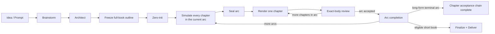

<div align="center">


# novel-studio — Open-source, local-first AI novel engine

**Simulate the world. Plan the arc. Render only what the viewpoint character can truly see.**

A local-first AI novel generator with self-hosted orchestration for long-form fiction, serialized stories and web novels.

[](https://github.com/Xiaoyangy/novel-studio)
[](https://github.com/Xiaoyangy/novel-studio/releases/latest)
[](go.mod)
[](#requirements)
[](LICENSE)

[简体中文](README.md) · [English](README_EN.md)

[Why novel-studio?](#why-novel-studio) · [Preview](#preview) · [Quick start](#quick-start) · [Workflow](#from-world-to-prose) · [RAG](#rag-that-can-be-traced) · [Docs](#documentation-and-community)

</div>

---

novel-studio is an open-source production system for **AI-assisted long-form fiction, web novels, short books and serialized storytelling**. It turns outlines, character continuity, world state, retrieval memory, prose review and revision into a durable pipeline instead of leaving them inside a chat transcript.

It is not a wrapper around “continue this paragraph.” The engine freezes a full-book navigation outline, simulates every chapter in the current arc, seals that causal chain, and only then renders and reviews prose one chapter at a time. Hidden world state stays outside the viewpoint character's knowledge.

> If you want an AI novel writer that can remember, reason about character consequences, stop safely and resume from evidence, consider [⭐ starring novel-studio](https://github.com/Xiaoyangy/novel-studio). Real production feedback drives the roadmap.

## Why novel-studio?

Generating a plausible page is easy. Keeping a story coherent after dozens or hundreds of chapters is a different problem.

| Long-form problem | How novel-studio handles it |
|---|---|
| Characters only react when the protagonist appears | Every character has goals, pressure, resources, knowledge and independent off-screen actions |
| The outline says one thing and the prose improvises another | Full-book navigation is frozen first; world simulation, POV planning, capacity and cross-chapter obligations are sealed before prose |
| RAG returns a lot but influences little | A retrieval hit must become a sourced fact anchor or craft method inside the sealed render packet |
| Characters know future facts or hidden secrets | World state and POV-visible state are separate, with mechanical first-appearance, knowledge and reveal boundaries |
| Review and publication refer to different drafts | Plan, body, review, commit, acceptance and delivery bind to the exact body SHA-256 |
| A long provider call fails and the run starts over | Pipeline stages, arc planning, candidate prose, review, publication and RAG use checkpoints and receipts |
| Retries silently burn budget | Each sealed candidate has a durable prose-realization budget and fails before the provider when exhausted |

### Highlights

| Capability | What it means |
|---|---|
| 🌍 Multi-agent world simulation | Character decisions, relationships, knowledge, resources and off-screen actions produce the next causal state |
| 🧭 Full-book orientation, arc-sized production | Freeze volume/arc/chapter navigation, then “plan one arc, render one arc”; review remains chapter-scoped |
| 🧠 Long-term RAG memory | Separate channels for canon facts, writing craft, references and review calibration; BM25, embeddings and Qdrant are supported |
| 🎭 Viewpoint projection | The Drafter receives only POV-visible facts, voice constraints, hard outcomes and a bounded set of writable beats |
| 📖 Reader-first rendering | Candidate selection and prose scoring lead with readability: concrete scene, live dialogue, varied rhythm, present POV and a real forward pull; anti-AI-voice and detector checks are guardrails, not the goal |
| ✅ Exact-body quality loop | Deterministic gates, whole-chapter checks, an independent Reviewer, Editor and actual-state matching decide publication |
| 🛟 Resumable execution | Recover from persisted evidence rather than trusting model narration or chat history |
| 📊 Live observability | Inspect arc planning, chapters, characters, off-screen state, RAG, reviews, model calls, costs and errors |
| 🔒 Local-first / self-hosted orchestration | Project files, indexes, prose and receipts stay in your own run directory; providers remain configurable |

## Preview


<details>
<summary><strong>Character and off-screen world views</strong></summary>


</details>

The dashboard cross-checks prose, progress, sealed planning, reviews, RAG, checkpoints and runtime events. A frozen outline, a formally planned arc, an active prose chapter and accepted canon are reported as different states.

## Quick start

### Requirements

- Native macOS or Linux. Use WSL2 on Windows; do not use the native Windows ZIP from an older Release.
- Release installs do not require a local Go toolchain; building from source requires Go 1.25.5.
- At least one configured text-model provider. The complete sealed pipeline requires the `reviewer` role to explicitly use DeepSeek.
- Python 3 for the dashboard. It currently starts from a source checkout; the one-line Release installer installs only the CLI binary. Embeddings and Qdrant are optional and config-driven.
- “Local-first” does not automatically mean fully offline. That also depends on text, embedding and vector providers, plus whether the run invokes `web_research` or another network-dependent setup step.

### 1. Install

This README documents current `main`. Choose the source build for the production contracts and dashboard described here. Choose the Release for a stable CLI-only installation that may lag behind `main`. Do not run both blocks.

```bash
# Option A: current main with the full dashboard
git clone https://github.com/Xiaoyangy/novel-studio.git
cd novel-studio
mkdir -p "$HOME/.local/bin"
go build -o "$HOME/.local/bin/novel-studio" ./cmd/novel-studio
export PATH="$HOME/.local/bin:$PATH"
```

```bash
# Option B: stable Release, CLI only
curl -fsSL https://raw.githubusercontent.com/Xiaoyangy/novel-studio/main/scripts/install.sh | sh
```

### 2. Configure and verify providers

```bash
novel-studio
novel-studio --check
```

Global configuration lives at `~/.novel-studio/config.json`. A project-local `./.novel-studio/config.json` can override it. See [config.example.jsonc](config.example.jsonc).

### 3. Start a book

```bash
novel-studio --pipeline --new-novel \
  --prompt "Create a 12-chapter urban mystery with two female leads. Freeze character knowledge boundaries, arc payoffs and the ending in the outline before drafting."
```

For serious projects, keep the full creative contract in a file:

```bash
novel-studio --pipeline --new-novel --prompt-file prompt.md
```

This creates the project and enters a **bounded, resumable** pipeline. It does not ask one endless model context to blindly write an entire book. A normal invocation advances only legal stages and accepts at most the next prose chapter.

### 4. Resume

```bash
novel-studio --pipeline --dir data/runs/<book-name>
```

Repeat the same command to continue from durable evidence. Do not edit `progress.json` by hand, and do not run two writing pipelines for the same book.

### 5. Open the dashboard from the source checkout

```bash
novel-studio service start
novel-studio service open
```

Default URL: [http://127.0.0.1:8765/](http://127.0.0.1:8765/)

## From world to prose



The important boundaries are:

1. **Freeze the full-book outline first.** It gives global navigation but is not yet a formal plan for every chapter.
2. **Simulate one arc, render one arc.** Every chapter in the current arc gets character decisions, causal transitions, POV boundaries, obligations and prose capacity before sealing.
3. **Render and review chapter by chapter.** Each invocation promotes the next immutable chapter bundle and creates prose in an isolated candidate workspace.
4. **Publish only accepted evidence.** The candidate enters canon only when exact-body review and actual-state change match the sealed plan.
5. **Finish the arc before the next arc.** Missing acceptance receipts or body-hash drift block progression. Exact-book finalization and publication packages currently apply only to projects that satisfy the short-book global-review contract; they are not a long-form whole-book review claim.

Arc-sized planning captures multi-chapter cause and effect. Chapter-sized rendering keeps prose quality, cost and revision bounded. See the [Project-All arc architecture](docs/project-all-architecture.md) for generation, bundle, obligation, promotion and recovery contracts.

## Prose quality loop

```text
sealed plan + exact frozen render context
                  ↓
      typed preflight + one-shot permit
                  ↓
            isolated draft
                  ↓
 deterministic gates + hard consistency
                  ↓
           candidate commit
                  ↓
 whole-chapter checks + Reviewer + Editor
                  ↓
 actual-delta match + journaled publication
```

Every accepted chapter must answer four questions:

- **Are the facts correct?** Amounts, time, place, authorization, knowledge and causal order must match the sealed plan.
- **Does the story work?** Goal, resistance, action, turn, relationship movement, reader reward and hook must be supported.
- **Does the prose read like fiction?** The pipeline checks for report-like exposition, repetitive rhythm, dialogue-as-data-transfer and metadata leakage.
- **Was this exact body reviewed?** Review, consistency, commit, acceptance and delivery must bind the same SHA.

Prose is written for readers, not for detectors. The engine computes a deterministic **reader-experience score** (scene concreteness, live dialogue, sentence-rhythm variety, POV presence and forward pull; higher reads better). Three-candidate selection uses it to pick the more readable draft, and it surfaces in both review and the dashboard. It stays a soft signal on purpose: it steers prose toward readers, while anti-AI-voice and external detection remain hard guardrails — passing them is the floor, not the point.

Third-party detector websites remain optional, user-supplied spot checks. novel-studio does not operate those sites and does not block production when no external score is reported. See the [external detector protocol](docs/external-detector-protocol.md).

## RAG that can be traced

novel-studio uses retrieval-augmented generation as a provenance path, not a raw context dump:

```text
BM25 / embedding / Qdrant hit
              ↓
 exact source ref + content-addressed receipt
              ↓
 Planner converts it into a chapter fact or craft method
              ↓
 sealed render packet
              ↓
 Drafter receives the smallest POV-safe input
```

| Retrieval channel | Purpose |
|---|---|
| Canon facts | World rules, character state, chapter facts, resources, relationships and foreshadowing |
| Writing craft | Dialogue, scene construction, pacing, genre methods and craft cards |
| Reference material | Isolated structural samples and reference-work analysis |
| Review calibration | Readability, AIGC signals, platform feedback and revision history |

Each arc generation freezes its own `rag_snapshot_root`. The Drafter cannot read raw hits or query live Qdrant during rendering; only transformed, sourced and sealed inputs cross that boundary.

This proves provenance and controlled injection into planning. It does not mechanically prove that every soft fact anchor or craft suggestion changed the final prose.

```bash
novel-studio --build-rag --dir data/runs/<book-name>/output/novel
novel-studio --rag-ready --dir data/runs/<book-name>/output/novel
```

## Models and deployment

Roles can use different providers, models and reasoning effort. Adapters currently cover OpenAI, Anthropic, Gemini, OpenRouter, DeepSeek, Qwen, GLM, Grok, MiniMax, Mimo, Ollama, Bedrock, OpenAI-compatible gateways and the local Codex CLI. Adapter support does not mean every current model release has been tested in every production role.

| Configuration | Purpose |
|---|---|
| `providers` | Credentials, protocol, base URL, model and extra parameters |
| `roles` | Coordinator, Architect, Writer (shared by World Simulator and Planner), Drafter, Editor and Reviewer routing |
| `context_window` | Real context limits and compaction policy |
| `rag.embedding` | Remote embeddings or local GGUF embeddings |
| `rag.qdrant` | Qdrant address, collection and startup behavior |
| `budget` | Per-book cost warnings and hard stops |
| `notify` | Desktop or custom notifications |

Project state stays local. The complete sealed pipeline requires its independent bare-text `reviewer` to explicitly target DeepSeek; other production roles remain independently routable. A run is fully offline only when every active role and retrieval service is local and no stage invokes `web_research` or another network-dependent setup step. Never commit real API keys.

## Who is it for?

- Authors building dozens to hundreds of chapters of serialized fiction or web novels.
- Story teams that need durable character state, knowledge boundaries, relationships, resources and payoff tracking.
- Developers who want a self-hosted AI writing workflow with explicit models, RAG, cost and project files.
- Engineers studying multi-agent storytelling, world simulation, context governance and resumable agent pipelines.
- Content studios that need planning, prose and chapter review, plus exact-book finalization and publication packages for eligible short books.

novel-studio is currently a CLI-centered production engine, not a drag-and-drop desktop editor. It does not promise a perfect million-word book from one unattended prompt. Long-running projects are the design target; this is not a claim that a completed million-word book has passed production-quality validation. Final quality still depends on the creative contract, models, source material, review standards, budget and author sampling.

## Common commands

| Command | Purpose |
|---|---|
| `novel-studio --pipeline --new-novel --prompt "..."` | Create a book and start the pipeline |
| `novel-studio --pipeline --dir data/runs/<book>` | Resume the next legal step |
| `novel-studio --pipeline --stages preplan,project-all,seal` | Simulate and seal the current arc without prose |
| `novel-studio --pipeline --stages preplan,project-all,seal,promote,render` | Verify the sealed arc, then render and review the next chapter |
| `novel-studio --pipeline --stages finalize,deliver` | For eligible short books only, run exact-book review and build the publication package after all chapters pass |
| `novel-studio --build-rag --dir .../output/novel` | Build the project RAG index |
| `novel-studio --rag-ready --dir .../output/novel` | Validate embedding and vector state |
| `novel-studio service open` | Open the dashboard |
| `novel-studio --diag` | Run read-only diagnostics |
| `novel-studio --check` | Check provider, model and fallback configuration |

Advanced rebase, outline repair, successor-generation, slow-run diagnostics, the full output tree and execution receipts live in the [production reference](README-TECHNICAL.md).

## Documentation and community

Most deep technical references are currently Chinese-first. This English README covers the supported workflow and operational boundaries without implying that the full documentation set has already been translated.

| Document | Topic |
|---|---|
| [中文 README](README.md) | Chinese project overview and quick start |
| [Production reference](README-TECHNICAL.md) | Full operational contracts, recovery, commands and output layout (Chinese) |
| [System architecture](docs/architecture.md) | Host, Agent, Tools, Store and context topology |
| [Project-All arc architecture](docs/project-all-architecture.md) | Arc planning, sealing, chapter acceptance and next-arc unlock |
| [Design-stage workflow](docs/design-stage-workflow.md) | Architect, outline-all and zero-init |
| [Context management](docs/context-management.md) | Stage-aware compaction, receipts and recovery packets |
| [Data lifecycle](docs/data-lifecycle-and-progression.md) | Chapter, character, world and progression ledgers |
| [Writing and review workflow](docs/writing-review-workflow.md) | Draft, review, rewrite, commit and delivery |
| [Evaluation system](docs/evaluation-system.md) | Cases, metrics and regressions |
| [Observability](docs/observability.md) | Events, usage, traces and diagnostics |

Found a bug or have a production use case? Open a [GitHub Issue](https://github.com/Xiaoyangy/novel-studio/issues). Pipeline changes should include the intended boundary and regression coverage.

### Roadmap

- Smaller onboarding templates and reproducible example books.
- Public benchmarks for long-form continuity, RAG grounding and prose quality.
- Broader English documentation and cross-platform installation.
- Richer dashboard diagnostics and human-confirmation workflows.

## FAQ

<details>
<summary><strong>Is novel-studio an AI novel generator or a writing assistant?</strong></summary>

Both, but “AI novel production engine” is more precise. Brainstorming, world design, full-book outlining, arc simulation, chapter prose and review share one resumable data contract. Eligible short books may also use exact-book finalization and delivery.

</details>

<details>
<summary><strong>Can it write a million-word novel with one click?</strong></summary>

No. It is designed for long-running fiction through repeated, bounded arc and chapter calls; it does not claim that a completed million-word production sample has already passed quality validation. Quality, speed and cost still depend on models, genre, the creative contract, RAG and review requirements.

</details>

<details>
<summary><strong>Does it really use RAG?</strong></summary>

Yes. It supports BM25, embeddings, local vector artifacts and Qdrant. Retrievals must pass through exact references, receipts and Planner transformation before entering a sealed render packet; raw hits do not go to the prose model.

</details>

<details>
<summary><strong>Can I use local models or run fully offline?</strong></summary>

You can configure Ollama, a local OpenAI-compatible endpoint, local GGUF embeddings and self-hosted Qdrant. A run is fully offline only when every active role and retrieval component is local and no stage invokes `web_research` or another network-dependent setup step.

</details>

## Development

```bash
go test -count=1 ./...
go vet ./...
go build -o /tmp/novel-studio ./cmd/novel-studio

python3 scripts/validate_skill_context.py
python3 -m unittest services.dashboard.test_server -v

git diff --check
```

## License

[Apache License 2.0](LICENSE)

<div align="center">

If novel-studio helps your AI writing, long-form fiction or agent engineering work, please [⭐ Star the repository](https://github.com/Xiaoyangy/novel-studio), [open an issue](https://github.com/Xiaoyangy/novel-studio/issues), or share what happened in real production.

</div>
