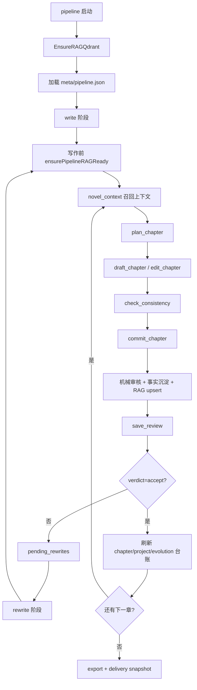

# 数据沉淀与推进机制

这份文档把 `novel-studio` 的数据写入、RAG 召回、断点恢复和章级推进口径收拢到一处。目标是回答三个问题：

- 哪些文件是事实源，哪些只是检索加速或诊断证据。
- 一章从规划、草稿、提交、审核到返工，如何推动状态机前进。
- embedding + Qdrant 如何在 pipeline 启动、写作前检查和后续沉淀中接入。

## 1. 三层事实模型

项目数据分三层，优先级从上到下递减：

| 层级 | 代表工件 | 作用 | 口径 |
|---|---|---|---|
| 权威事实层 | `chapters/`、`summaries/`、`reviews/`、`meta/*.json` | 创作、审核、恢复的唯一事实 | 工具原子写入，不能靠聊天记忆替代 |
| 推进状态层 | `meta/progress.json`、`meta/pipeline.json`、`meta/checkpoints.jsonl`、`meta/pending_commit.json` | 判断下一步该做什么 | 状态可恢复，checkpoint append-only |
| 检索辅助层 | `meta/rag/index_state.json`、`meta/rag/vector_store.json`、Qdrant collection、`meta/rag/retrieval_trace.jsonl` | 给 `novel_context` 提供相关事实召回 | 只做候选召回，不能覆盖权威事实 |

核心原则：

- `progress.json` 决定章节和返工队列的状态。
- `pipeline.json` 只记录阶段完成证据，不替代章节事实。
- `checkpoints.jsonl` 是崩溃恢复和阶段验证证据。
- Qdrant 和 `vector_store.json` 是召回加速层；删除后可由本地事实重建。
- 参考库、deconstruction-library和对标库不能进本书 RAG 索引。

## 2. 总体推进图



这张图里，只有工具写盘成功后才算状态前进。模型说“已完成”没有效力。

## 3. 数据沉淀清单

| 入口 | 主要写入 | RAG/召回沉淀 | 推进意义 |
|---|---|---|---|
| `save_foundation` | `premise.md`、`outline.json/md`、`layered_outline.json/md`、`characters.json/md`、`world_rules.json/md`、`book_world.json/md`、`meta/compass.json` | foundation chunk upsert 到 `meta/rag/index_state.json`，embedding 启用时同步写 Qdrant 和 `vector_store.json` | 新书有可写的设计包 |
| `--zero-init` | `meta/zero_chapter_context_manifest.*`、`meta/initial_character_dynamics.*`、`relationship_state.initial.*`、`meta/initial_resource_ledger.*`、`meta/character_return_plan.*`、`meta/crowd_role_policy.*`、`drafts/01.zero_init.plan.json`、`meta/ch01_zero_init_plan.md`、`meta/first_chapter_generation_readiness.*` | 可按零章白名单重建项目 RAG；只作为第一章写前证据，不是已发生正文事实 | foundation 已落盘但正文未开写时，生成角色系统、关系契约、资源边界、捧场角色策略和第一章推演草案 |
| `plan_chapter` | `drafts/NN.plan.json`、章节工作态；必须包含 `causal_simulation` | 不直接沉淀 RAG | 本章从待写进入可草稿状态；写前必须证明已理解前文、全员时间线、当前卷弧、未来 3-4 章、网络参考、角色弧线、资源/伏笔/关系账本和 AI 味风险 |
| `draft_chapter` | `drafts/NN.draft.md` | 不直接沉淀 RAG | 草稿保存，但不算完成 |
| `edit_chapter` | 只改 `drafts/NN.draft.md` | 不直接沉淀 RAG | 返工稿必须再过 check/commit |
| `check_consistency` | 审核返回事实，不作为终稿 | 不直接沉淀 RAG | 提交前一致性门禁 |
| `commit_chapter` | `chapters/NN.md`、`summaries/NN.json`、`timeline.*`、`foreshadow_ledger.*`、`relationship_state.*`、`meta/state_changes.json`、`meta/resource_ledger.*`、`reviews/NN_ai_gate.json`、`reviews/NN.md`、`meta/progress.json`、`meta/checkpoints.jsonl` | 章节摘要、事件、伏笔、关系、状态变化、资源变化等 chunk upsert | 本章唯一正式提交点 |
| `save_review` | `reviews/NN.md`、结构化评审、`meta/review-summary.md`、`meta/progress.json`、`meta/writing_assets.json/md` | 审稿教训、返工建议、验收结果 upsert；可复用写法问题同步进写法资产库的 `feedback` 和 active rules | 决定 accept / polish / rewrite，并把历史反馈变成后续写作前置规则 |
| `save_review(verdict=accept)` | `meta/chapter_progress.json/md`、`meta/character_continuity.json/md`、`meta/project_progress.json/md`、`meta/evolution_report.json/md` | 章审通过后会把项目记忆 artifact 按 `source_path` 全量替换进 RAG：章节推进、角色动力学/人物续用、项目进度、演化报告、时间线、伏笔、关系、状态变化、资源账本、世界规则、本书世界、outline、layered_outline、compass、写法资产库与历史反馈，以及零章初始化资产（若存在） | 解锁下一章或完结判断 |
| `review-existing` | 统一审核报告和批量汇总 | 按章写 review RAG chunk | 给已有章节补审核事实 |
| `rewrite-existing` | `.pre-rewrite.md` 备份、新 `drafts/`/`chapters/`、返工结果 | 写前先检查 RAG；重写后按 source_path 替换旧 chunk | 清理返工队列 |
| `export` / delivery settle | TXT/EPUB、`meta/delivery_snapshot.*`、交付事实 chunk | 当前实现会写 `index_state` 交付事实；向量层在下一次 RAG 检查时重建 | 完结交付证据 |

`commit_chapter` 是最重要的边界：`drafts/NN.draft.md` 只是工作稿，`chapters/NN.md + progress + checkpoint` 同时存在才算已提交。

### 3.1 写前推演硬门禁

所有正文写作都必须通过 `novel-studio --pipeline` 进入 `plan_chapter -> draft_chapter -> check_consistency -> commit_chapter`。`plan_chapter` 不再接受旧式“目标/冲突/钩子”裸计划；缺少完整 `causal_simulation` 时直接拒绝进入正文。

`causal_simulation` 至少要证明这些输入已经被消化：

- `current_chapter_outline`、`chapter_contract`、`progression_snapshot.next_plan` 和 `future_outline_window`。未来窗口默认覆盖当前章后 3-4 章，避免只按单章事件孤立写作。
- `recent_summaries`、`timeline`、`character_continuity`、`character_stage_records`、`resource_audit`、`foreshadow_ledger`、`relationship_state`、`project_progress` 和 `writing_engine`。
- `external_reference_plan`、`trend_language_plan`、`grounding_details`。写作前必须有网络信息收集证据，来源可为 `meta/web_reference_brief.*`、`references/web_reference_brief.md` 或本轮 web search；计划中要记录来源、检索时间、时效要求、可用细节和禁用内容。
- `initial_state`、`voice_logic`、`offscreen_character_stage`、`environment_state` 和 `causal_beats`。关键角色都要有当前目标、压力、资源、误判、能力边界、知识账本、决策框架、情绪评价和长期弧线；非主角必须有同时间线行动记录，不能随着主角随叫随到。

网络热梗的默认口径是“先收集，后转化，低预算使用”。热梗可以不在单章写完，但必须在 `trend_language_plan` 说明载体、场景功能、使用预算、禁用位置和后续回收方式。旁白、恐怖规则、黑卡/欠费单条款、主角关键判断和章末钩子默认不用热梗。

### 3.2 动态角色现场台账

`commit_chapter.character_stage_records` 会写入新目录：

- `meta/character_stage/NNN.json`
- `meta/character_stage/NNN.md`

这个目录存每章同一时间线里主角之外角色的地点、环境、当前行动、压力、决策、误判、知识边界、正文可见性、时间线一致性和后续潜势。正文可以只呈现主角视角，但台账必须记录短期会回归角色、与本章规则/资源相关的角色，以及本章未展示但正在经历事件的关键人物。

角色死亡、失踪、受伤、背叛、转移地点或获得新任务都应通过 `state_changes`、`relationship_changes`、`resource_updates/proposals` 和 `character_stage_records` 同步落盘。主角出现前的背景时间线不自动演化；角色进入正文后，移动时间、交通工具、见面限制和快速移动能力都要服从当前世界地图与规则。

### 3.3 动态世界地图

`book_world.json/md` 不是一次性背景设定，而是连载中的城市地图和势力状态表。长篇项目开写前至少要有开局城市、主场景、短期会用到的相邻地点、现实交通限制和势力/规则压力。以鬼城项目为例，第一章前就不应只有“3栋楼道”，还要能表达北城、阴阳公寓3栋、1702/1703/1704、周行舟小超市、红伞医院线索、午夜便利店远期入口等节点，以及它们在冥雾时间线中的状态。

世界地图推进原则：

- `places` 存地点和状态：风险、可交易资产、规则压力、可复用物件锚点、当前开放/封闭状态。
- `routes` 存移动限制：现实距离、交通工具、冥雾阻断、楼层/门牌/电梯/道路的规则代价。除非角色已有快速移动能力、附身或规则通行权，移动时间按现实世界相当口径处理。
- `factions` 存行动方：官方、商会、收租方、店方、医院、住户群等都要有目标、资源和关系，不只为主角服务。
- 每章 `environment_state` 和 `character_stage_records` 若引入新地点、新路线、新势力或地点状态变化，必须在 commit/review 后推动 `book_world`、`timeline`、`resource_ledger` 或 `project_progress` 同步更新。
- 地图信息写进正文时只展示角色能看到、能利用或正在承受代价的部分；不要把地图说明整段讲给读者。

## 4. RAG 与向量库机制

### 4.1 启动和检查

- `Host.New` 和 `--pipeline` 启动都会调用 `bootstrap.EnsureRAGQdrant`。
- embedding 启用时，默认使用本机 Qdrant：`http://127.0.0.1:6333`，容器名 `novel-studio-qdrant`。
- `docker-compose.yml` 也提供 `qdrant` 服务，适合显式 `docker compose up`。
- `pipelineWrite` 与交付阶段在执行前调用 `ensurePipelineRAGReady`：先迁移/校验 schema、回填已生成章节摘要并处理 `pending_upserts.json`；已有本地向量可复用时只校验或恢复 Qdrant，不重新 embedding。
- 如果 embedding 未启用，系统仍使用本地关键词 RAG，不强制启动向量链路。

### 4.2 召回顺序

`novel_context` 的召回顺序是：

1. Qdrant 向量 + BM25 混合召回。
2. Qdrant 错误或空结果时，`meta/rag/vector_store.json` 本地向量 + BM25。
3. embedding 错误或向量不可用时，`meta/rag/index_state.json` 的缓存 BM25 / 关键词召回。

每次召回会写 `meta/rag/retrieval_trace.jsonl`，记录 query、strategy、命中来源、分数和 reason，便于判断召回强弱。

### 4.3 Upsert 规则

所有增量沉淀统一走 `UpsertRAGChunks`：

- chunk 先规范化，过滤禁入来源。
- 按 `source_path` 替换旧 chunk，避免同一章节或同一评审多版本堆积。
- 来源 hash 未变化且本地向量齐全时直接 no-op。
- 变化来源先在内存完成全部 embedding 和维度/数值校验；成功后才删除同 `source_path` 的旧 points，并按小批量幂等写入。
- 同时写一份 `vector_store.json`，作为没有 Qdrant 或 Qdrant 失效时的本地向量 fallback。
- `vector_store.json` 成功后才提交 `index_state.json`；任一步失败会保留旧提交并写 `meta/rag/pending_upserts.json`，下次调用或 pipeline 启动自动重放。
- `save_review` 会把每次审阅的 issue、contract miss、低分维度和门禁升级原因写入 `meta/writing_assets.json.feedback`，并把可复用写法建议去重为 `active_rules`；对应 review chunk 关键词包含 `审阅反馈` / `历史反馈` / 维度名。
- `save_review(verdict=accept, scope=chapter)` 额外调用项目记忆 RAG sink，覆盖 `meta/chapter_progress.md`、`meta/character_continuity.md`、`meta/project_progress.md`、`meta/evolution_report.md`、`timeline.md`、`foreshadow_ledger.md`、`relationship_state.md`、`meta/state_changes.json`、`meta/resource_ledger.md`、`world_rules.md`、`book_world.md`、`outline.md`、`layered_outline.md`、`meta/compass.json`、`meta/writing_assets.md`。如果存在零章初始化资产，也会把 `meta/zero_chapter_context_manifest.md`、`meta/initial_character_dynamics.md`、`relationship_state.initial.md`、`meta/initial_resource_ledger.md`、`foreshadow_ledger.initial.md`、`meta/character_return_plan.md`、`meta/crowd_role_policy.md`、`meta/ch01_zero_init_plan.md` 和 `meta/initial_review_lessons.md` 纳入项目记忆。

### 4.4 Tag 口径

当前没有独立的通用 tag 表。检索层使用这些字段表达“标签”语义：

- `source_kind`：来源类型，如 `foundation`、`chapter`、`review`、`ledger`、`planning`、`world`、`craft`。
- `facet`：信息面，如 `plot`、`character`、`world`、`resource`、`progress`、`planning`、`craft`、`review`。
- `keywords`：轻量中文关键词，用于本地召回和 trace；审阅/写法反馈会显式带 `审阅反馈`、`历史反馈`、`review_lesson` 和相关维度名。
- `metadata`：章节号、来源工具、verdict、影响章节等结构化补充。

发布平台的题材标签、书籍标签和推荐标签不应直接混进 RAG tag。它们属于发行/平台文案层，除非已经沉淀为本书设定或评审事实。

## 5. Snapshot 使用口径

项目里有多类 `snapshot`，用途不同，不能混成同一层记忆：

| Snapshot | 主要文件/实现 | 当前用途 | 是否进入写作上下文 |
|---|---|---|---|
| UI 状态快照 | `internal/host/host_snapshot.go`、`UISnapshot` | TUI/上层入口展示进度、模型、flow、上下文健康度和恢复标签 | 否，只是运行态展示 |
| 诊断快照 | `internal/diag/snapshot.go` | `/diag` 规则读取 output 工件并生成 findings | 否，诊断建议需经工具/人工采纳 |
| 用户规则快照 | `meta/user_rules.json`、`internal/rules/snapshot.go` | 把用户长期规则归一化，供 `novel_context` 和 `commit_chapter` 机械检查使用 | 是，进入 `working_memory.user_rules` |
| 角色弧线快照 | `meta/snapshots/vXXaXX.json` | `save_arc_summary` 在长篇弧结束保存角色状态；`novel_context` 和 rewrite brief 读取最近快照 | 是，进入 `foundation.character_snapshots` |
| 动态推进快照 | `meta/chapter_progress.*`、`meta/project_progress.*`、`meta/evolution_report.*`、`meta/character_continuity.*` | `novel_context` 压缩为 `progression_snapshot` / `project_progress` / `evolution_report` / `character_continuity`；其中 `character_continuity.dynamics` 记录目标、压力、资源、关系、秘密、误判、知识账本、决策框架、关系契约、情绪评价、长期弧线和行动倾向 | 是，写下一章前必须核对 |
| 写法反馈快照 | `meta/writing_assets.json/md` 的 `feedback` / `compiled` | `save_review` 把历史审阅反馈沉淀为写法资产，`novel_context` 以 `writing_engine` 注入 | 是，写作手法前置规则 |
| 交付快照 | `meta/delivery_snapshots/*.json` | `export` 记录交付包、字数、审核证据和文件路径 | 否，主要是交付审计证据 |
| 用量快照 | `meta/usage.json`、`UsageTracker.Snapshot()` | 持久化 token/cost 用量 | 否，运维统计 |

## 6. 状态推进规则

### 6.1 Progress

`meta/progress.json` 是章级状态机：

- `phase`：宏观阶段，如 planning / writing / complete。
- `flow`：当前流向，如 drafting / reviewing / polishing / rewriting。
- `current_chapter`、`in_progress_chapter`：当前章节位置。
- `completed_chapters`：已正式 commit 的章节列表。
- `pending_rewrites`：必须先处理的返工队列。
- `rewrite_reason`：返工来源和原因。

推进不变量：

- `pending_rewrites` 非空时，不能开新章。
- 只写草稿不能推进 `completed_chapters`。
- `commit_chapter` 负责提交正文和写 checkpoint。
- `save_review` 负责用 verdict 调整返工队列。
- 全书完结必须同时满足章节完成、返工队列清空、必要摘要/交付证据齐全。

### 6.2 Pipeline

`meta/pipeline.json` 是阶段级恢复状态：

- 阶段顺序默认 `architect -> zero-init -> write -> review -> rewrite -> deliver`。
- 已完成阶段重跑时先验证证据；证据缺失会清除完成标记并重跑。
- `write` 证据看 `progress + chapters + commit_chapter checkpoint`。
- `review` 证据要求机械门禁、AI voice、Editor JSON、DeepSeek 裸正文判定、统一报告和 `review-summary` 都绑定当前正文 SHA-256。
- `rewrite` 只使用当前正文版本的审核证据，并核对章节更新和 `.pre-rewrite.md`。
- `deliver` 要求当前章审 `accept`、交付日志和 delivery snapshot。
- 每个阶段保存 artifact digest；最终对账刷新合法跨阶段变更，`diag` 报告后续内容漂移。

Pipeline 只负责阶段编排。章内下一步仍由 `progress.json`、checkpoint、pending signal 和 Host reminder 决定。

### 6.3 Checkpoint 与 pending commit

- `meta/checkpoints.jsonl` 只追加，每个工具成功后写一条。
- `meta/pending_commit.json` 是提交 saga 过程中的保护信号，用来避免崩溃后半提交污染状态。
- `meta/last_commit.json`、`meta/last_review.json` 是最近结果信号，供恢复、看板和诊断读取。

如果 `progress`、checkpoint 和文件系统不一致，先跑：

```bash
go run ./cmd/novel-studio --diag
```

不要手工编辑章节状态后直接续写。

## 7. 写作前检查

进入 `write` 阶段前必须完成这些检查：

1. 配置加载成功，`output_dir` 已确定。
2. Qdrant 按配置可启动或可连接；失败时 pipeline 直接报错。
3. `ensureDefaultRAGIndex` 只索引当前项目内 `prompt.md`、`input/` 和 `output/novel`；手动 `--build-rag` 默认还会从 `summaries/` + `chapters/` 回填已完成章节事实，避免重建索引时丢失 `chapter_summary_facts`。第一章开写前可先跑 `--zero-init`，它使用更窄的白名单，只索引 foundation 和零章写前资产，不回填旧章节、审稿或实验稿。
4. embedding 启用时，`ensurePipelineRAGReady` 必须证明当前 schema/chunk/model/dimension/向量数值一致，并保证 Qdrant 点数正确；允许从本地 vector fallback 恢复 Qdrant。
5. 已有进度时，优先恢复，不用新 prompt 重开。
6. `pending_rewrites` 非空时，先走返工，不开新章。

常用核对命令：

```bash
go run ./cmd/novel-studio --build-rag --with-embeddings --probe-chapter 1
go run ./cmd/novel-studio --diag
go run ./cmd/novel-studio --refresh-progress
curl -s http://127.0.0.1:6333/collections
```

## 8. 排障入口

| 问题 | 先看哪里 | 说明 |
|---|---|---|
| 不知道该续写还是返工 | `meta/progress.json`、`meta/pipeline.json` | 先看 pending queue 和阶段完成证据 |
| 明明写完但 pipeline 重跑 | `meta/checkpoints.jsonl`、`chapters/NN.md`、`meta/pipeline.json` | 可能缺 `commit_chapter` checkpoint |
| Writer 忘前文 | `meta/rag/retrieval_trace.jsonl`、`meta/chapter_progress.md`、`summaries/` | 判断是召回弱、台账没刷新，还是摘要缺失 |
| Qdrant 没命中 | `meta/rag/vector_store.md`、Qdrant `/collections/{collection}` | 先确认 embedding 是否启用和 collection 是否匹配 |
| 审核通过但没解锁下一章 | `reviews/NN.md`、`meta/last_review.json`、`pending_rewrites` | verdict 或返工队列可能没清 |
| 状态互相矛盾 | `go run ./cmd/novel-studio --diag` | 诊断会报告 progress/checkpoint/pipeline 漂移 |

## 9. 维护边界

- 新增长期记忆时，优先写入权威事实层，再考虑 RAG chunk。
- 新增 RAG 来源时，必须继续排除deconstruction-library、对标库和外部参考库。
- 新增审核维度时，要同步结构化 review、统一 markdown、progress verdict 和 RAG review chunk。
- 新增推进状态时，要同时考虑 dashboard、diag、resume prompt 和 pipeline evidence。
- 不要让 Qdrant 成为唯一事实源；它永远可以由本地文件重建。
