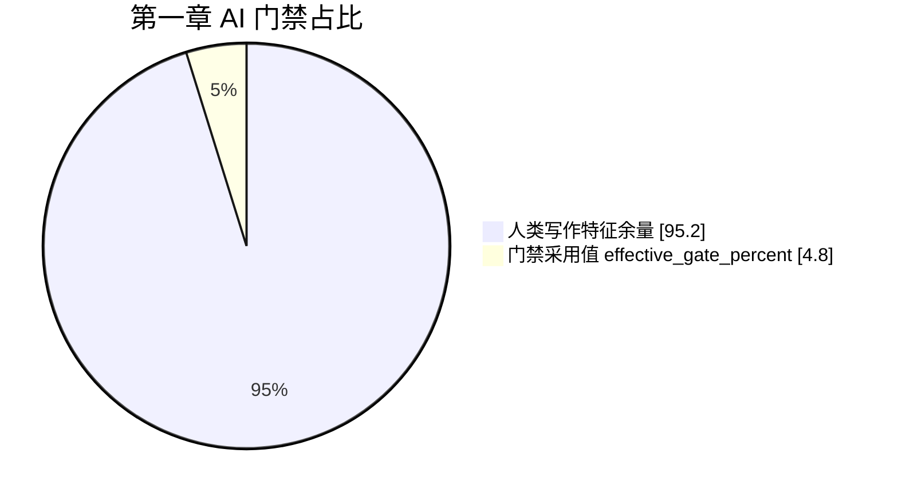
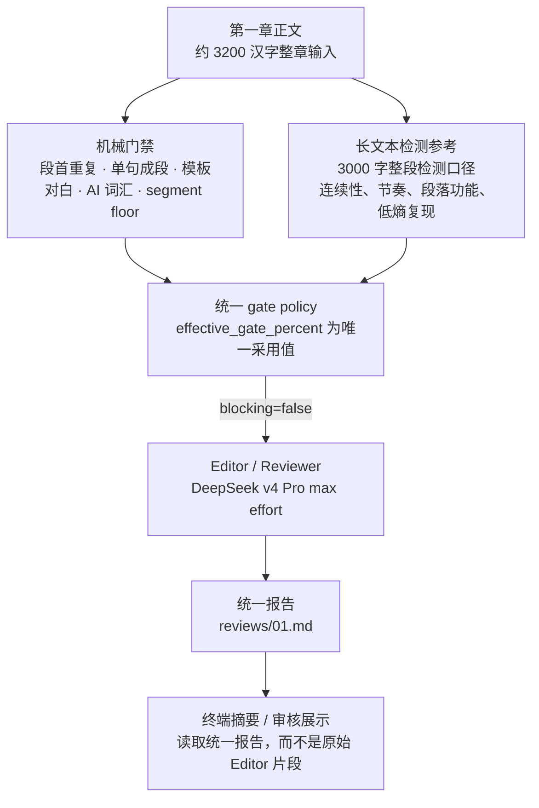
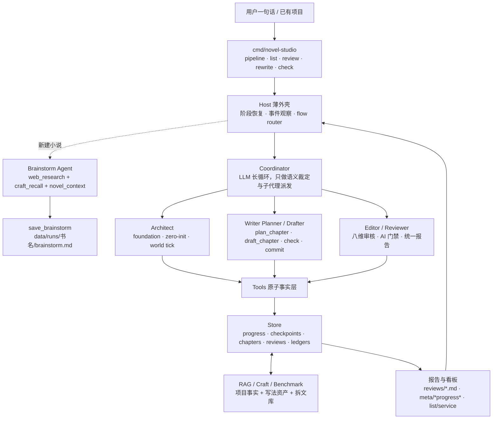
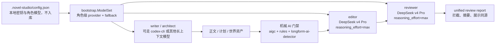
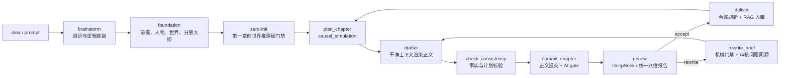
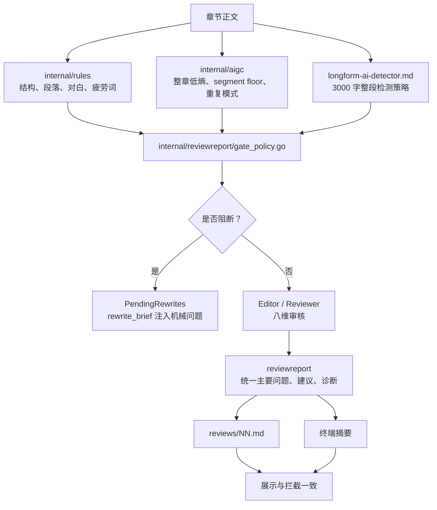

# 2026-07-08 工程交付总览

> 本页把本轮代码、审核口径、第一章证据链和 GitHub 交付范围串成一份可读图谱。最前面先放《她的第二算法》第一章的进度图，后面再展开系统架构、流水线和变更清单。

## 第一章进度图




| 指标 | 旧基线 | DeepSeek 复审 | 结论 |
|---|---:|---:|---|
| 八维总分 | 760 / 800 | 800 / 800 | 复审满分通过 |
| 是否需要改写 | 否 | 否 | 不再进入返工队列 |
| 主要问题 | 暂无 | 暂无 | 报告展示与门禁一致 |
| 诊断摘要 | 开场环境描写密度略高，苏曼视角缺失与前提设定矛盾 | 开篇示范级控制力，仅角色名声音区分度可稍作标识，不改 | warning 作为建议，不作为 blocker |
| AI 门禁采用值 | 4.80% | 4.80% | 低风险，通过 |
| 汉字数 | 3208 | 3208 | 符合 3000 字整章检测样本 |
| repeated starts | 0 | 0 | 无连续段首复读 |
| segment floor | 0.00% | 0.00% | 没有局部高风险段落抬底 |



### 第一章通过判定

- 最终报告：`data/runs/她的第二算法/output/novel/reviews/01.md`，生成时间 `2026-07-08T14:08:16+08:00`。
- 模型证据：审核日志显示 `editor=deepseek/deepseek-v4-pro`、`reviewer=deepseek/deepseek-v4-pro`，未触发 fallback。
- 门禁口径：`effective_gate_percent=4.80%`，`risk_level=低`，`blocking=false`，与终端摘要、Markdown 报告一致。
- 展示修复：原始 Editor 的 advisory warning 不再被当成“主要问题”；只有 error / critical / 机械门禁 blocker 才进入阻断区。

## 最新系统架构图



### 模型与裁判链路



## 主流水线



## 审核门禁流程



## 本轮代码变更梳理

| 方向 | 主要文件 | 结果 |
|---|---|---|
| 新建小说头脑风暴 | `assets/prompts/brainstorm.md`、`internal/agents/brainstorm.go`、`internal/tools/save_brainstorm.go`、`internal/tools/web_research.go`、`cmd/novel-studio/pipeline_cmd.go` | `--pipeline --new-novel` 先调研、推敲并落盘 `brainstorm.md`，再进入 foundation / zero-init / write |
| 书目进度入口 | `cmd/novel-studio/novels_list.go`、`cmd/novel-studio/main.go` | `novel-studio list` 扫描 `data/runs/`，展示阶段、章节、字数、续写命令 |
| Codex 订阅适配 | `internal/llmcodex/codex.go`、`internal/llmcodex/codex_test.go`、`internal/bootstrap/*` | 将 Codex CLI 订阅封装为 agentcore ChatModel，支持工具调用与自由文本正文重渲染 |
| 长文本 AI 检测 | `assets/references/longform-ai-detector.md`、`assets/references/anti-ai-tone.md`、`internal/aigc/aigc.go`、`internal/rules/lint.go` | 针对 3000 字整章检测补 segment floor、段首复读、模板对白、结构性 AI 味规则 |
| 审核报告一致性 | `internal/reviewreport/*`、`cmd/novel-studio/review_existing.go`、`cmd/novel-studio/review_existing_gate_test.go` | 拦截、统一报告、终端摘要读取同一份 gate 结论；warning 不再误报为主要 blocker |
| Writer / Drafter 约束 | `assets/prompts/writer.md`、`assets/prompts/drafter.md`、`internal/tools/plan_chapter.go`、`internal/tools/plan_chapter_phases.go` | Planner 负责完整因果推演，Drafter 只读定稿计划渲染正文，减少上下文污染与模板化 |
| 世界与 zero-init | `internal/tools/save_foundation.go`、`cmd/novel-studio/zero_init_*`、`internal/tools/worldsim_gate.go` | foundation 改动会使第一章 readiness 过期，世界推演资产和白名单 RAG 更严格 |
| 上下文治理 | `internal/agents/context_manager.go`、`internal/tools/novel_context*.go`、`internal/tools/context_architect.go` | 加入长文本检测参考、rewrite_brief 机械门禁摘要、计划一致性与 RAG 召回证据 |
| 质量审计脚本 | `quality/audit/scripts/content_lint.py` | 离线审计补结构性 AI 味和章节机械规则检查 |
| 文档与运维 | `docs/subscription-and-pipeline-setup.md`、`docs/production-interruption-analysis-20260707.md`、本文件 | 记录订阅接入、新流水线、生产中断原因、第一章审核证据与架构图 |

## DeepSeek 接入说明

- 代码层支持角色级 provider / fallback / reasoning effort；本机 `.novel-studio/config.json` 使用 DeepSeek 作为 editor 和 reviewer 主裁判。
- `.novel-studio/` 已在 `.gitignore`，API key 与本地模型偏好不会进入 GitHub。
- DeepSeek 官方兼容模式中 `reasoning_effort=max` 是最高档；本机审核使用该档位。
- 本轮实测 `--check` 可识别 DeepSeek editor / reviewer，并在第一章复审日志里看到真实 provider 命中。

## 验证清单

交付前应跑：

```bash
go test ./...
go build -o /tmp/novel-studio ./cmd/novel-studio
python3 scripts/validate_skill_context.py
go run ./cmd/novel-studio --dir data/runs/她的第二算法 --pipeline --stages review --restart --from 1 --to 1
```

本轮第一章复审已经通过，代码级验证结果以本 PR / commit 的终端记录为准。
